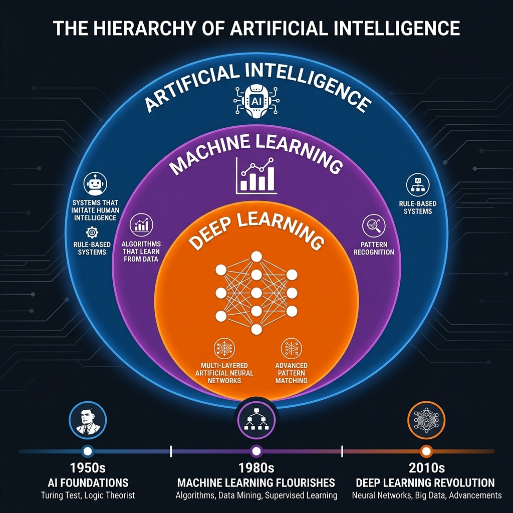
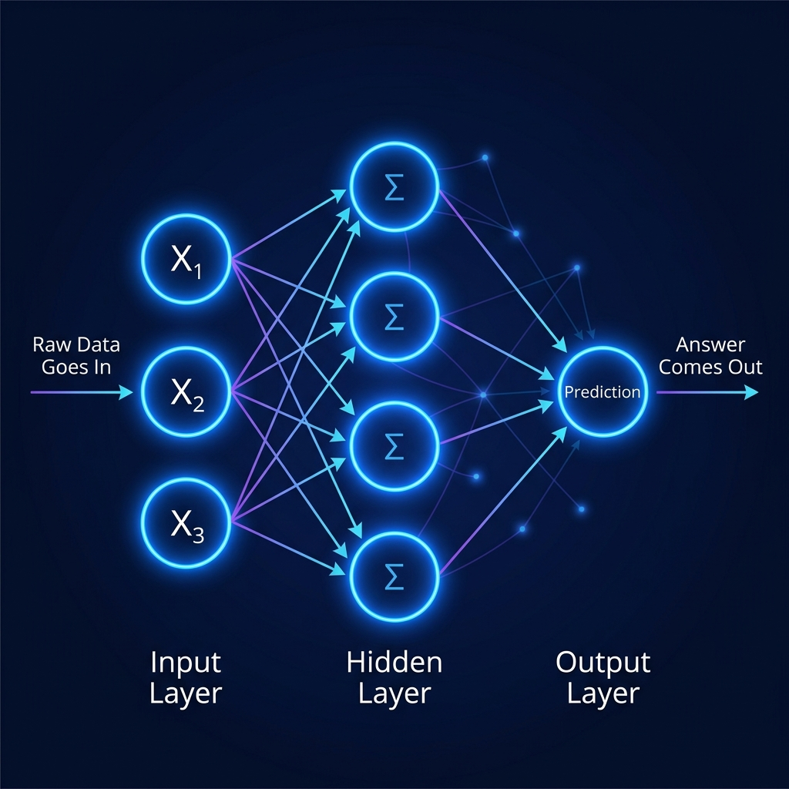
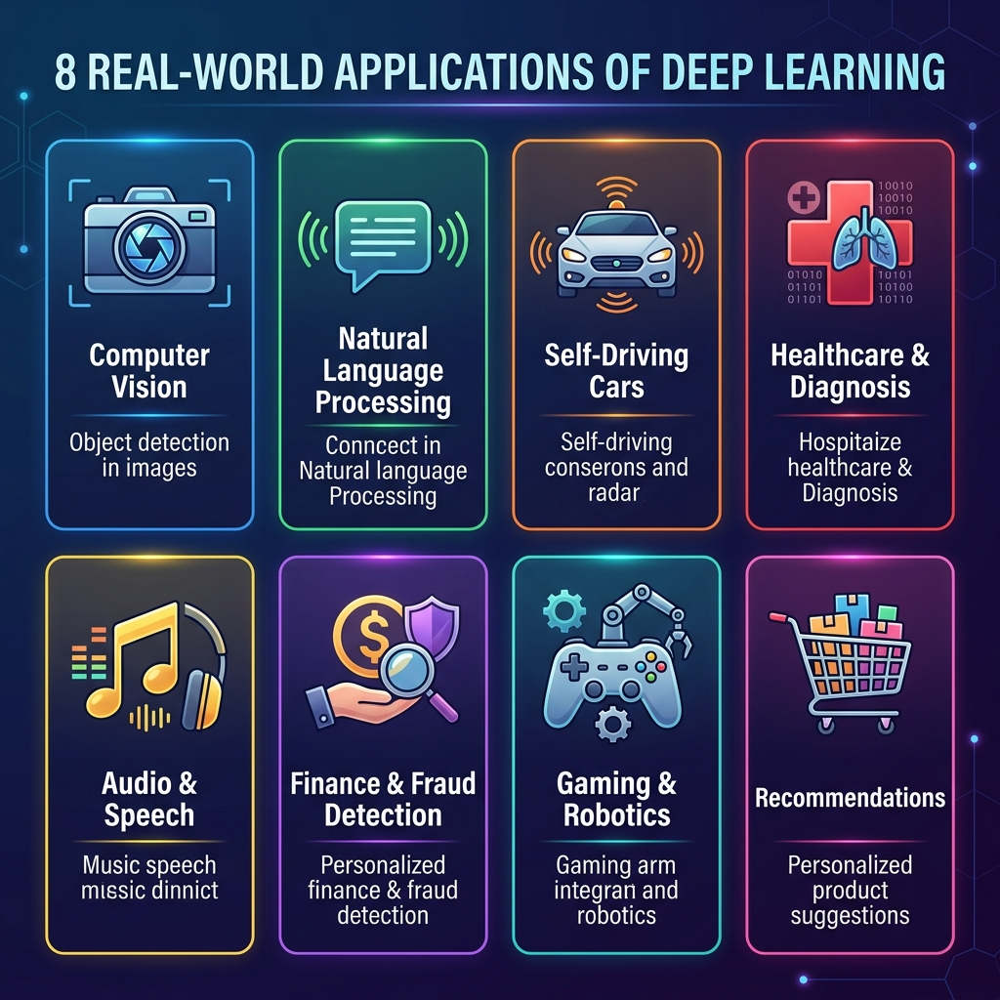
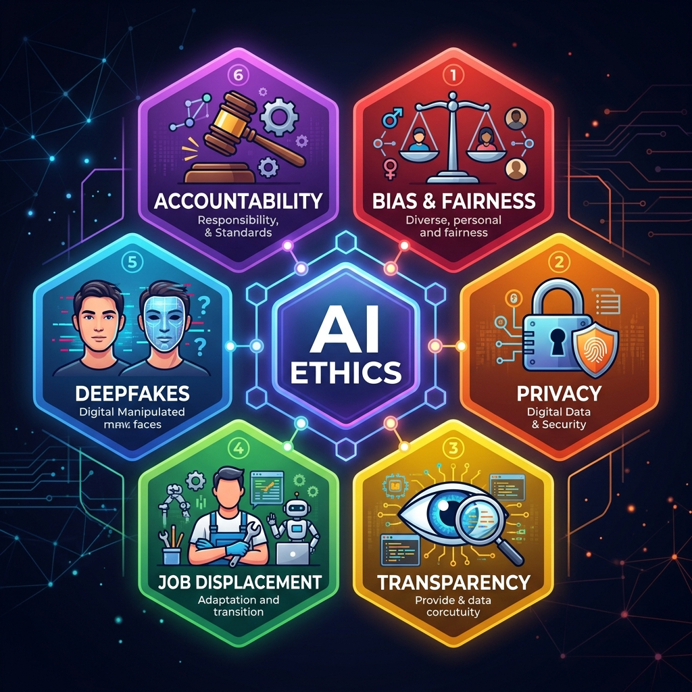

# 📘 Session 01 — Introduction to Deep Learning
### Course: Deep Learning Using Neural Networks | Aptech
### Duration: 2 Hours (TL1)
---

> **Professor's Opening Note:**
> *"Before we write a single line of code, we must first understand the WHY. Why does Deep Learning exist? What problem does it solve that humans couldn't solve before? By the end of this session, you will see the world differently — because once you understand how machines learn, you start seeing learning everywhere."*

---

## 📚 Table of Contents
1. [What is Deep Learning? — The Big Picture](#1-what-is-deep-learning)
2. [The AI → ML → DL Hierarchy](#2-the-ai--ml--dl-hierarchy)
3. [The Essence of Deep Learning](#3-the-essence-of-deep-learning)
4. [Applications of Deep Learning](#4-applications-of-deep-learning)
5. [Ethical Considerations in AI](#5-ethical-considerations-in-ai)
6. [Key Terminology Glossary](#6-key-terminology-glossary)
7. [Recommended Videos](#7-recommended-videos)
8. [Summary & What's Next](#8-summary--whats-next)

---

## 1. What is Deep Learning?

### 🧠 Real-Life Analogy: The Baby Learning to Walk

Think about how a baby learns to walk. Nobody gives the baby a manual. Nobody programs exact muscle movements. The baby:
1. **Tries** to stand (attempts)
2. **Falls** (makes an error)
3. **Adjusts** (learns from the error)
4. **Tries again** with a slight correction
5. Repeats this thousands of times until walking becomes natural

**Deep Learning works exactly the same way.**

A Deep Learning model:
1. Makes a **prediction** (attempts)
2. Compares its prediction to the correct answer (**calculates error**)
3. **Adjusts its internal settings** (learns from the error)
4. Repeats millions of times until it gets it right

> 💡 **Key Insight:** Deep Learning is not programmed with rules. It **learns rules from data**, just like a baby learns to walk from experience.

---

### 📖 Formal Definition

**Deep Learning (DL)** is a subset of Machine Learning that uses **artificial neural networks with multiple layers** to learn hierarchical representations of data. These networks are inspired by the structure and function of the human brain.

The word **"Deep"** refers to the **number of layers** in the neural network. More layers = more depth = ability to learn more complex patterns.

---

## 2. The AI → ML → DL Hierarchy



Think of this as **three nested circles** — like Russian dolls:

```
┌─────────────────────────────────────────────┐
│           ARTIFICIAL INTELLIGENCE           │  ← The BIG umbrella
│   (Any technique that makes machines smart)  │
│                                             │
│   ┌─────────────────────────────────────┐   │
│   │         MACHINE LEARNING           │   │  ← A SUBSET of AI
│   │  (Machines learn from data using   │   │
│   │   statistics and algorithms)        │   │
│   │                                     │   │
│   │   ┌─────────────────────────────┐   │   │
│   │   │       DEEP LEARNING        │   │   │  ← A SUBSET of ML
│   │   │  (Learning using Neural    │   │   │
│   │   │   Networks with many       │   │   │
│   │   │   layers of neurons)       │   │   │
│   │   └─────────────────────────────┘   │   │
│   └─────────────────────────────────────┘   │
└─────────────────────────────────────────────┘
```

### 🕰️ Timeline of Evolution

| Era | Technology | Key Milestone |
|-----|-----------|---------------|
| **1950s** | Artificial Intelligence | Alan Turing asks: "Can machines think?" |
| **1960s–70s** | AI (Rule-based) | Experts write IF-THEN rules for machines |
| **1980s–90s** | Machine Learning | Machines learn patterns from data statistically |
| **2006** | Deep Learning Revival | Geoffrey Hinton shows deep networks can be trained |
| **2012** | Deep Learning Breakthrough | AlexNet wins ImageNet — DL beats all other methods |
| **2017** | Transformers | Google publishes "Attention is All You Need" |
| **2022–Present** | Generative AI | ChatGPT, Gemini, DALL-E change the world |

### 🔄 How They Differ: A Practical Comparison

| Feature | Traditional Programming | Machine Learning | Deep Learning |
|---------|------------------------|-----------------|---------------|
| **Rules** | Written by humans | Learned from data | Learned automatically from data |
| **Data needed** | None (rules are given) | Moderate | LARGE amounts |
| **Feature extraction** | Manual | Manual | **Automatic** |
| **Hardware** | Any CPU | CPU / GPU | **GPU / TPU required** |
| **Best for** | Fixed, known rules | Structured data | Images, Audio, Text, Video |

---

## 3. The Essence of Deep Learning

### 🧠 Real-Life Analogy: How Your Brain Recognizes a Cat

When you see a photo of a cat, your brain processes it in stages:
1. **Layer 1 (Eyes):** Detects raw light and dark edges
2. **Layer 2 (Visual Cortex V1):** Recognizes lines and curves
3. **Layer 3 (Visual Cortex V2):** Sees shapes (ears, whiskers)
4. **Layer 4 (Higher Processing):** Recognizes "this is a face"
5. **Layer 5 (Recognition):** Identifies: "this is a CAT"

**A Deep Learning network does THE SAME THING:**



```
RAW DATA          LAYER 1         LAYER 2         LAYER 3         OUTPUT
(Pixels)        (Edges)         (Shapes)        (Features)      (Answer)
   ●  ──────►    [edges]  ──► [curves] ──►  [cat face] ──► "It's a CAT!"
   ●  ──────►
   ●  ──────►
```

### 🔑 Three Core Ingredients of Deep Learning

Deep Learning **requires three things** to work. Think of it like baking:

| Ingredient | Baking Analogy | Deep Learning |
|-----------|---------------|---------------|
| **Data** | Raw ingredients (flour, eggs) | Examples to learn from (images, text, numbers) |
| **Algorithm** | The recipe | The neural network architecture |
| **Compute** | The oven (heat + time) | GPU/TPU processing power |

> ⚠️ **Miss any one ingredient and the cake fails!** You CANNOT build good Deep Learning models without sufficient data, a proper algorithm, AND computing power.

### 💡 What Makes Deep Learning "Deep"?

The **depth** comes from having **multiple hidden layers** in a neural network:

```
SHALLOW NETWORK (1 hidden layer):
Input → [Hidden Layer] → Output
= Can learn SIMPLE patterns

DEEP NETWORK (many hidden layers):
Input → [L1] → [L2] → [L3] → [L4] → [L5] → Output
= Can learn VERY COMPLEX patterns (faces, speech, language)
```

**More layers = More abstract understanding = More complex problems solved**

### 🏆 Why Did Deep Learning Succeed NOW?

Three reasons it exploded after 2012:

1. **Big Data Revolution** 📊
   - Internet generated MASSIVE datasets (ImageNet: 14 million images)
   - More data = better learning

2. **GPU Power** 💻
   - Gaming GPUs (NVIDIA) can process millions of calculations in parallel
   - Training time dropped from weeks to hours

3. **Better Algorithms** 🔬
   - ReLU activation functions (we'll cover this in Session 4)
   - Dropout regularization
   - Better initialization techniques

---

## 4. Applications of Deep Learning



### 🖼️ 4.1 Computer Vision

**What it does:** Teaches machines to "see" and interpret images and video.

**Real Examples You Use Today:**
- 📸 **Face Unlock** on your smartphone → recognizes YOUR face from millions
- 🏷️ **Google Photos** → automatically tags people and places
- 🏥 **Medical Diagnosis** → detects cancer in X-rays with 95%+ accuracy
- 🚗 **Self-Driving Cars** → identifies pedestrians, signs, lanes in real-time

**How it works (simple view):**
```
Photo of a Dog ──► CNN Model ──► "Golden Retriever, 98% confident"
```

---

### 🗣️ 4.2 Natural Language Processing (NLP)

**What it does:** Teaches machines to read, write, and understand human language.

**Real Examples You Use Today:**
- 💬 **ChatGPT / Gemini** → answers complex questions in natural language
- 🌍 **Google Translate** → translates 100+ languages instantly
- 📧 **Gmail Smart Reply** → suggests responses to your emails
- 🎤 **Siri / Alexa** → understands your voice commands

---

### 🚗 4.3 Autonomous Vehicles

**What it does:** Combines computer vision + sensor data to drive cars safely.

**Real Examples:**
- **Tesla Autopilot** → reads road signs, detects obstacles, maintains lanes
- **Waymo** (Google) → fully self-driving taxis in select cities

**The challenge:** The car must make life-or-death decisions in milliseconds.

---

### 🏥 4.4 Healthcare & Medical Diagnosis

**Real Examples:**
- **Eye Disease Detection** → Google's DL model diagnoses diabetic retinopathy
- **Cancer Detection** → Reads mammograms better than radiologists
- **Drug Discovery** → AlphaFold (DeepMind) predicted protein structures that took decades using traditional methods
- **ECG Analysis** → Detects heart arrhythmias from Apple Watch data

---

### 🎵 4.5 Audio, Music & Speech

**Real Examples:**
- **Spotify** → recommends music you'll love based on listening patterns
- **Google Speech-to-Text** → converts spoken words to text in real-time
- **Voice Cloning** → AI can replicate ANY voice from a short sample (raises ethical concerns!)

---

### 💰 4.6 Finance & Fraud Detection

**Real Examples:**
- **Credit Card Fraud** → Your bank uses DL to flag suspicious transactions in real-time
- **Algorithmic Trading** → AI makes buy/sell decisions faster than any human
- **Loan Risk Assessment** → Predicts if a loan applicant will default

---

### 🎮 4.7 Gaming & Robotics

**Real Examples:**
- **AlphaGo** (DeepMind) → Defeated the world champion at Go (a game with more moves than atoms in the universe)
- **OpenAI Five** → Beat professional Dota 2 teams
- **Boston Dynamics** → Robots that can run, jump, and do parkour

---

### 🛒 4.8 Recommendation Systems

**Real Examples:**
- **YouTube** → Knows what video you'll watch next (keeps you on the platform)
- **Netflix** → "Because you watched..." recommendations
- **Amazon** → "Customers who bought this also bought..."

> 💡 **Fun Fact:** Netflix saves $1 billion per year because their recommendation engine prevents users from cancelling subscriptions!

---

## 5. Ethical Considerations in AI



> **Professor's Note:** *"Deep Learning is one of the most powerful technologies ever created. With great power comes great responsibility. As future engineers, you MUST understand the ethical implications of what you build."*

### ⚖️ 5.1 Bias & Fairness

**The Problem:**
AI learns from historical data. If that data contains human biases, the AI will **amplify** those biases.

**Real Example:**
- Amazon built a hiring AI trained on 10 years of past resumes
- Problem: Most past hires were male
- Result: The AI **penalized** resumes that included the word "women's" (e.g., "women's chess club")
- Amazon had to **shut down** the AI

**The Lesson:** If your training data is biased, your model will be biased. Period.

**Types of Bias:**
| Type | Description | Example |
|------|-------------|---------|
| **Data Bias** | Training data doesn't represent all groups | Face recognition fails on dark skin tones |
| **Confirmation Bias** | Model confirms what humans already believe | Criminal risk scoring |
| **Reporting Bias** | Some events are underreported in data | Rare diseases have less medical data |

---

### 🔒 5.2 Privacy & Surveillance

**The Problem:**
Deep Learning is incredibly good at identifying people. This can be misused.

**Real Examples:**
- **Facial Recognition** by governments to track citizens without consent
- **Data Mining** — companies collect and sell your personal data to train models
- **Location Tracking** — AI predicts your movements from phone data

**The Questions to Ask:**
- Who owns the data?
- Who consents to its use?
- Where is it stored and who has access?

---

### 🪟 5.3 Transparency & Explainability (The "Black Box" Problem)

**The Problem:**
Deep Learning models are extremely complex. Even their creators often cannot explain WHY they made a specific decision.

**Real-Life Analogy: The Black Box Court Judge**
Imagine a judge who gives verdicts but cannot explain their reasoning. Would you trust them? Should their decisions affect your life?

This is exactly what happens when:
- A bank's AI **rejects your loan** but can't explain why
- A medical AI says you have **cancer** but can't show its reasoning
- A criminal justice AI says you're a **high-risk offender** but is wrong

**The Solution:** Explainable AI (XAI) — building models that can justify their decisions.

---

### 👷 5.4 Job Displacement

**The Problem:**
As AI automates tasks, certain jobs become obsolete.

**Jobs at Risk:**
- Data entry clerks
- Basic customer service (chatbots)
- Manufacturing assembly line workers
- Truck drivers (self-driving vehicles)
- Radiologists (AI reads scans faster)

**The Balance:**
- AI also **creates** new jobs (AI trainers, data scientists, ML engineers)
- The challenge is the **transition period** — people need retraining

---

### 🎭 5.5 Deepfakes & Misinformation

**The Problem:**
Generative AI (GANs — we'll learn this in Session 13) can create:
- Realistic fake videos of politicians saying things they never said
- Fake photos that look like real events
- AI-generated voices that impersonate real people

**Real Impact:**
- Fake videos influencing elections
- Scammers using AI voice clones to impersonate CEOs and steal money
- Fake "evidence" being created for legal cases

---

### 🌍 5.6 Environmental Impact

**The Problem:**
Training large AI models consumes ENORMOUS amounts of electricity.

**Real Numbers:**
- Training GPT-3 (OpenAI) produced as much CO₂ as **5 cars over their entire lifetime**
- Training one large language model uses the same electricity as **US households use in an hour**

**The Responsibility:**
- Use efficient models when possible
- Consider the energy cost of your AI decisions
- Advocate for renewable energy in data centers

---

### 📋 5.7 Summary: The 6 Pillars of Responsible AI

| Pillar | Question to Ask |
|--------|----------------|
| **Fairness** | Is my model treating all groups equally? |
| **Privacy** | Am I protecting user data appropriately? |
| **Transparency** | Can I explain how my model makes decisions? |
| **Accountability** | Who is responsible when the AI makes a mistake? |
| **Safety** | Could my model cause harm if it's wrong? |
| **Sustainability** | Am I considering the environmental cost? |

---

## 6. Key Terminology Glossary

| Term | Plain English Definition |
|------|--------------------------|
| **Artificial Intelligence (AI)** | Any technique that makes a computer simulate human intelligence |
| **Machine Learning (ML)** | AI systems that learn from data without being explicitly programmed |
| **Deep Learning (DL)** | ML using multi-layered neural networks |
| **Neural Network** | A computational system inspired by biological neurons in the brain |
| **Neuron (Node)** | A single computational unit in a neural network |
| **Layer** | A group of neurons that process data at the same "depth" |
| **Weight** | A number that controls the strength of a connection between neurons |
| **Training** | The process of showing data to the model so it learns |
| **Dataset** | A collection of data used for training or testing |
| **GPU** | Graphics Processing Unit — the hardware that accelerates deep learning |
| **Bias (algorithmic)** | Systematic errors in AI predictions that unfairly favor or disadvantage groups |
| **Deepfake** | AI-generated fake media (video/audio/image) that appears realistic |
| **XAI** | Explainable AI — methods to make AI decisions understandable |

---

## 7. 🎬 Recommended Videos

Watch these BEFORE or AFTER class to reinforce your understanding:

### 🥇 Video 1 — START HERE (Best Intro)
**"But what is a Neural Network?"**
- 📺 Channel: **3Blue1Brown**
- 🔗 Link: [https://www.youtube.com/watch?v=aircAruvnKk](https://www.youtube.com/watch?v=aircAruvnKk)
- ⏱️ Duration: ~19 minutes
- 🎯 Why Watch: The most visually beautiful explanation of neural networks ever made. Grant Sanderson (3Blue1Brown) uses stunning animations to show you exactly how neural networks process information. This is REQUIRED viewing for any DL student.

---

### 🥈 Video 2 — University Level Introduction
**"MIT 6.S191: Introduction to Deep Learning — Lecture 1"**
- 📺 Channel: **MIT OpenCourseWare / Alexander Amini**
- 🔗 Link: [https://www.youtube.com/watch?v=QDX-1M5Nj7s](https://www.youtube.com/watch?v=QDX-1M5Nj7s)
- ⏱️ Duration: ~60 minutes
- 🎯 Why Watch: A rigorous, university-level overview of deep learning from MIT. Covers the same concepts we do in this session but from an academic perspective. Watch at 1.5x speed if needed.

---

### 🥉 Video 3 — Understand the AI/ML/DL Hierarchy
**"Machine Learning vs Deep Learning — What's the Difference?"**
- 📺 Channel: **IBM Technology**
- 🔗 Link: [https://www.youtube.com/watch?v=q6kJ71tEYqM](https://www.youtube.com/watch?v=q6kJ71tEYqM)
- ⏱️ Duration: ~8 minutes
- 🎯 Why Watch: A crisp, clear explanation of the AI/ML/DL difference with visual diagrams. Great for solidifying the hierarchy in your mind.

---

### 🎯 Video 4 — Ethics in AI (Critical Viewing)
**"The Danger of AI is Weirder Than You Think"**
- 📺 Channel: **TED**
- 🔗 Link: [https://www.youtube.com/watch?v=OhCzX0iLnOc](https://www.youtube.com/watch?v=OhCzX0iLnOc)
- ⏱️ Duration: ~12 minutes
- 🎯 Why Watch: A TED talk that reveals unexpected and counterintuitive dangers of AI systems. After watching this, you will understand WHY ethics is not an afterthought — it must be baked into your design process from Day 1.

---

### 🔥 Video 5 — Real-World Applications Showcase
**"Deep Learning Applications in 2024"**
- 📺 Channel: **Fireship**
- 🔗 Link: [https://www.youtube.com/watch?v=jPhJbKBuNnA](https://www.youtube.com/watch?v=jPhJbKBuNnA)
- ⏱️ Duration: ~10 minutes
- 🎯 Why Watch: Fast-paced, engaging overview of real-world DL applications. Shows you the SCOPE of what you're about to learn to build.

---

## 8. Summary & What's Next

### ✅ What You Learned Today

| Topic | Key Takeaway |
|-------|-------------|
| **Essence of DL** | DL uses multi-layered neural networks to learn patterns from data automatically |
| **AI → ML → DL** | Deep Learning is a subset of ML, which is a subset of AI |
| **Why DL works now** | Big Data + GPU Power + Better Algorithms = DL Revolution |
| **Applications** | Computer Vision, NLP, Healthcare, Finance, Autonomous Vehicles, and more |
| **Ethics** | Bias, Privacy, Transparency, Job Displacement, Deepfakes, Environment |

### 🚀 What's Coming Next

**Session 2 (TL2) — Artificial Neural Networks (ANN):**
- We will look INSIDE the neural network
- You will understand neurons, weights, biases, and connections
- We'll see how information flows through a network
- You will write your FIRST neural network code

---

> 📌 **Instructor Reminder:** Ensure students have Python and the necessary libraries installed before Session 3 where we start coding. See the Environment Setup Guide in the `Code_Snippets` folder.

---
*© 2024 Aptech Limited | Deep Learning Using Neural Networks | Session 01*
