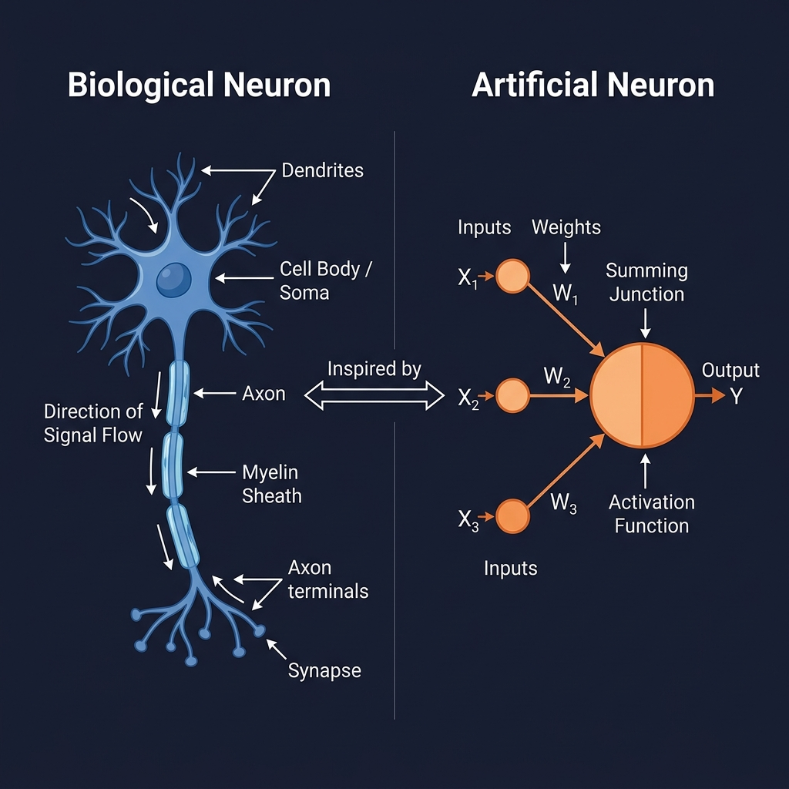
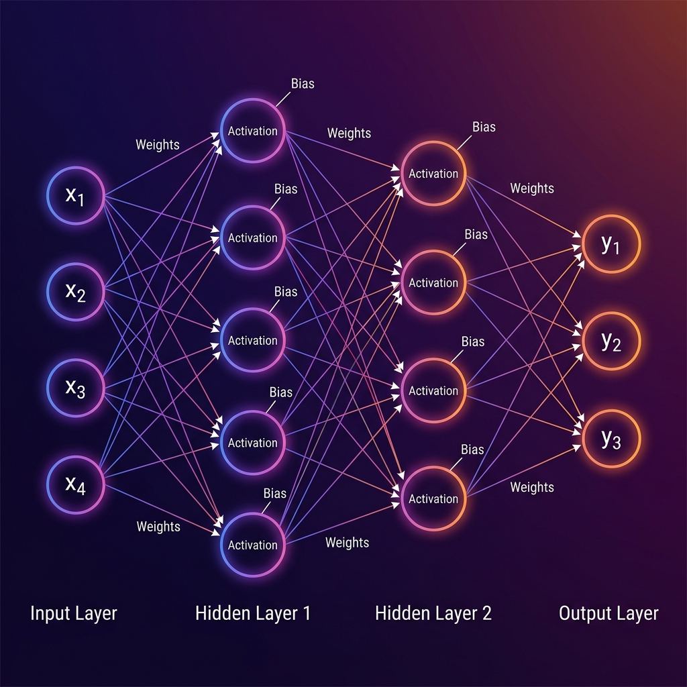
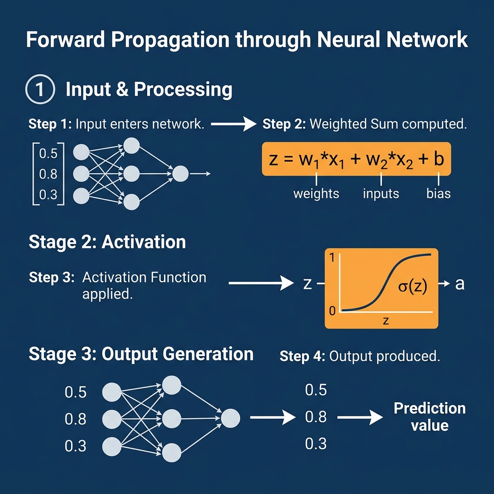
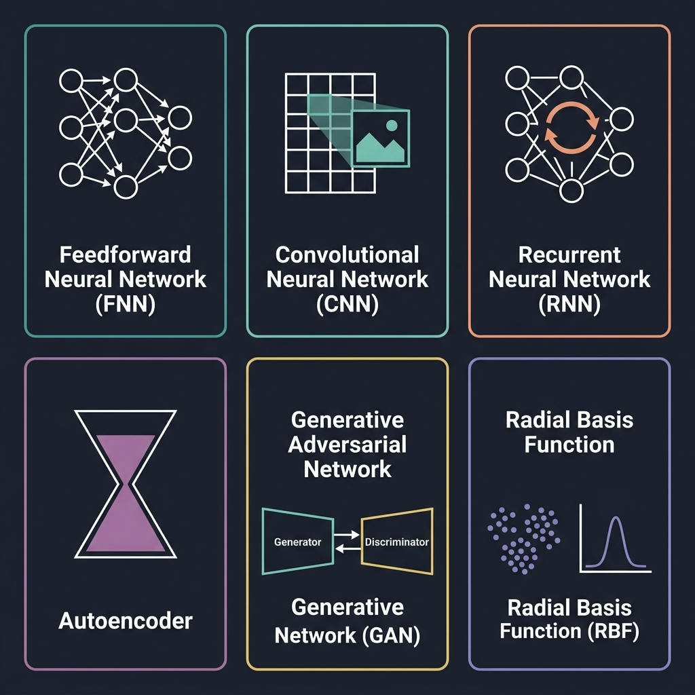

# 📘 Session 02 — Artificial Neural Networks (ANN)
### Course: Deep Learning Using Neural Networks | Aptech
### Duration: 2 Hours (TL2)
---

> **Professor's Opening Note:**
> *"In the last session, we saw the BIG picture — what Deep Learning is and why it matters. Today we go INSIDE the machine. We are going to crack open a neural network and look at every single part. By the end of this session, when someone says 'neural network', you will not just nod — you will be able to draw it, label every component, and explain exactly how information moves through it."*

---

## 📚 Table of Contents
1. [ANN Fundamentals in ML](#1-ann-fundamentals-in-ml)
2. [The Biological Inspiration](#2-the-biological-inspiration)
3. [Components of an ANN](#3-components-of-an-ann)
4. [How an ANN Works — Step by Step](#4-how-an-ann-works)
5. [The Mathematics Made Simple](#5-the-mathematics-made-simple)
6. [Types of ANNs](#6-types-of-anns)
7. [Key Terminology Glossary](#7-key-terminology-glossary)
8. [Recommended Videos](#8-recommended-videos)
9. [Summary & What's Next](#9-summary--whats-next)

---

## 1. ANN Fundamentals in ML

### 🧠 Real-Life Analogy: The Office Building

Imagine a large company's **office building** that processes customer orders:

- The **Ground Floor (Reception)** receives all incoming orders → This is the **Input Layer**
- The **Middle Floors (Processing Departments)** — accounting, logistics, quality control — each department transforms the order and passes it to the next → These are the **Hidden Layers**
- The **Top Floor (Executive Suite)** makes the final decision (approve/reject/modify the order) → This is the **Output Layer**

Information enters at the bottom, gets processed floor by floor, and a final decision emerges at the top. **This is EXACTLY how a neural network works.**

---

### 📖 What is an ANN?

An **Artificial Neural Network (ANN)** is a computational model **inspired by the structure and function of biological neural networks** (i.e., the human brain). It consists of:

- Interconnected **nodes** (artificial neurons)
- Organized into **layers**
- Connected by **weighted edges** (like synapses in the brain)
- That **learn** by adjusting these weights based on data

> 💡 **Key Phrase:** An ANN is a system that learns to map **inputs to outputs** by finding patterns in training data — without being explicitly programmed with rules.

### 🔑 Why ANNs Matter in ML

Traditional ML algorithms (like linear regression, decision trees) require humans to:
1. Select which features matter
2. Define the relationships between features
3. Manually engineer representations

**ANNs eliminate this entirely.** They automatically discover:
- Which features matter (feature selection)
- How features relate to each other (feature interaction)
- Complex non-linear patterns (feature transformation)

This is why ANNs can do things like recognize a face in a photo — something impossible to program with explicit rules.

---

## 2. The Biological Inspiration



### 🧬 The Real Brain Neuron

Your brain has approximately **86 billion neurons**. Each neuron:

| Brain Part | What It Does | Equivalent in ANN |
|-----------|-------------|------------------|
| **Dendrites** | Receive signals from other neurons | Input connections (x₁, x₂, x₃) |
| **Cell Body (Soma)** | Processes and integrates all incoming signals | Summation + Activation function |
| **Axon** | Transmits the processed signal forward | Output connection |
| **Synapse** | The junction between neurons — signal strength varies | **Weight (w)** |
| **Neurotransmitters** | Chemical strength of signal at synapse | Weight value magnitude |

### ⚡ How a Real Neuron Fires

A biological neuron fires (sends a signal) only when the **total incoming signal exceeds a threshold**.

```
If (sum of all incoming signals) > threshold:
    → FIRE! Send signal to next neuron
Else:
    → Stay quiet. Don't pass on the signal.
```

An artificial neuron does the SAME thing using an **activation function** — which we will explore fully in Session 4.

### 📊 Key Differences: Biological vs Artificial

| Feature | Biological Neuron | Artificial Neuron |
|---------|-----------------|-----------------|
| Speed | ~200 signals/second | Billions of operations/second |
| Number in brain | 86 billion | Thousands to billions (in models) |
| Connection type | Chemical (synapses) | Mathematical (weighted connections) |
| Learning | Structural changes in synapses | Numerical changes in weights |
| Energy | ~20 watts (whole brain) | Kilowatts (large GPU clusters) |
| Parallelism | Massive parallel processing | Sequential on CPU, parallel on GPU |

---

## 3. Components of an ANN



Every ANN has **5 fundamental components**. Learn these and you understand the skeleton of every neural network ever built.

---

### 🔵 Component 1: Neurons (Nodes)

A **neuron** is the basic processing unit of a neural network. Think of it as a tiny calculator that:
1. **Receives** multiple input numbers
2. **Multiplies** each input by a weight
3. **Adds** a bias value
4. **Applies** an activation function
5. **Outputs** a single number to the next layer

**Visual Representation of a Single Neuron:**
```
     x₁ ──── w₁ ──┐
     x₂ ──── w₂ ──┤
     x₃ ──── w₃ ──┤──► [Σ + b] ──► [Activation f()] ──► output
     x₄ ──── w₄ ──┘
                   ↑
                bias (b)

Where:
  x₁, x₂, x₃, x₄ = inputs
  w₁, w₂, w₃, w₄ = weights
  b               = bias
  Σ               = sum of all (input × weight)
  f()             = activation function
```

---

### ⚖️ Component 2: Weights (w)

**Weights** are the most important numbers in a neural network. They control **how much influence each input has** on the neuron's output.

### 🧊 Real-Life Analogy: The Recipe

Imagine you're making a smoothie and the recipe has ingredients:
- Banana, Strawberry, Yogurt, Ice

The **weights** are like **how much of each ingredient** you add:
- A lot of banana (high weight) → banana flavor dominates
- A tiny bit of ice (low weight) → barely affects the taste
- Negative amount... wait, that's not possible in a real smoothie — but in a neural network, **negative weights SUPPRESS a signal** (like an ingredient that reduces the output)

```python
# Example: Weights in practice
inputs  = [0.5,  0.8,  0.3]  # Input values
weights = [0.9, -0.4,  0.7]  # Connection strengths (can be negative!)

# Negative weight SUPPRESSES that input's influence
# Positive weight AMPLIFIES that input's influence

# A weight close to 0 means "this input barely matters"
# A weight close to 1 or -1 means "this input matters a LOT"
```

**Key Facts About Weights:**
- Weights start **randomly initialized** (usually small random numbers near 0)
- They are **updated during training** through a process called backpropagation
- A network "learns" = **its weights change** to reduce prediction errors
- Weights are the **memory** of the network — they store what the network has learned

---

### 🎯 Component 3: Bias (b)

**Bias** is a special extra value added to the weighted sum, **independent of any input**.

### 🧊 Real-Life Analogy: The Thermostat Offset

Imagine a thermostat that reads temperature sensors. Even with no sensors reading heat, the thermostat might have a **base setting** — it starts at 20°C even with no input. That base setting is the **bias**.

```
Without Bias:
  If all inputs are 0 → output is always 0 (stuck!)

With Bias:
  If all inputs are 0 → output = f(0 + b) = f(b) ≠ 0
  The bias lets the neuron "activate" even when inputs are zero
```

**Why Bias Matters:**
- Without bias, the activation function is always centered at zero
- Bias shifts the activation function left or right
- This gives the network **more flexibility** to fit complex patterns
- Think of bias as the **y-intercept** in a line equation (y = mx + **b**)

---

### 🏗️ Component 4: Layers

A neural network is organized into **layers** — groups of neurons that process data at the same "depth."

#### 📥 Input Layer
- **First layer** of the network
- Receives the raw data
- **Does NOT perform any computation** — just passes data through
- Number of neurons = number of features in your data

```
Example: Predicting house prices
  Input features: [size, bedrooms, age, location_score, distance_to_school]
  → Input layer has 5 neurons (one per feature)
```

#### 🔄 Hidden Layer(s)
- **Middle layers** between input and output
- Where ALL the learning happens
- Can have 1 to hundreds of layers (deep networks have many)
- Each neuron applies: weighted sum → add bias → activation function
- "Hidden" because we never directly observe these values during normal use

```
The more hidden layers → the more ABSTRACT the patterns learned:
  Layer 1 might learn: edges in an image
  Layer 2 might learn: shapes (nose, eye, ear)
  Layer 3 might learn: face parts
  Layer 4 might learn: complete faces
```

#### 📤 Output Layer
- **Final layer** — produces the network's prediction
- Number of neurons depends on the task:

| Task Type | Output Neurons | Example |
|-----------|---------------|---------|
| Binary Classification | 1 | Is it spam? (yes=1, no=0) |
| Multi-class Classification | N (one per class) | Which digit? (10 neurons for 0-9) |
| Regression | 1 | What is the house price? |
| Multi-output Regression | N | Predict x,y,z coordinates |

---

### ⚡ Component 5: Activation Functions

**Activation functions** decide whether a neuron should "fire" (activate) or not. They introduce **non-linearity** into the network.

### 🧊 Real-Life Analogy: The Light Switch vs The Dimmer

- **WITHOUT activation function:** The neuron is like an ON/OFF light switch — either fully on or fully off. Very limited.
- **WITH activation function:** The neuron is like a **dimmer switch** — it can produce any value between 0 and 1 (or -1 and 1), giving the network much more expressive power.

**Why Non-linearity Matters:**
```
Without activation functions (all linear):
  Layer1(Layer2(Layer3(x))) = just a single linear function
  → A 100-layer network = same as a 1-layer network!
  → Can ONLY learn straight-line relationships

With activation functions (non-linear):
  → Each layer transforms data in a non-linear way
  → Can learn curves, spirals, complex boundaries
  → Can separate ANY pattern (given enough neurons and layers)
```

**Common Activation Functions (Preview — covered fully in Session 4):**

| Function | Formula | Range | Use Case |
|----------|---------|-------|---------|
| **Sigmoid** | 1/(1+e⁻ˣ) | (0, 1) | Binary output |
| **ReLU** | max(0, x) | (0, ∞) | Hidden layers (most common) |
| **Tanh** | (eˣ-e⁻ˣ)/(eˣ+e⁻ˣ) | (-1, 1) | Hidden layers |
| **Softmax** | eˣⁱ/Σeˣʲ | (0,1) sum=1 | Multi-class output |

---

## 4. How an ANN Works



### 🔄 The ANN Learning Cycle — 4 Phases

Think of training a neural network like **coaching a student for an exam:**

```
PHASE 1: FORWARD PASS (The Student Attempts the Question)
  Data flows → Input Layer → Hidden Layers → Output Layer
  Network makes a PREDICTION

PHASE 2: LOSS CALCULATION (Mark the Paper)
  Compare prediction to correct answer
  Calculate the ERROR (how wrong was it?)

PHASE 3: BACKWARD PASS / BACKPROPAGATION (Teacher Reviews Mistakes)
  Error propagates BACKWARDS through the network
  Each weight gets told: "You contributed THIS MUCH to the error"

PHASE 4: WEIGHT UPDATE (Student Corrects Their Approach)
  Weights are adjusted slightly to reduce the error
  Using a rule called GRADIENT DESCENT

Repeat Phases 1–4 thousands of times → Network improves!
```

---

### 📡 Phase 1: Forward Propagation (Detailed)

Let's trace a single number through a tiny network, step by step.

**Example:** Predicting if a student will pass (1) or fail (0) based on:
- x₁ = Hours studied (e.g., 0.8 after normalization)
- x₂ = Attendance rate (e.g., 0.6 after normalization)

**Step 1: At the Hidden Neuron**
```
Inputs:  x₁ = 0.8,  x₂ = 0.6
Weights: w₁ = 0.5,  w₂ = 0.4
Bias:    b  = 0.1

Weighted Sum:
  z = (x₁ × w₁) + (x₂ × w₂) + b
  z = (0.8 × 0.5) + (0.6 × 0.4) + 0.1
  z = 0.40 + 0.24 + 0.1
  z = 0.74

Apply Sigmoid Activation:
  a = 1 / (1 + e^(-z))
  a = 1 / (1 + e^(-0.74))
  a = 1 / (1 + 0.477)
  a = 1 / 1.477
  a ≈ 0.677
```

**Step 2: At the Output Neuron**
```
Input:   a = 0.677  (output from hidden layer)
Weight:  w = 0.9
Bias:    b = -0.1

z_out = (0.677 × 0.9) + (-0.1) = 0.609 - 0.1 = 0.509
Output = Sigmoid(0.509) ≈ 0.625

Prediction: 0.625 → rounds to 1 (PASS) ✓
```

---

### 📉 Phase 2: Loss Calculation

**Loss** (also called **Cost** or **Error**) measures HOW WRONG the network's prediction is.

```
Actual Answer:   y_true = 1  (student actually passed)
Network Output:  y_pred = 0.625

Most Common Loss Function (Binary Cross-Entropy):
  Loss = -[y_true × log(y_pred) + (1-y_true) × log(1-y_pred)]
  Loss = -[1 × log(0.625) + 0 × log(0.375)]
  Loss = -[1 × (-0.47) + 0]
  Loss = 0.47

Goal: Make this Loss as SMALL as possible → Means the network is correct
```

---

### ⬅️ Phase 3: Backpropagation (Conceptual Overview)

**Backpropagation** is the algorithm that figures out how much each weight contributed to the error.

### 🧊 Real-Life Analogy: The Blame Game

Imagine a factory assembly line makes a defective product:
- Worker A installed part X incorrectly (70% of the fault)
- Worker B installed part Y slightly wrong (20% of the fault)
- Worker C installed part Z perfectly (10% of the fault)

Backpropagation does EXACTLY this — it **assigns blame** (gradient) to each weight based on how much it contributed to the final error.

```
Forward:  Input → → → → → Error
Backward: Input ← ← ← ← Error (blame flows back)

Each weight receives: "Your contribution to the error was X"
Each weight then adjusts: "I'll change by -learning_rate × X"
```

> 📌 **Note:** We will study backpropagation in full mathematical detail in Session 5. Today, understand the CONCEPT.

---

### 🎯 Phase 4: Gradient Descent — Weight Update

**Gradient Descent** is the optimization algorithm that updates weights to reduce the loss.

### 🧊 Real-Life Analogy: Hiking Down a Foggy Mountain

You are lost on a mountain in thick fog. Your goal: **reach the valley (lowest point = minimum loss)**.

Strategy: At every step, feel the slope under your feet and take a **small step downhill**.

- The **mountain** = the loss landscape
- The **valley** = minimum possible loss
- Your **position** = current weight values
- **Step size** = Learning Rate (how big each update is)

```
New Weight = Old Weight - (Learning Rate × Gradient)

Where:
  Learning Rate = how big each step is (e.g., 0.01)
  Gradient      = the slope (direction of steepest descent)
```

**Learning Rate Matters:**
```
Too HIGH learning rate → Overshoot the valley, bounce around
Too LOW learning rate  → Take forever to reach the valley
Just right            → Smooth, efficient descent to the minimum
```

---

## 5. The Mathematics Made Simple

### 📐 The Complete Forward Pass Formula

For a single neuron:
```
z = w₁x₁ + w₂x₂ + w₃x₃ + ... + wₙxₙ + b
a = f(z)

Where:
  z    = weighted sum (pre-activation)
  a    = activation (post-activation) = output of this neuron
  x    = inputs
  w    = weights
  b    = bias
  f()  = activation function
```

**In vector notation (more compact):**
```
z = W·X + b
a = f(z)

Where:
  W = weight vector [w₁, w₂, w₃, ...]
  X = input vector  [x₁, x₂, x₃, ...]
  · = dot product (multiply corresponding elements and sum them)
```

### 📊 Concrete Numerical Example (Complete)

```
Network: 2 inputs → 1 hidden (2 neurons) → 1 output
Task: Will it rain tomorrow? (1=Yes, 0=No)
Inputs: [Temperature=0.7, Humidity=0.9] (normalized 0-1)

LAYER 1 - Hidden Neuron 1:
  w = [0.3, 0.8], b = 0.2
  z₁ = 0.3(0.7) + 0.8(0.9) + 0.2 = 0.21 + 0.72 + 0.2 = 1.13
  a₁ = sigmoid(1.13) = 0.756

LAYER 1 - Hidden Neuron 2:
  w = [0.6, 0.2], b = -0.1
  z₂ = 0.6(0.7) + 0.2(0.9) + (-0.1) = 0.42 + 0.18 - 0.1 = 0.50
  a₂ = sigmoid(0.50) = 0.622

LAYER 2 - Output Neuron:
  Inputs: [a₁=0.756, a₂=0.622]
  w = [0.7, 0.5], b = 0.1
  z_out = 0.7(0.756) + 0.5(0.622) + 0.1 = 0.529 + 0.311 + 0.1 = 0.940
  output = sigmoid(0.940) = 0.719

Prediction: 0.719 → YES, it will likely rain (>0.5 threshold)
```

---

## 6. Types of ANNs



Different problems require different neural network architectures. Think of them as **specialized tools** — a hammer for nails, a screwdriver for screws.

---

### 🔷 Type 1: Feedforward Neural Network (FNN / MLP)

**The simplest and most foundational type.**

- Data flows **only forward** — input → hidden → output
- No loops, no cycles, no memory
- Also called **Multi-Layer Perceptron (MLP)**

```
Input ──► Hidden ──► Output
                    (one direction only)
```

**Best for:**
- Tabular/structured data (spreadsheets, databases)
- Simple classification and regression
- When data has no sequential or spatial structure

**Real Examples:**
- Predicting loan approval from customer features
- Classifying email as spam/not-spam from word counts
- Predicting house prices from property features

---

### 🔷 Type 2: Convolutional Neural Network (CNN)

**Specialized for grid-like data — especially images.**

- Uses **convolutional filters** that scan across the input
- Automatically detects features like edges, textures, shapes
- Dramatically fewer parameters than a fully-connected FNN on images

```
Image ──► [Conv Layer] ──► [Pool Layer] ──► [FC Layer] ──► Label
          (detects features)  (reduces size)   (classifies)
```

**Best for:**
- Image classification (Is this a cat or dog?)
- Object detection (Where is the car in this image?)
- Medical imaging (Is this tumor cancerous?)
- Video analysis

**Real Examples:**
- Google Photos face tagging
- Self-driving car obstacle detection
- Instagram content moderation

> 📌 **We cover CNNs in full detail in Sessions 9-10**

---

### 🔷 Type 3: Recurrent Neural Network (RNN)

**Specialized for sequential data — data where ORDER matters.**

- Has **loops** — output from a step is fed back as input to the next step
- Maintains a **"memory"** of previous inputs
- The hidden state carries information from past timesteps

```
Input₁ ──► [RNN] ──► Output₁
              ↕ (memory)
Input₂ ──► [RNN] ──► Output₂
              ↕ (memory)
Input₃ ──► [RNN] ──► Output₃
```

**Best for:**
- Natural Language Processing (text, sentences)
- Time-series prediction (stock prices, weather)
- Speech recognition
- Language translation

**Real Examples:**
- Google Translate
- Speech-to-text systems
- Stock price prediction
- Autocomplete on your phone keyboard

> 📌 **We cover RNNs in full detail in Sessions 11**

---

### 🔷 Type 4: Autoencoder

**Specialized for compression and reconstruction.**

- Has an **encoder** (compresses data) and a **decoder** (reconstructs data)
- The middle layer (bottleneck) learns the essential compressed representation
- Trained to output what it received as input (reconstruction)

```
Input ──► [Encoder] ──► [Bottleneck] ──► [Decoder] ──► Reconstructed Input
         (compress)    (compressed         (expand)
                       representation)
```

**Best for:**
- Dimensionality reduction
- Anomaly detection (things that reconstruct poorly are anomalies)
- Image denoising
- Data generation (Variational Autoencoders)

**Real Examples:**
- Netflix removing noise from video streams
- Detecting credit card fraud (anomalies reconstruct poorly)
- Compressing medical images for storage

> 📌 **We cover Autoencoders (VAE) in Session 12**

---

### 🔷 Type 5: Generative Adversarial Network (GAN)

**Specialized for generating new, realistic data.**

- Two networks **competing** against each other:
  - **Generator:** Creates fake data (tries to fool the Discriminator)
  - **Discriminator:** Judges if data is real or fake (tries to catch the Generator)
- They train together — the Generator gets better at fooling, the Discriminator gets better at judging
- Eventually, the Generator creates incredibly realistic outputs

```
[Generator] ──► Fake Image ──► [Discriminator] ──► Real or Fake?
    ↑                                  |
    └──────── Feedback ────────────────┘
    (Generator improves based on how often it fools Discriminator)
```

**Best for:**
- Generating realistic images (faces, art, landscapes)
- Data augmentation (creating extra training data)
- Image-to-image translation

**Real Examples:**
- DALL-E / Midjourney (text-to-image generation)
- Deepfake generation (and detection)
- Artistic style transfer
- Generating synthetic medical data for research

> 📌 **We cover GANs in full detail in Sessions 23-24**

---

### 🔷 Type 6: Radial Basis Function Network (RBF)

**A specialized network using radial basis functions as activation.**

- Each hidden neuron has a **center point** in the input space
- Neurons activate based on **distance** from that center
- Particularly effective for interpolation and function approximation

**Best for:**
- Function approximation
- Time-series prediction
- Control systems

---

### 📊 ANN Types — Quick Reference Table

| Type | Data Type | Direction | Key Feature | Sessions |
|------|-----------|-----------|-------------|---------|
| **FNN/MLP** | Tabular | Forward only | Simple, versatile | 3, 4 |
| **CNN** | Images/Grids | Forward only | Convolutional filters | 9, 10 |
| **RNN** | Sequences/Text | Forward + loops | Sequential memory | 11 |
| **Autoencoder** | Any | Encode+Decode | Compression/Reconstruction | 12 |
| **GAN** | Any (generate) | Two competing networks | Generative capability | 13 |
| **RBF** | Tabular | Forward only | Distance-based activation | Reference |

---

## 7. Key Terminology Glossary

| Term | Plain English Definition |
|------|--------------------------|
| **ANN** | Artificial Neural Network — a computational model inspired by biological brains |
| **Neuron (Node)** | Single computational unit that takes inputs, computes a weighted sum, applies activation |
| **Weight** | A number controlling how much influence one neuron has on the next |
| **Bias** | An extra value added to the weighted sum, independent of inputs; shifts the activation |
| **Input Layer** | First layer; receives raw data, performs no computation |
| **Hidden Layer** | Middle layer(s) where all learning and feature extraction happens |
| **Output Layer** | Final layer; produces the network's prediction |
| **Activation Function** | Mathematical function that introduces non-linearity; decides if/how much a neuron fires |
| **Forward Pass** | The process of data flowing from input to output to produce a prediction |
| **Loss Function** | Measures how wrong the network's prediction is (also: cost function, error function) |
| **Backpropagation** | Algorithm that calculates how much each weight contributed to the loss |
| **Gradient Descent** | Optimization algorithm that updates weights to reduce loss |
| **Learning Rate** | Controls how big each weight update step is |
| **Epoch** | One complete pass through the entire training dataset |
| **Batch** | A subset of training data processed before weights are updated |
| **Parameters** | All the weights and biases in a network (what gets "learned") |
| **Hyperparameters** | Settings YOU choose before training (learning rate, # layers, # neurons) |

---

## 8. 🎬 Recommended Videos

### 🥇 Video 1 — The BEST Visual Explanation of Neural Networks (REQUIRED)
**"But what is a neural network? | Chapter 1, Deep learning"**
- 📺 Channel: **3Blue1Brown**
- 🔗 Link: [https://www.youtube.com/watch?v=aircAruvnKk](https://www.youtube.com/watch?v=aircAruvnKk)
- ⏱️ Duration: ~19 minutes
- 🎯 Why Watch: Grant Sanderson uses stunning animations to show neurons, weights, and layers working together on the MNIST handwritten digit dataset. After watching this, the ANN will click visually like nothing else can achieve.

---

### 🥈 Video 2 — Gradient Descent and Backpropagation (Visual)
**"What is backpropagation really doing? | Chapter 3, Deep learning"**
- 📺 Channel: **3Blue1Brown**
- 🔗 Link: [https://www.youtube.com/watch?v=Ilg3gGewQ5U](https://www.youtube.com/watch?v=Ilg3gGewQ5U)
- ⏱️ Duration: ~14 minutes
- 🎯 Why Watch: Visually shows exactly how errors flow backwards and how weights get updated. The mountain/gradient descent analogy is illustrated with beautiful animations.

---

### 🥉 Video 3 — Neural Networks: Main Ideas (Step-by-Step)
**"Neural Networks Pt. 1: Inside the Black Box"**
- 📺 Channel: **StatQuest with Josh Starmer**
- 🔗 Link: [https://www.youtube.com/watch?v=CqOfi41LfDw](https://www.youtube.com/watch?v=CqOfi41LfDw)
- ⏱️ Duration: ~20 minutes
- 🎯 Why Watch: Josh explains weights, biases, and activations using incredibly simple numerical examples. Perfect complement to 3Blue1Brown — less visual, more mathematical step-by-step.

---

### 🎯 Video 4 — Types of Neural Networks Overview
**"Types of Neural Networks | Deep Learning Tutorial"**
- 📺 Channel: **Simplilearn**
- 🔗 Link: [https://www.youtube.com/watch?v=oJNHXPs0XDk](https://www.youtube.com/watch?v=oJNHXPs0XDk)
- ⏱️ Duration: ~15 minutes
- 🎯 Why Watch: A clear, well-organized overview of the main ANN types (FNN, CNN, RNN, Autoencoder, GAN) with real-world use cases. Great for today's "Types of ANNs" section.

---

### 🔥 Video 5 — Weights and Biases Explained Simply
**"Neural Networks: Weights, Biases, and Activation Functions Explained"**
- 📺 Channel: **Sentdex**
- 🔗 Link: [https://www.youtube.com/watch?v=aircAruvnKk](https://www.youtube.com/watch?v=IN2XmBhILt4)
- ⏱️ Duration: ~13 minutes
- 🎯 Why Watch: Practical, code-oriented explanation of how weights and biases actually look in Python. Bridges the gap between theory (today) and coding (Session 3+).

---

## 9. Summary & What's Next

### ✅ What You Learned Today

| Topic | Key Takeaway |
|-------|-------------|
| **ANN Fundamentals** | ANNs are inspired by the brain; they learn by adjusting weights on connections |
| **ANN Components** | 5 components: Neurons, Weights, Biases, Layers (Input/Hidden/Output), Activation Functions |
| **How ANNs Work** | 4 phases: Forward Pass → Loss Calculation → Backpropagation → Weight Update |
| **The Math** | z = W·X + b, then a = f(z) — this formula runs inside EVERY neuron |
| **Types of ANNs** | FNN, CNN, RNN, Autoencoder, GAN, RBF — each for different data types |

### 🗺️ Where Each ANN Type Leads in This Course

```
Session 2  (Today):  ANN Fundamentals — Components & Types
Session 3-4:         FNN — Feedforward Networks (coding starts!)
Session 5:           Training — Backpropagation deep dive
Session 6:           Activation Functions — ALL of them
Session 9-10:        CNN — Convolutional Networks for images
Session 11:          RNN — Recurrent Networks for sequences
Session 12:          VAE — Variational Autoencoders
Session 13-14:       GAN — Generative Adversarial Networks
Session 15:          Style Transfer (CNN + advanced techniques)
```

### 🚀 What's Coming Next

**Session 3 (TL3) — Feedforward Neural Networks (FNN):**
- We zoom in on the most fundamental ANN type
- You will understand the perceptron — the atomic unit of all neural networks
- We will run through ALL the activation functions with their pros and cons
- **First coding begins!** We write our first neural network in Python

---

> 📌 **Instructor Reminder:**
> - Confirm ALL students completed the environment setup (Task 2, Session 1 Assignment)
> - Run `environment_check.py` at the start — anyone with ❌ should be helped NOW, not later
> - The mathematical examples in Section 5 should be worked through ON THE WHITEBOARD live

---
*© 2024 Aptech Limited | Deep Learning Using Neural Networks | Session 02*
