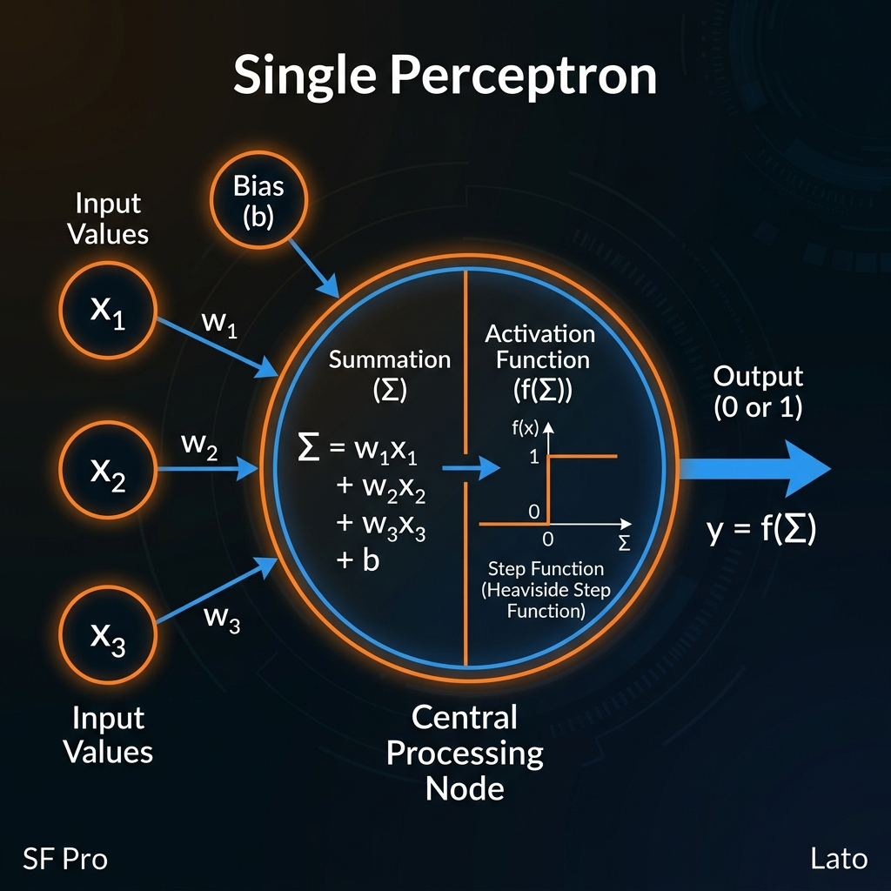
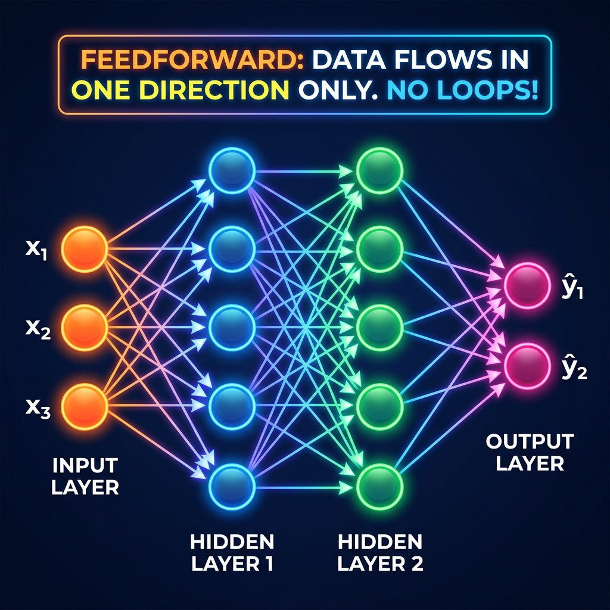
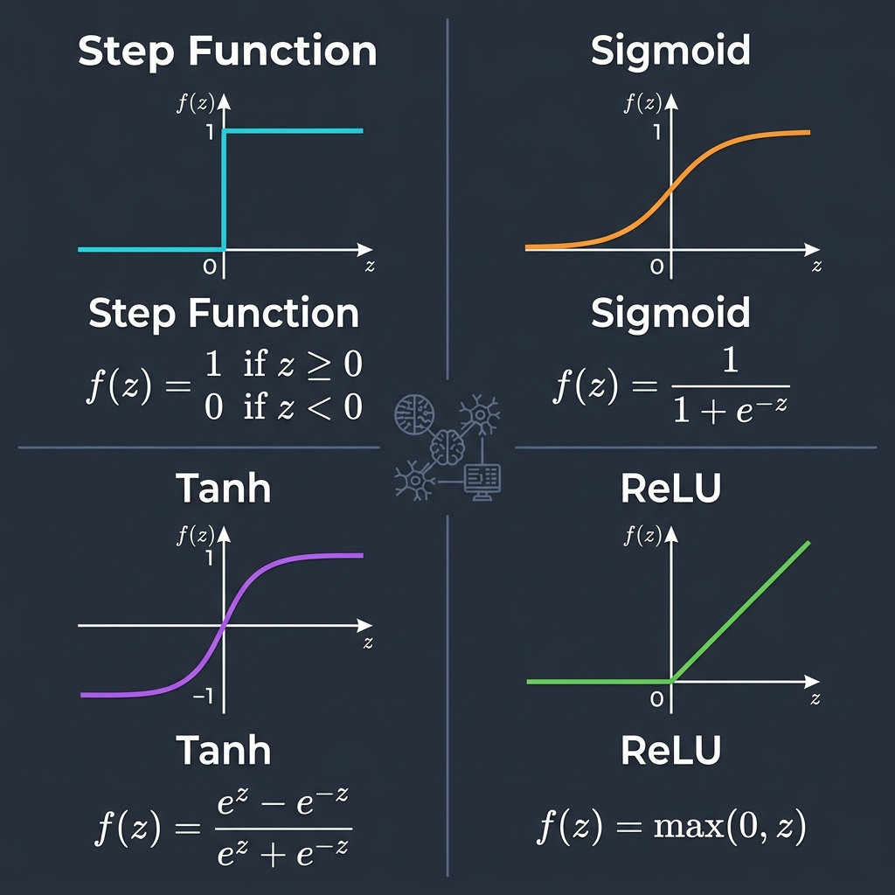

# 📘 Session 03 — Feedforward Neural Networks (FNN)
### Course: Deep Learning Using Neural Networks | Aptech
### Duration: 2 Hours (TL3)
---

> **Professor's Opening Note:**
> *"Today, we build the foundation. We are going to study the Feedforward Neural Network — the simplest, purest form of artificial intelligence. If you understand this, you understand the core mechanics of ChatGPT, self-driving cars, and facial recognition. We'll start with the atom (the Perceptron) and build up to the organism (the FNN)."*

---

## 📚 Table of Contents
1. [The Perceptron: The Foundational Building Block](#1-the-perceptron-the-foundational-building-block)
2. [Fundamental Concepts of Feedforward Neural Networks (FNNs)](#2-fundamental-concepts-of-feedforward-neural-networks-fnns)
3. [The Problem with Linear Models (XOR Problem)](#3-the-problem-with-linear-models-xor-problem)
4. [Activation Functions: The Secret Sauce](#4-activation-functions-the-secret-sauce)
5. [Assessing the Impact of Activation Functions](#5-assessing-the-impact-of-activation-functions)
6. [Key Terminology Glossary](#6-key-terminology-glossary)
7. [Recommended Videos](#7-recommended-videos)
8. [Summary & What's Next](#8-summary--whats-next)

---

## 1. The Perceptron: The Foundational Building Block

Before we can build a complex network, we must understand its smallest unit: the **Perceptron**.

Invented in 1957 by Frank Rosenblatt, the Perceptron was originally intended to be a physical machine, not just a software algorithm! It is the simplest possible artificial neural network: **a network with only ONE neuron.**



### 🧠 Real-Life Analogy: The Bouncer

Imagine a strict Bouncer at a nightclub deciding who gets in (Output = 1) and who doesn't (Output = 0).
The Bouncer looks at three things (Inputs):
1. $x_1$: Are they dressed well? (1 for yes, 0 for no)
2. $x_2$: Are they on the guest list? (1 for yes, 0 for no)
3. $x_3$: Are they intoxicated? (1 for yes, 0 for no)

But the Bouncer cares about these things differently (**Weights**):
- Being on the guest list is VERY important ($w_2 = 5$)
- Being dressed well is somewhat important ($w_1 = 2$)
- Being intoxicated is a HUGE negative ($w_3 = -6$)

The Bouncer calculates a score:
`Score = (x_1 * 2) + (x_2 * 5) + (x_3 * -6)`

If the score passes his strict threshold (**Bias/Step Function**), he lets them in. Otherwise, they are rejected.

### 📖 How the Perceptron Works Mathematically

A perceptron takes multiple binary inputs (0 or 1) and produces a single binary output (0 or 1).

1. It multiplies each input $x_i$ by its corresponding weight $w_i$.
2. It sums all these values together.
3. It adds a bias $b$.
4. It passes the result through a **Step Function**.

**The Step Function:**
```
If (Sum + Bias) > 0  → Output 1
If (Sum + Bias) <= 0 → Output 0
```
*Note: Early perceptrons used a threshold instead of a bias. Saying "Sum > Threshold" is mathematically identical to saying "Sum - Threshold > 0", where "-Threshold" is the Bias!*

### ⚠️ The Limitations of the Perceptron
A single perceptron is a **Linear Classifier**. It can only separate data that can be divided by a single straight line. If the data is complex (like a circle of red dots surrounded by blue dots), a single perceptron will **always fail**.

To solve complex problems, we need to connect many perceptrons together. When we do that, we get a Feedforward Neural Network.

---

## 2. Fundamental Concepts of Feedforward Neural Networks (FNNs)

When we stack multiple neurons in layers, we create a **Multi-Layer Perceptron (MLP)**, more commonly known as a **Feedforward Neural Network (FNN)**.



### 🌊 Why "Feedforward"?
It is called "Feedforward" because **information only moves in one direction: FORWARD**.
- From the Input Layer...
- Through the Hidden Layers...
- To the Output Layer.

There are **NO cycles, NO loops, and NO memory**. If you feed an FNN the exact same image twice, it will give you the exact same answer twice, completely unaware that it just saw the image 1 second ago. (Networks *with* memory are called Recurrent Neural Networks, which we cover in Session 11).

### 🏗️ Architecture Breakdown

1. **Input Layer:** Just holds the data. If your image is 28x28 pixels, you have 784 input neurons. (No math happens here).
2. **Hidden Layers:** Where the magic happens. A network can have 1 hidden layer (Shallow) or 100 hidden layers (Deep). Each layer extracts increasingly complex features.
3. **Output Layer:** Provides the final prediction.

### 🔗 "Fully Connected" (Dense) Layers
In a standard FNN, every neuron in Layer A is connected to **every single neuron** in Layer B. Because the connections are so dense, these layers are often called **Dense Layers** in frameworks like Keras.

If Layer 1 has 10 neurons, and Layer 2 has 20 neurons, there are $10 * 20 = 200$ weights connecting them!

---

## 3. The Problem with Linear Models (XOR Problem)

To understand why FNNs are powerful, we must understand the historical **XOR Problem** that almost killed AI research in the 1970s (The AI Winter).

Imagine plotting points on a graph based on two inputs (x1, x2):

**The OR Gate (Linear):**
If either x1 or x2 is 1, output 1 (Blue). Otherwise 0 (Red).
```
(0,1)[B]     (1,1)[B]
(0,0)[R]     (1,0)[B]
```
You can easily draw a single straight line to separate the Red from the Blues. A single Perceptron can solve this.

**The XOR Gate (Non-Linear):**
Output 1 (Blue) ONLY if x1 and x2 are different. Output 0 (Red) if they are the same.
```
(0,1)[B]     (1,1)[R]
(0,0)[R]     (1,0)[B]
```
Try drawing ONE straight line to separate the Reds from the Blues. **You can't.**

A single layer of neurons can only draw straight lines. To draw curves, or to combine multiple lines to box in the blue dots, we need **Hidden Layers** AND **Activation Functions**.

---

## 4. Activation Functions: The Secret Sauce

If weights and biases are the engine of a neural network, the Activation Function is the steering wheel. Without it, the network can only drive in straight lines.

### 🧠 Real-Life Analogy: The Volume Knob vs. The Light Switch

- The original Perceptron used a **Step Function** (Light Switch). It is either ON (1) or OFF (0). There is no "slightly on".
- Modern networks use functions like **Sigmoid** or **ReLU** (Volume Knob). They allow for nuance: "I am 80% confident this is a cat."



An Activation Function $f(x)$ takes the raw weighted sum ($z$) from the neuron and "squishes" or transforms it before passing it to the next layer.

### 🌟 Why are they necessary? (The property of Non-Linearity)
If you do not use an activation function (or use a linear one like $f(x) = x$), a neural network with 100 layers behaves exactly the same mathematically as a network with 1 layer.
Why? Because the sum of linear functions is just another linear function.
Activation functions inject **non-linearity**, allowing the network to learn complex curves, circles, and jagged boundaries to separate data.

---

## 5. Assessing the Impact of Activation Functions

Let's look at the "Big Four" activation functions you will use in your career.

### 1. The Step Function (The Grandfather)
- **Formula:** $f(z) = 1$ if $z > 0$, else $0$
- **Output Range:** {0, 1}
- **Impact:** Used in early perceptrons.
- **Problem:** It is completely flat almost everywhere, meaning its derivative (slope) is 0. Since networks learn by calculating slopes (gradient descent), a network using Step Functions **cannot learn**. It is rarely used today.

### 2. Sigmoid (The Classic)
- **Formula:** $f(z) = \frac{1}{1 + e^{-z}}$
- **Output Range:** (0, 1)
- **Impact:** Transforms any number into a probability between 0 and 1. Excellent for the **Output Layer** when you need a binary answer (e.g., "Is this a dog? 0.85 -> 85% Yes").
- **Problem:** "Vanishing Gradient". For very high or very low values of $z$, the curve becomes flat. The network stops learning.

### 3. Tanh (Hyperbolic Tangent)
- **Formula:** $f(z) = \frac{e^z - e^{-z}}{e^z + e^{-z}}$
- **Output Range:** (-1, 1)
- **Impact:** Similar to Sigmoid, but centered at zero. Because it is zero-centered, it often makes the network learn faster than Sigmoid in hidden layers.
- **Problem:** Still suffers from the Vanishing Gradient problem at the extremes.

### 4. ReLU (Rectified Linear Unit) — The Modern Champion
- **Formula:** $f(z) = \max(0, z)$
- **Output Range:** [0, $\infty$)
- **Impact:** The most popular activation function in the world for **Hidden Layers**. If the input is positive, it passes it through unchanged. If negative, it outputs zero.
- **Why it wins:** It is incredibly fast to compute (no complex exponential math). Because the positive side never flattens out, it fixes the Vanishing Gradient problem! Deep networks can finally learn.
- **Problem:** "Dying ReLU". If a neuron's weights get pushed so that $z$ is always negative, the neuron outputs 0 forever and "dies" (stops learning).

### 📋 Professor's Cheat Sheet: Which one do I use?
| Where in the Network? | Task Type | Best Activation Function |
|-----------------------|-----------|--------------------------|
| **Hidden Layers** | Almost anything | **ReLU** (Default choice!) |
| **Output Layer** | Binary Classification (Yes/No) | **Sigmoid** |
| **Output Layer** | Multi-class (Cat vs Dog vs Bird) | **Softmax** (Covered later) |
| **Output Layer** | Regression (Predicting a price) | **Linear / None** |

---

## 6. Key Terminology Glossary

| Term | Definition |
|------|------------|
| **Perceptron** | A single artificial neuron with a step activation function. The earliest form of a neural net. |
| **Feedforward** | Information flows strictly from input to output. No loops. |
| **MLP** | Multi-Layer Perceptron. Another name for a Feedforward Neural Network. |
| **Dense Layer** | A layer where every neuron is connected to every neuron in the previous layer. |
| **Activation Function** | A mathematical formula applied to a neuron's output to introduce non-linearity. |
| **Non-Linearity** | The property that allows neural networks to learn complex, non-straight-line patterns. |
| **Vanishing Gradient** | A problem where the learning signal gets too small as it travels backward through deep layers, causing learning to stop. |
| **ReLU** | Rectified Linear Unit. The standard activation function for modern hidden layers. |

---

## 7. 🎬 Recommended Videos

### 🥇 Video 1 — The Perceptron Masterclass
**"Basics of The Perceptron in Neural Networks"**
- 📺 Channel: **The AI Hacker**
- 🔗 Link: [https://www.youtube.com/watch?v=RNYT9bECfOo](https://www.youtube.com/watch?v=RNYT9bECfOo)
- ⏱️ Duration: ~10 minutes
- 🎯 Why Watch: A crisp, focused breakdown of exactly how a single perceptron works before moving to multi-layer networks.

### 🥈 Video 2 — Activation Functions Explained Visually
**"Activation Functions in Neural Networks"**
- 📺 Channel: **StatQuest with Josh Starmer**
- 🔗 Link: [https://www.youtube.com/watch?v=68BZ5f7P94E](https://www.youtube.com/watch?v=68BZ5f7P94E) (Focuses on ReLU)
- ⏱️ Duration: ~15 minutes
- 🎯 Why Watch: Josh Starmer explains exactly why we need ReLU and how it solves the problems of older activation functions. "BAM!"

### 🥉 Video 3 — Feedforward Flow
**"Feedforward Neural Networks Explained"**
- 📺 Channel: **CodeEmporium**
- 🔗 Link: [https://www.youtube.com/watch?v=b0wF1kGv8S0](https://www.youtube.com/watch?v=b0wF1kGv8S0)
- ⏱️ Duration: ~12 minutes
- 🎯 Why Watch: Shows exactly how data travels left to right through dense layers.

---

## 8. Summary & What's Next

### ✅ What You Learned Today

| Topic | Key Takeaway |
|-------|-------------|
| **Perceptron** | A single neuron with a step function; a simple linear classifier. |
| **FNN Structure** | Data flows one way: Input $\rightarrow$ Hidden $\rightarrow$ Output. |
| **Non-Linearity** | Required to solve complex problems (like XOR); provided by Activation Functions. |
| **Activation Functions** | ReLU is king for hidden layers. Sigmoid is for binary outputs. |

### 🚀 What's Coming Next

**Session 4 (TL4) — Implementing FNNs in Python:**
- We move from theory to PRACTICE.
- You will write an FNN in Python to classify real data (the famous MNIST dataset).
- We will learn how to initialize networks properly.
- We will see the network *actually* train and improve its accuracy!

---
*© 2024 Aptech Limited | Deep Learning Using Neural Networks | Session 03*
