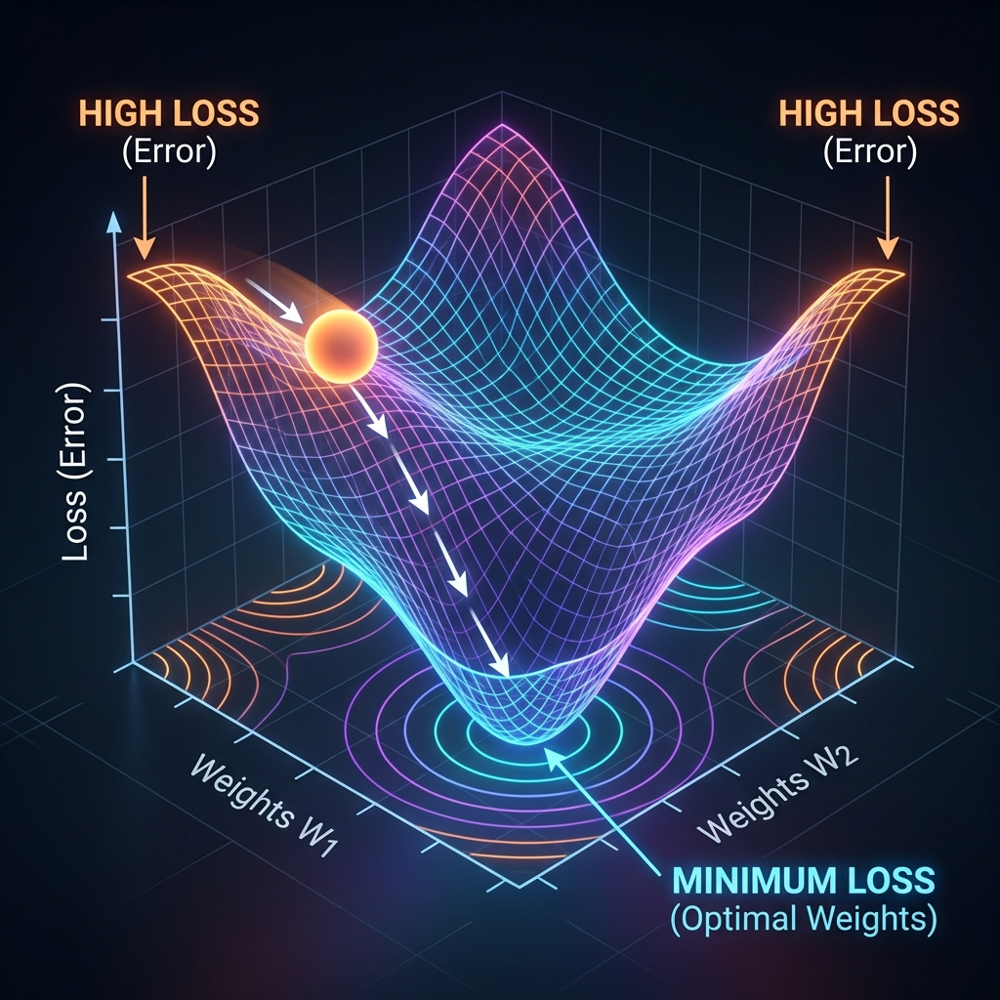
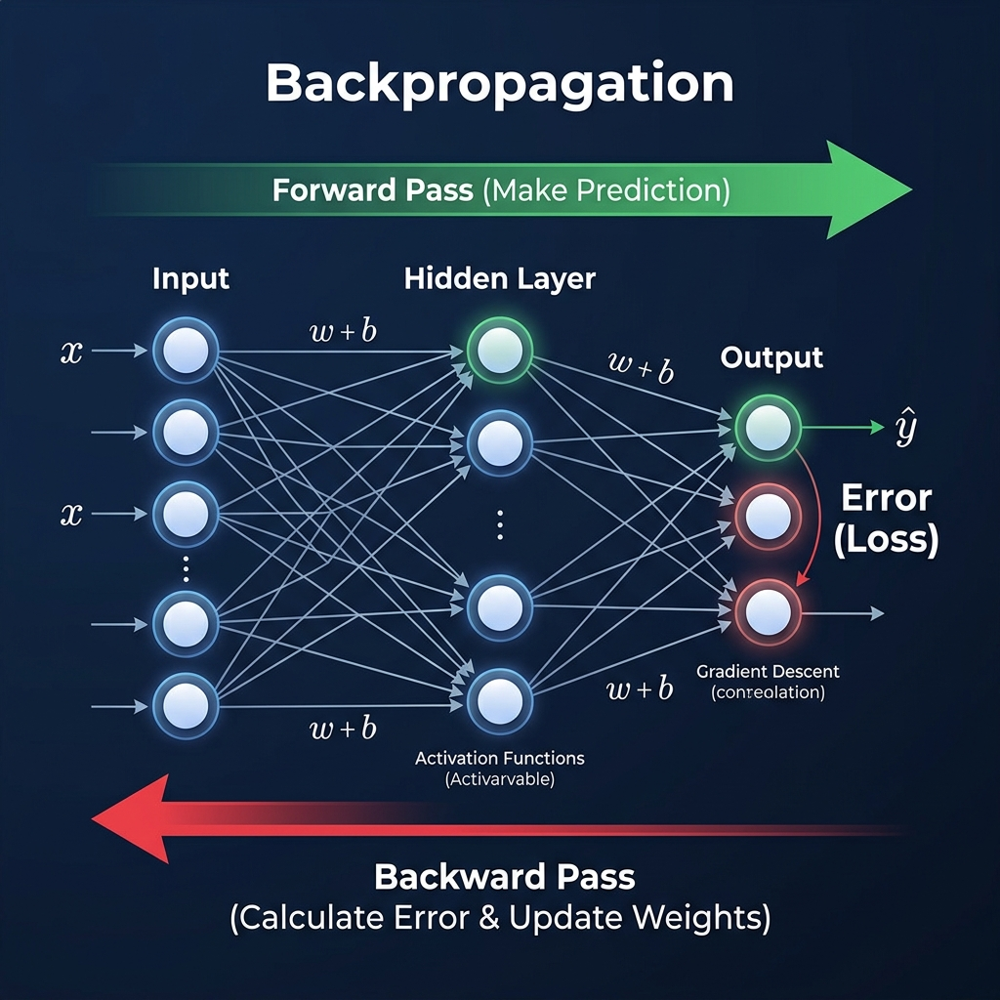
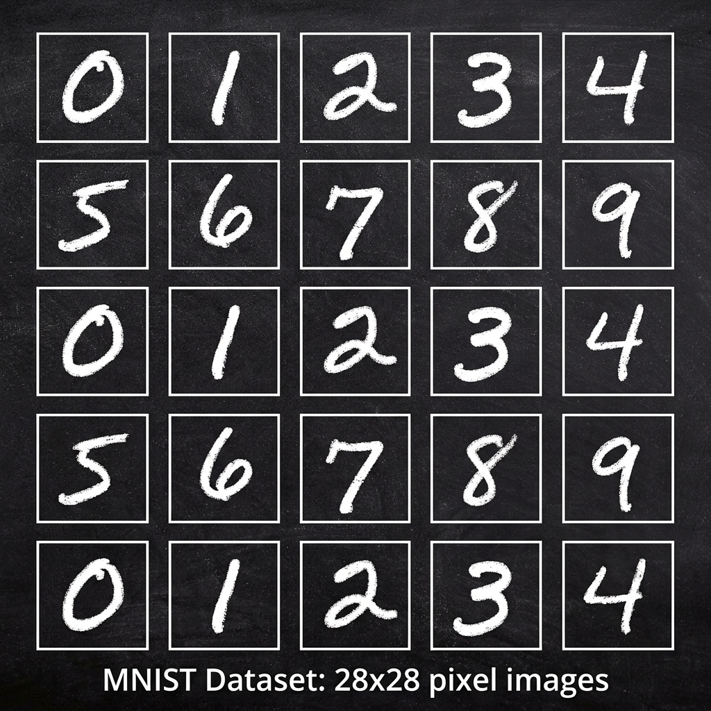

# 📘 Session 04 — Feedforward Neural Networks (Training & MNIST)
### Course: Deep Learning Using Neural Networks | Aptech
### Duration: 2 Hours (TL4)
---

> **Professor's Opening Note:**
> *"In the last session, we built the engine of a car (the FNN architecture). Today, we are going to put fuel in it and teach it how to drive. We will uncover the absolute core of machine learning: how a network actually learns from its mistakes using Gradient Descent and Backpropagation. Then, you will write your first real AI script to recognize handwritten digits!"*

---

## 📚 Table of Contents
1. [How Do Networks Learn? The 4-Step Cycle](#1-how-do-networks-learn-the-4-step-cycle)
2. [The Loss Function (Measuring the Error)](#2-the-loss-function-measuring-the-error)
3. [Gradient Descent (Finding the Bottom of the Valley)](#3-gradient-descent-finding-the-bottom-of-the-valley)
4. [Backpropagation (The Blame Game)](#4-backpropagation-the-blame-game)
5. [Training Terminology (Epochs, Batches, Learning Rate)](#5-training-terminology-epochs-batches-learning-rate)
6. [Hello World of AI: The MNIST Dataset](#6-hello-world-of-ai-the-mnist-dataset)
7. [Recommended Videos](#7-recommended-videos)
8. [Summary & What's Next](#8-summary--whats-next)

---

## 1. How Do Networks Learn? The 4-Step Cycle

When a neural network is first created, its weights and biases are completely random. It is entirely ignorant. If you show it a picture of a cat, it will guess randomly.

Training a neural network is an iterative process. It repeats these 4 steps millions of times:
1. **Forward Pass:** Make a guess.
2. **Loss Calculation:** Check how wrong the guess was.
3. **Backward Pass (Backpropagation):** Figure out which weights caused the error.
4. **Optimization (Gradient Descent):** Adjust the weights slightly to be less wrong next time.

---

## 2. The Loss Function (Measuring the Error)

Before a network can improve, it needs to know exactly how bad its current prediction is. We measure this using a **Loss Function** (or Cost Function).

### 🧠 Real-Life Analogy: The Archery Target
Imagine you are shooting arrows blindfolded. You fire an arrow (make a prediction). The trainer yells, "You are 10 meters away from the bullseye!" That distance (10 meters) is the **Loss**. Your goal is to minimize the Loss to 0.

### Common Loss Functions
- **Mean Squared Error (MSE):** Used for Regression (predicting continuous numbers like house prices). It squares the difference between the prediction and the actual value, penalizing large errors heavily.
- **Cross-Entropy Loss:** Used for Classification (categorizing items like Cat vs. Dog). It measures the difference between two probability distributions. If the network is 99% confident it's a dog, and it IS a dog, the loss is near 0. If it's 99% confident it's a dog, but it's actually a cat, the loss explodes to a massive number.

---

## 3. Gradient Descent (Finding the Bottom of the Valley)

Once we know our Loss, how do we adjust the weights? If a network has 1 million weights, we can't just guess which ones to change. We use **Gradient Descent**.

### 🧠 Real-Life Analogy: A Hiker in the Fog
Imagine you are hiking in the mountains, a thick fog rolls in, and you need to get down to the village at the bottom of the valley (the minimum loss). You can't see the village. What do you do?
You feel the ground with your feet. You find which direction slopes downward the steepest (the **Gradient**). You take a small step in that direction. You repeat this until the ground is flat.

In math terms:
1. We calculate the derivative (gradient) of the Loss Function with respect to every single weight.
2. The gradient tells us the direction of the steepest ascent.
3. We multiply the gradient by a small negative number (the **Learning Rate**) to step *down* the slope.
4. We update the weight: `New Weight = Old Weight - (Learning Rate * Gradient)`

---

## 4. Backpropagation (The Blame Game)

To do Gradient Descent, we need to know the gradient for every weight. How do we find the gradients for weights buried deep in the hidden layers? We use **Backpropagation** (Backward Propagation of Errors).

### 🧠 Real-Life Analogy: The Corporate Blame Game
1. The CEO (Output Layer) makes a terrible decision that loses the company $1 Million (High Loss).
2. The CEO blames the VP (Hidden Layer 2) who gave them bad data.
3. The VP blames the Managers (Hidden Layer 1) who compiled the reports.
4. The Managers blame the Interns (Input Layer).
The error is distributed backwards through the company, proportional to who had the most influence on the bad decision!

Mathematically, Backpropagation uses the **Chain Rule of Calculus** to efficiently calculate how much every single weight contributed to the final error, starting from the output and working backwards to the input.

---

## 5. Training Terminology (Epochs, Batches, Learning Rate)

To train a model effectively, you must understand these critical hyperparameters:

| Term | Definition | Analogy |
|------|------------|---------|
| **Epoch** | One complete pass through the ENTIRE training dataset. | Reading a textbook from cover to cover once. (Usually takes many epochs to learn). |
| **Batch Size** | How many samples the network looks at before updating its weights. | Reading 10 pages, stopping to take notes (updating weights), then reading 10 more. |
| **Learning Rate ($\alpha$)** | The size of the step taken during Gradient Descent. | The length of the hiker's stride. |

### ⚠️ The Goldilocks Problem of Learning Rate
- **Too High:** The hiker takes massive leaps, overshoots the valley bottom, and bounces up the other side (The model diverges/explodes).
- **Too Low:** The hiker takes millimeter-sized steps. It takes millions of years to reach the bottom (Training takes forever or gets stuck in a shallow ditch).
- **Just Right:** The model converges smoothly and quickly to the minimum error.

---

## 6. Hello World of AI: The MNIST Dataset

Every programmer starts by printing "Hello, World!". Every deep learning engineer starts by classifying the **MNIST Dataset**.

### What is MNIST?
- It stands for Modified National Institute of Standards and Technology database.
- It contains **70,000 images of hand-drawn digits (0-9)**.
- Each image is exactly **28x28 pixels**, grayscale.
- 60,000 images are for **Training**, and 10,000 are for **Testing** (to prove the network didn't just memorize the answers).

### How does an FNN look at an image?
An FNN cannot look at a 2D grid. We must **flatten** the image.
A 28x28 image becomes a single 1D array of **784 pixels**.
Therefore, our Input Layer will have exactly **784 neurons**.
Our Output Layer will have exactly **10 neurons** (one for each digit, 0 through 9). The neuron with the highest activation is the network's prediction.

In the upcoming lab, you will write the Python code to build and train this exact network!

---

## 7. 🎬 Recommended Videos

### 🥇 Video 1 — The Backpropagation Visualization
**"Backpropagation calculus | Chapter 4, Deep learning"**
- 📺 Channel: **3Blue1Brown**
- 🔗 Link: Search "3Blue1Brown backpropagation"
- ⏱️ Duration: ~10 minutes
- 🎯 Why Watch: The absolute best visual explanation of how the Chain Rule calculates the blame for each weight.

### 🥈 Video 2 — Gradient Descent Step-by-Step
**"Gradient Descent, Step-by-Step"**
- 📺 Channel: **StatQuest with Josh Starmer**
- 🔗 Link: Search "StatQuest gradient descent"
- ⏱️ Duration: ~23 minutes
- 🎯 Why Watch: Josh removes the scary calculus symbols and walks through the exact math with simple numbers. "BAM!"

---

## 8. Summary & What's Next

### ✅ What You Learned Today
- Networks learn in a cycle: Forward Pass $\rightarrow$ Calculate Loss $\rightarrow$ Backpropagate Error $\rightarrow$ Update Weights via Gradient Descent.
- The Learning Rate is a critical hyperparameter that controls how fast weights change.
- The MNIST dataset is the standard benchmark for computer vision beginners.

### 🚀 What's Coming Next
**Session 5 (TL5) — Deep Dive into Keras & TensorFlow:**
- You just wrote your first Keras model for MNIST. In the next session, we will break down the Keras API, learn how to add dropout to prevent overfitting, and evaluate model performance using confusion matrices!

---
*© 2024 Aptech Limited | Deep Learning Using Neural Networks | Session 04*
