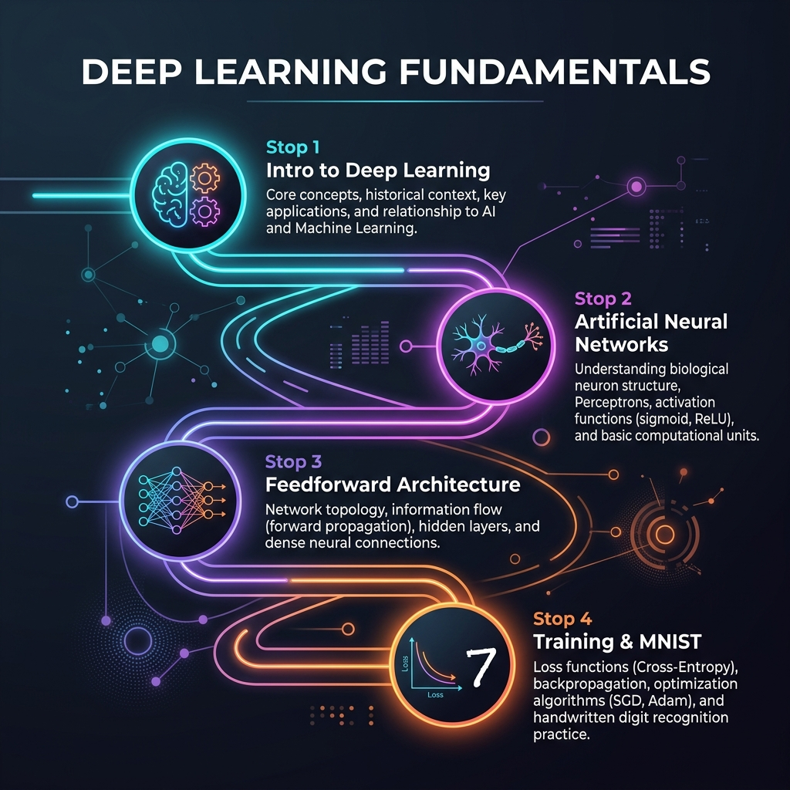

# 📘 Session 05 — Review & "Try It Yourself" Lab
### Course: Deep Learning Using Neural Networks | Aptech
### Duration: 2 Hours (TL5)
---

> **Professor's Opening Note:**
> *"Over the last four sessions, you have climbed a steep mountain. You learned the history of AI, dissected the biological neuron, built a mathematical Perceptron by hand, and finally trained a real Feedforward Neural Network to read handwriting. Today is a consolidation day. We put away the new theories and focus entirely on solidifying what you've learned through hands-on challenges."*

---

## 📚 Table of Contents
1. [The Journey So Far (Sessions 1-4 Recap)](#1-the-journey-so-far-sessions-1-4-recap)
2. [Session 1 Review: The "What" and "Why"](#2-session-1-review-the-what-and-why)
3. [Session 2 Review: The Neuron](#3-session-2-review-the-neuron)
4. [Session 3 & 4 Review: Architecture and Training](#4-session-3--4-review-architecture-and-training)
5. [Common Pitfalls & Developer Tips](#5-common-pitfalls--developer-tips)
6. [Recommended Refresher Videos](#6-recommended-refresher-videos)

---

## 1. The Journey So Far (Sessions 1-4 Recap)

Before we jump into the "Try It Yourself" lab, let's trace the path we've taken:

1. **Session 1:** We defined Deep Learning as a subset of ML based on artificial neural networks, capable of feature extraction without human intervention.
2. **Session 2:** We zoomed in on the **Neuron**, learning how it calculates a weighted sum ($z = W \cdot X + b$) and applies an activation function.
3. **Session 3:** We connected neurons into **Feedforward Networks (FNN)**, discovering that layers and non-linear activation functions (like ReLU) are required to solve complex problems like XOR.
4. **Session 4:** We put the network in motion. We learned how **Gradient Descent** minimizes the **Loss Function**, and how **Backpropagation** calculates the blame for each weight. Finally, we wrote a Keras script to classify **MNIST digits**.

---

## 2. Session 1 Review: The "What" and "Why"

**Key Question:** *Why did Deep Learning suddenly become so popular in the 2010s if the math was invented in the 1980s?*
**Answer:** The intersection of three things: Massive Data (the internet), Massive Compute power (GPUs), and better algorithms (like ReLU preventing vanishing gradients).

**Key Question:** *What is the difference between Traditional ML and Deep Learning?*
**Answer:** In Traditional ML, a human expert must manually extract features (e.g., "Look for round shapes to find a wheel"). In DL, the network learns the features automatically from raw pixels.

---

## 3. Session 2 Review: The Neuron

### The Anatomy of a Decision
Every neuron makes a simple decision based on three components:
1. **Inputs ($x$):** The data it receives.
2. **Weights ($w$):** How much it cares about each specific input.
3. **Bias ($b$):** Its natural tendency to fire or not fire, regardless of the input.

**The Golden Rule:** A neural network without an activation function is just a giant, useless linear regression model. Activation functions ($f(x)$) provide the "curves" needed to separate real-world data.

---

## 4. Session 3 & 4 Review: Architecture and Training

### The Architecture (FNN)
- **Input Layer:** Must match the shape of your data (e.g., 784 for a 28x28 image).
- **Hidden Layers:** Where the patterns are learned. Deeper = more complex patterns, but harder to train.
- **Output Layer:** Must match your desired prediction. (e.g., 10 neurons for digits 0-9).

### The Training Loop (The Engine)
1. **Forward Pass:** The data moves left-to-right. A prediction is made.
2. **Loss:** We compare the prediction to the true answer using a Loss Function (e.g., Cross-Entropy).
3. **Backward Pass (Backprop):** The error moves right-to-left. The network figures out which weights were wrong.
4. **Gradient Descent:** The optimizer (like Adam) updates the weights taking a step sized by the **Learning Rate**.

---

## 5. Common Pitfalls & Developer Tips

As you move into the Lab, remember these standard developer rules:

1. **Shape Mismatch Errors:** 90% of your errors in Keras will be because the shape of your data doesn't match the shape of your Input Layer. Always check `X_train.shape`.
2. **Exploding Loss:** If your Loss becomes `NaN` (Not a Number), your Learning Rate is likely too high.
3. **Overfitting:** If your Training Accuracy is 99% but your Test Accuracy is 60%, your model has memorized the data. You need less epochs, or a simpler network.
4. **Data Normalization:** Never feed raw pixels (0-255) into a neural network. Always normalize to 0-1 (e.g., `X = X / 255.0`). Large numbers destroy gradients.

---

## 6. 🎬 Recommended Refresher Videos

If you feel shaky on any concept before the lab, watch these masterclass summaries:

### 🥇 Video 1 — The Conceptual Masterclass
**"But what is a neural network? | Chapter 1, Deep learning"**
- 📺 Channel: **3Blue1Brown**
- 🔗 Link: Search "3Blue1Brown neural network chapter 1"
- ⏱️ Duration: ~19 minutes
- 🎯 Why Watch: The ultimate visual explanation. If you only watch one video, make it this one. It perfectly visualizes the MNIST network you built in Session 4.

### 🥈 Video 2 — The Fast & Clear Summary
**"The Essential Main Ideas of Neural Networks"**
- 📺 Channel: **StatQuest with Josh Starmer**
- 🔗 Link: Search "StatQuest Neural Networks Main Ideas"
- ⏱️ Duration: ~18 minutes
- 🎯 Why Watch: Josh breaks down the exact math of how inputs turn into outputs without overwhelming calculus.

---

## ➡️ Proceed to the "Try It Yourself" Lab
Open `02_In_Class_Task.md`. It is time to prove what you've learned.

---
*© 2024 Aptech Limited | Deep Learning Using Neural Networks | Session 05*
