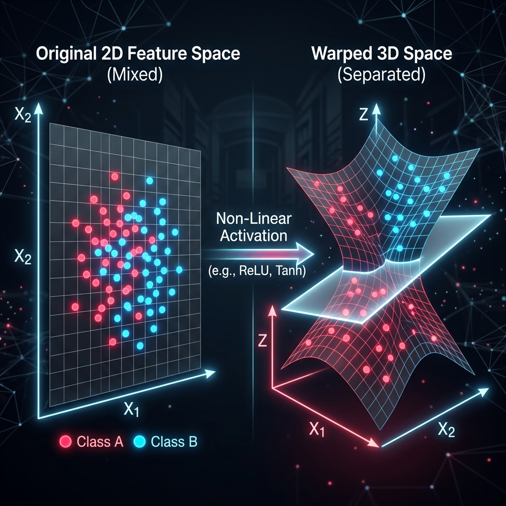
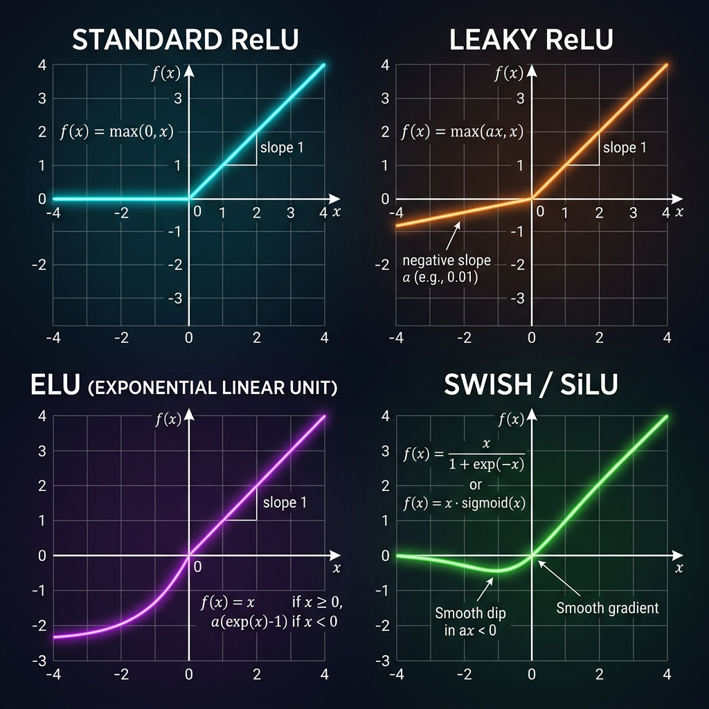

# 📘 Session 06 — Activation Functions Deep Dive
### Course: Deep Learning Using Neural Networks | Aptech
### Duration: 2 Hours (TL6)
---

> **Professor's Opening Note:**
> *"Imagine trying to build a curvy, winding road using only straight, rigid steel beams. It's impossible. In the same way, Neural Networks cannot map the complex, 'curvy' realities of the real world using only linear math. Today, we look at the heat of the forge: **Activation Functions**. These are the mathematical hammers that bend our straight lines into the complex curves needed for true Artificial Intelligence."*

---

## 📚 Table of Contents
1. [The Fundamental Role: Why Do We Need Them?](#1-the-fundamental-role-why-do-we-need-them)
2. [The "Dying" Problem: Why Sigmoid Fell from Grace](#2-the-dying-problem-why-sigmoid-fell-from-grace)
3. [The King of Modern AI: Standard ReLU](#3-the-king-of-modern-ai-standard-relu)
4. [Fixing ReLU: The Advanced Variants (Leaky ReLU, ELU, Swish)](#4-fixing-relu-the-advanced-variants-leaky-relu-elu-swish)
5. [Summary: Which one should I use?](#5-summary-which-one-should-i-use)
6. [Recommended Videos](#6-recommended-videos)

---

## 1. The Fundamental Role: Why Do We Need Them?

A neuron calculates a weighted sum: $z = W \cdot X + b$. This is a **linear** equation (a straight line).
If you stack 100 hidden layers together, but don't use an activation function, the entire 100-layer network collapses mathematically into a single, simple straight line. It would be entirely incapable of learning complex patterns like faces, language, or stock trends.

An **Activation Function** $f(z)$ is applied to the output of that sum. By making the output **non-linear** (curvy), the network can warp, bend, and fold its perspective of the data until complex classes (like cats vs dogs) can be cleanly separated.

---

## 2. The "Dying" Problem: Why Sigmoid Fell from Grace

In the early days of AI (1990s-2000s), the **Sigmoid** function was the standard.
It squished any number into a range between `0.0` and `1.0`.

**The fatal flaw:** The "Vanishing Gradient" problem.
When Sigmoid receives a very high number (like +50) or a very low number (like -50), the curve becomes completely flat. 
- If the curve is flat, the **Gradient** (slope) is exactly **0**.
- Recall from Session 4: We update weights by multiplying by the Gradient. 
- If Gradient = 0, the weight never updates. The neuron is "dead" and the network stops learning.

*Note: Sigmoid is still used today, but ONLY in the Output Layer for binary classification (Yes/No predictions).*

---

## 3. The King of Modern AI: Standard ReLU

Around 2010, researchers realized that the simplest non-linear function was actually the best. They introduced **ReLU** (Rectified Linear Unit).

**The Formula:** `f(x) = max(0, x)`
- If the input is positive, let it pass through unchanged. (Input 5 $\rightarrow$ Output 5)
- If the input is negative, turn it to 0. (Input -10 $\rightarrow$ Output 0)

**Why is it the King?**
1. **Computational Speed:** Calculating `max(0, x)` takes almost zero CPU/GPU cycles compared to calculating the complex exponents in Sigmoid.
2. **No Vanishing Gradient (mostly):** For positive numbers, the slope is a constant `1`. It never goes flat. The network learns extremely fast.

---

## 4. Fixing ReLU: The Advanced Variants (Leaky ReLU, ELU, Swish)

Standard ReLU has one major weakness: **The Dying ReLU Problem**.
If a neuron accidentally learns a large negative bias during training, its output will always be negative. ReLU will force the output to 0. The slope at 0 is 0. The neuron becomes permanently dead and will never update again.

To fix this, researchers created variants of ReLU.

### Variant 1: Leaky ReLU
Instead of making negative numbers exactly 0, Leaky ReLU gives them a tiny, slight slope (e.g., `0.01`).
- Input -10 $\rightarrow$ Output -0.1.
- *Advantage:* The slope is never zero, so neurons never permanently die.

### Variant 2: ELU (Exponential Linear Unit)
Instead of a sharp, jagged angle at 0, ELU uses an exponential curve to smoothly transition into the negatives.
- *Advantage:* Smooth math makes Gradient Descent highly stable.
- *Disadvantage:* Calculating the exponential curve (`e^x`) is computationally slow.

### Variant 3: Swish (or SiLU)
Invented by Google Brain in 2017. It allows a small "dip" into the negatives before rising back up.
- Formula: `f(x) = x * sigmoid(x)`
- *Advantage:* Currently considered state-of-the-art for incredibly deep networks. It is the default activation function in modern Large Language Models (LLMs) like LLaMA and Gemini.

---

## 5. Summary: Which one should I use?

As an AI architect, use this cheat sheet when designing your Hidden Layers:

1. **Default Choice:** Always start with **Standard ReLU**. It is fast, reliable, and works 90% of the time.
2. **If your network stops learning (Dying Neurons):** Switch to **Leaky ReLU**.
3. **If you have massive computing power and want maximum accuracy:** Try **Swish** or **ELU**.

*(Remember: Output layers use different functions like Softmax for classification, which we covered in Session 4).*

---

## 6. 🎬 Recommended Videos

### 🥇 Video 1 — The Visual Masterclass
**"Activation Functions Explained Visually — Sigmoid, ReLU, GELU & More"**
- 🔗 Link: Search YouTube for this exact title.
- ⏱️ Duration: ~12 minutes
- 🎯 Why Watch: The creator uses beautiful animations to physically show how neurons "die" with Sigmoid, and how ReLU fixes it. 

### 🥈 Video 2 — The Math Breakdown
**"All-in-one Activation Functions | Sigmoid, tanh, ReLU, Leaky ReLU, ELU, Swish"**
- 🔗 Link: Search YouTube for this exact title.
- ⏱️ Duration: ~15 minutes
- 🎯 Why Watch: A fantastic, comprehensive breakdown that groups all the variants together and explains exactly when to use each one.

---
*© 2024 Aptech Limited | Deep Learning Using Neural Networks | Session 06*
