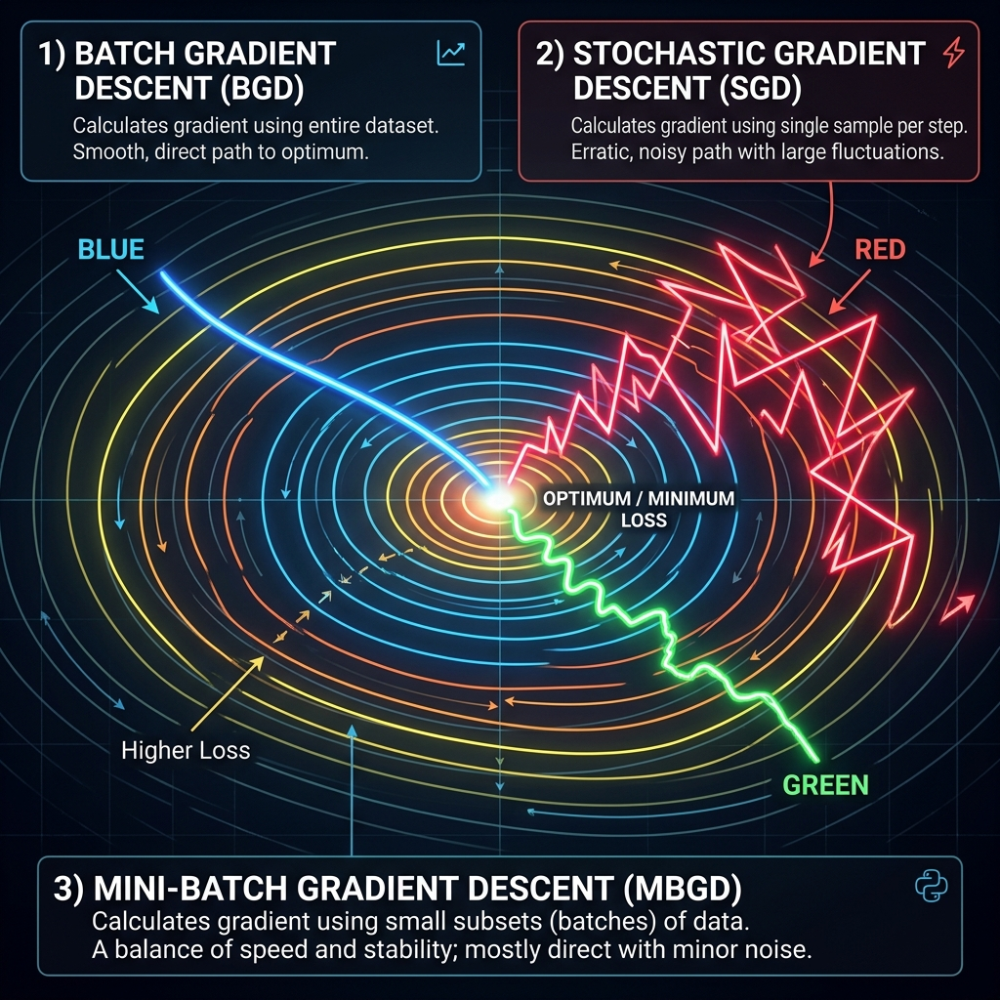

# 📘 Session 07 — Training Neural Networks (Backprop Variants)
### Course: Deep Learning Using Neural Networks | Aptech
### Duration: 2 Hours (TL7)
---

> **Professor's Opening Note:**
> *"We know how networks make decisions (Forward Pass) and how they measure their mistakes (Loss). We also know that Backpropagation calculates how to fix those mistakes. But *when* exactly should the network update its weights? After looking at one image? After looking at 1,000 images? After looking at all 60,000 images? Today, we explore the different 'rhythms' of learning."*

---

## 📚 Table of Contents
1. [Recap: The Core of Backpropagation](#1-recap-the-core-of-backpropagation)
2. [The Big Question: When to Update?](#2-the-big-question-when-to-update)
3. [Variant 1: Batch Gradient Descent](#3-variant-1-batch-gradient-descent)
4. [Variant 2: Stochastic Gradient Descent (SGD)](#4-variant-2-stochastic-gradient-descent-sgd)
5. [Variant 3: Mini-Batch Gradient Descent (The Industry Standard)](#5-variant-3-mini-batch-gradient-descent-the-industry-standard)
6. [Visualizing the Descent](#6-visualizing-the-descent)
7. [Recommended Videos](#7-recommended-videos)

---

## 1. Recap: The Core of Backpropagation

As a reminder, **Backpropagation** (Backward Propagation of Errors) is the algorithm that calculates the gradient of the loss function with respect to every weight in the network. 
It uses the **Chain Rule** from calculus. It starts at the output layer, looks at the final error, and asks: *"How much of this error was caused by the hidden layer? And how much of the hidden layer's error was caused by the input layer?"*

Once Backpropagation finds the gradients, **Gradient Descent** actually moves the weights down the slope.

---

## 2. The Big Question: When to Update?

Imagine you are studying for a massive final exam with 10,000 flashcards.
- **Strategy A:** Look at all 10,000 flashcards, take a 5-hour practice test, and then check your score at the end to see what you need to study more.
- **Strategy B:** Look at 1 flashcard, guess the answer, flip it over immediately to check if you were right, adjust your thinking, and move to the next card.
- **Strategy C:** Look at a small stack of 32 flashcards, guess the answers, check that stack of 32, adjust your thinking, and then grab the next stack of 32.

These three strategies correspond exactly to the three variants of Gradient Descent!

---

## 3. Variant 1: Batch Gradient Descent

**The Strategy:** Look at the *entire* dataset (all 60,000 MNIST images) before making a single update to the weights.

**How it works:**
1. Forward pass all 60,000 images.
2. Calculate the average loss across all 60,000 images.
3. Calculate the gradients and update the weights *once*.
4. This completes **One Epoch**.

**Pros:**
- Highly stable. Because it averages the error over the whole dataset, it takes a smooth, direct path down the loss valley.

**Cons:**
- Incredibly slow. You have to wait for 60,000 calculations just to make one tiny step.
- Impossible for large datasets. If you have 1 billion images, they will not fit in your computer's RAM/GPU Memory to be processed all at once.

---

## 4. Variant 2: Stochastic Gradient Descent (SGD)

*Note: "Stochastic" means randomly determined.*

**The Strategy:** Look at *one* single image, calculate the loss, and update the weights immediately. Repeat for the next image.

**How it works:**
1. Grab Image 1. Forward pass.
2. Calculate loss for Image 1.
3. Update weights immediately.
4. Grab Image 2. Repeat.
5. After doing this 60,000 times, you have completed **One Epoch**.

**Pros:**
- Extremely fast to take the first step. The model starts learning instantly.
- Uses very little memory (only needs to hold 1 image at a time).

**Cons:**
- Highly erratic. Image 1 might be a Cat, so the network moves its weights towards "Cat". Image 2 might be a Dog, so it immediately jerks its weights back towards "Dog". It zig-zags wildly.
- Cannot take advantage of modern GPU hardware, which is designed to process matrices (groups of data) simultaneously, not one by one.

---

## 5. Variant 3: Mini-Batch Gradient Descent (The Industry Standard)

**The Strategy:** The "Goldilocks" approach. Group the data into small batches (usually 32, 64, or 128 images).

**How it works:**
1. Grab a batch of 32 images. Forward pass all 32 simultaneously.
2. Calculate the average loss for those 32 images.
3. Update the weights once.
4. Grab the next batch of 32. Repeat.
5. After doing this ~1,875 times ($60,000 / 32$), you have completed **One Epoch**.

**Pros:**
- **The Best of Both Worlds:** It is much faster than Batch GD, but much more stable than SGD.
- **Hardware Optimization:** GPUs are perfectly designed to process matrices of size 32 or 64 in parallel.

*When someone says "Stochastic Gradient Descent" in modern deep learning, they are almost always actually referring to **Mini-Batch Gradient Descent**.*

---

## 6. Visualizing the Descent

Looking at a topographic map of the Loss Function (where the center is the lowest error):
- **Batch (Blue):** A straight, smooth line. Slow but steady.
- **Stochastic (Red):** A wild, noisy, zig-zag path. Fast, but drunk.
- **Mini-Batch (Green):** A slightly bumpy, but overall direct path. The perfect balance.

---

## 7. 🎬 Recommended Videos

### 🥇 Video 1 — The Visual Guide
**"Batch vs Mini-Batch vs Stochastic Gradient Descent Explained"**
- 📺 Channel: **ByteQuest**
- 🔗 Link: Search YouTube for this exact title.
- 🎯 Why Watch: Uses beautiful Manim (math animations) to show exactly how the data flows differently in all three variants.

### 🥈 Video 2 — The Code-Level Dive
**"Neural Networks: Zero to Hero (Building micrograd)"**
- 📺 Channel: **Andrej Karpathy** (Former Director of AI at Tesla)
- 🔗 Link: Search YouTube for "Karpathy micrograd"
- 🎯 Why Watch: This is a 2-hour masterclass. If you want to know exactly how Backpropagation works at the raw Python level (without Keras hiding the math), this is the greatest video on the internet.

---
*© 2024 Aptech Limited | Deep Learning Using Neural Networks | Session 07*
