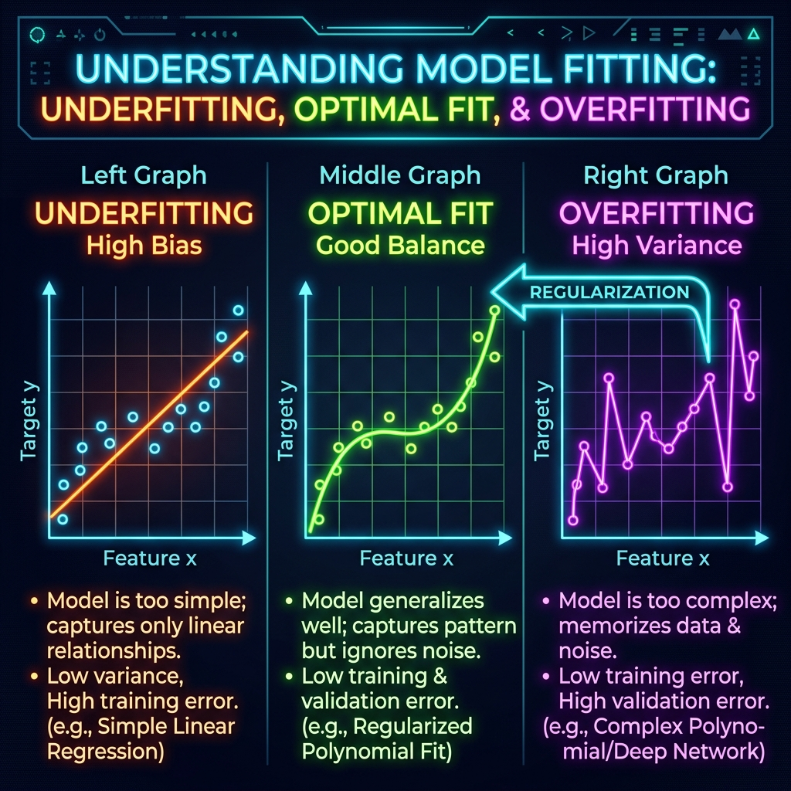
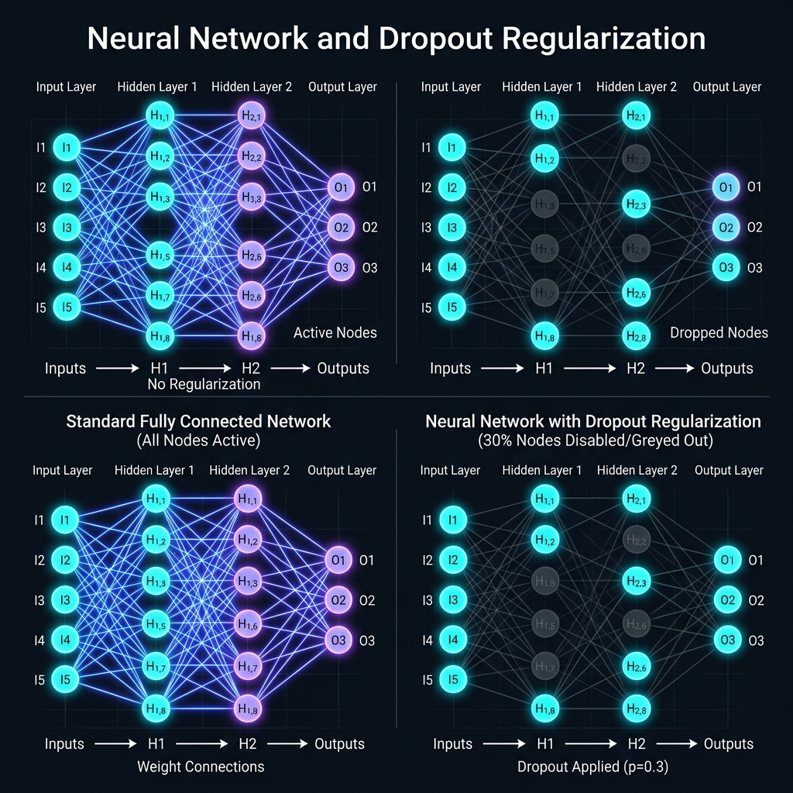

# 📘 Session 08 — Training Neural Networks (Regularization)
### Course: Deep Learning Using Neural Networks | Aptech
### Duration: 2 Hours (TL8)
---

> **Professor's Opening Note:**
> *"If you study for a test by memorizing the exact answers to the practice exam, you will score 100% on the practice test, but you will fail the real exam because you didn't learn the underlying concepts. Neural networks do the exact same thing. Today, we learn about Regularization: the mathematical techniques we use to stop networks from cheating."*

---

## 📚 Table of Contents
1. [The Enemy: Overfitting](#1-the-enemy-overfitting)
2. [What is Regularization?](#2-what-is-regularization)
3. [Technique 1: L1 and L2 Regularization (Weight Penalties)](#3-technique-1-l1-and-l2-regularization-weight-penalties)
4. [Technique 2: Dropout (The Industry Standard)](#4-technique-2-dropout-the-industry-standard)
5. [Technique 3: Early Stopping](#5-technique-3-early-stopping)
6. [Recommended Videos](#6-recommended-videos)

---

## 1. The Enemy: Overfitting

Before we fix the problem, we must understand the enemy. 

When training a neural network, you monitor two metrics:
- **Training Accuracy:** How well the model performs on the data it is actively studying.
- **Validation/Test Accuracy:** How well the model performs on unseen data.

**Overfitting** occurs when a network has too much "capacity" (too many neurons/layers) and trains for too many epochs. Instead of learning the general shape of the data (e.g., "Cats have pointy ears"), it memorizes the exact pixels of the training images (e.g., "Image #402 has a brown pixel at coordinate 12,14").
- *Symptom:* Training accuracy goes up to 99%, but Validation accuracy stalls at 70% or starts going down.

---

## 2. What is Regularization?

**Regularization** is any modification we make to the learning algorithm that is intended to reduce its *generalization error* (test error) but not its *training error*.
In simpler terms: We intentionally make it harder for the network to train, forcing it to learn robust, general rules rather than fragile, memorized rules.

---

## 3. Technique 1: L1 and L2 Regularization (Weight Penalties)

If a network memorizes data, it usually does so by assigning massive, highly specific weights to certain neurons. We can prevent this by penalizing large weights.

### 🧠 Real-Life Analogy: The Heavy Backpack
Imagine a hiker (Gradient Descent) trying to reach the bottom of the valley (Minimum Loss). L1 and L2 add rocks to the hiker's backpack based on how large their weights are. To minimize the total effort, the hiker is forced to keep their weights as small as possible.

- **L1 (Lasso Regularization):** Adds the *absolute value* of the weights to the loss function. It often pushes useless weights exactly to `0.0`, effectively deleting them.
- **L2 (Ridge Regularization):** Adds the *squared value* of the weights to the loss function. It heavily punishes massive weights, forcing all weights to be small and evenly distributed. L2 is much more common than L1.

---

## 4. Technique 2: Dropout (The Industry Standard)

Invented by Geoffrey Hinton and his team in 2012, Dropout is the most famous and effective regularization technique in modern Deep Learning.

### 🧠 Real-Life Analogy: The Corporate Team
Imagine a company where one brilliant senior engineer does 90% of the work, and the 9 junior engineers just agree with whatever she says. If she gets sick, the whole company fails. 
**Dropout** is like the CEO randomly sending 30% of the employees home every single day. To survive, the junior engineers are *forced* to learn how to do the work themselves.

**How it works in Keras:**
During training, a Dropout layer randomly disables a percentage (e.g., 20% to 50%) of the neurons in the previous layer. 
- In Epoch 1, Neurons A, C, and F are disabled.
- In Epoch 2, Neurons B, D, and E are disabled.
The network can no longer rely on a single "super neuron" to memorize the data. The knowledge is forced to spread evenly across the entire network, making it highly robust.

*Note: Dropout is automatically turned OFF during testing/prediction. It is only used during training.*

---

## 5. Technique 3: Early Stopping

The simplest form of regularization. 

If Overfitting happens when you train for too many epochs, why not just stop training the exact moment Overfitting begins?

**How it works:**
1. At the end of every epoch, Keras checks the Validation Loss.
2. If the Validation Loss goes down, the model is improving. Keep going.
3. If the Validation Loss starts going up (even if Training Loss is going down), the model has started memorizing.
4. Keras automatically halts the training process and restores the weights from the "best" epoch.

---

## 6. 🎬 Recommended Videos

### 🥇 Video 1 — The Code and Concept Guide
**"Regularization in Deep Learning | Dropout | Early Stopping | L2"**
- 🔗 Link: Search YouTube for this exact title (by CampusX or similar).
- ⏱️ Duration: ~20 minutes
- 🎯 Why Watch: Provides a very structured, step-by-step breakdown of how these concepts look mathematically, followed immediately by how they look in Python code.

### 🥈 Video 2 — The Visual Intuition
**"L1 & L2 | Dropout | Early Stopping | Deep Learning Part 4"**
- 🔗 Link: Search YouTube for this exact title.
- 🎯 Why Watch: Uses great animations to show exactly what a Neural Network looks like when Dropout is applied, helping to build a strong mental model before you start coding.

---
*© 2024 Aptech Limited | Deep Learning Using Neural Networks | Session 08*
