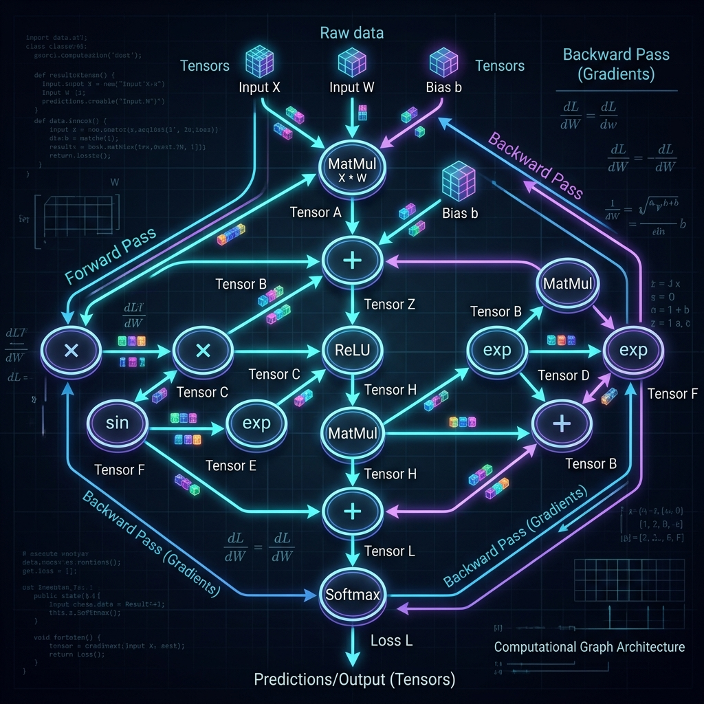
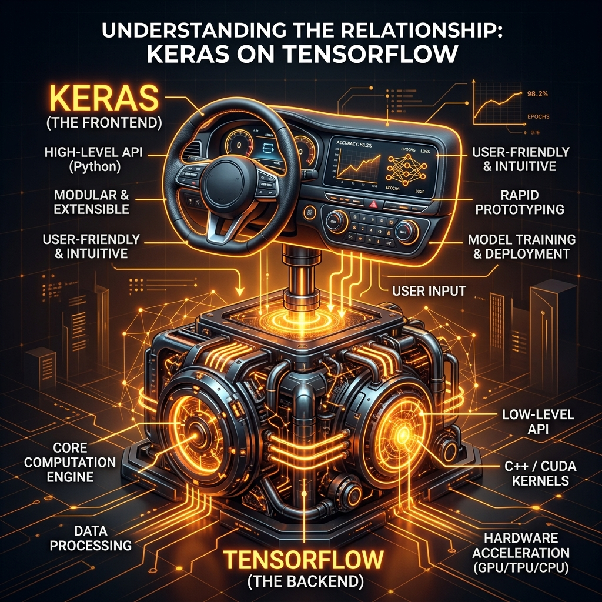

# 📘 Session 09 — TensorFlow and Keras
### Course: Deep Learning Using Neural Networks | Aptech
### Duration: 2 Hours (TL9)
---

> **Professor's Opening Note:**
> *"Up until now, you've been using Keras to build models. It took you 5 lines of code to build a network. But what is actually happening underneath those 5 lines? Today, we lift the hood and look at the engine that powers Keras: Google's TensorFlow. We will learn what a 'Tensor' is, what a 'Computational Graph' is, and why Keras exists in the first place."*

---

## 📚 Table of Contents
1. [What is TensorFlow?](#1-what-is-tensorflow)
2. [What is a Tensor?](#2-what-is-a-tensor)
3. [The Secret Engine: Computational Graphs](#3-the-secret-engine-computational-graphs)
4. [TensorFlow vs. Keras (The Relationship)](#4-tensorflow-vs-keras-the-relationship)
5. [Advanced Keras Concepts (Functional API)](#5-advanced-keras-concepts-functional-api)
6. [Recommended Videos](#6-recommended-videos)

---

## 1. What is TensorFlow?

**TensorFlow** is an open-source end-to-end platform for machine learning developed by the Google Brain team. It was released in 2015 and quickly became the absolute industry standard for deep learning research and production.

If you want to train an AI model and deploy it to a massive cloud server, a tiny Raspberry Pi, an Android phone, or a web browser, TensorFlow provides the infrastructure to do it.

---

## 2. What is a Tensor?

The name "TensorFlow" comes from its core data structure: the **Tensor**.

A Tensor is simply a container for numbers. It is a mathematical generalization of scalars, vectors, and matrices.
- **0D Tensor (Scalar):** A single number. (e.g., `5`)
- **1D Tensor (Vector):** An array of numbers. (e.g., `[5, 2, 8]`)
- **2D Tensor (Matrix):** A grid of numbers. (e.g., A grayscale image).
- **3D Tensor:** A cube of numbers. (e.g., An RGB color image with Width, Height, and 3 color channels).
- **ND Tensor:** N-dimensional arrays.

In TensorFlow, data *flows* through the network in the form of these Tensors.

---

## 3. The Secret Engine: Computational Graphs

Why is TensorFlow so incredibly fast at doing math? Because it doesn't execute math like standard Python. It uses **Computational Graphs**.



When you write standard Python code like `z = x + y`, Python executes it immediately.
When you write TensorFlow code, TF first builds a "map" (a graph) of all the operations. 
1. It creates a node for `x`.
2. It creates a node for `y`.
3. It creates an `Addition` node.
4. It connects them with arrows.

**Why go through this trouble?**
Because once TensorFlow has this map, it can heavily optimize it. It can look at the map and say, *"Oh, I can run these two branches at the exact same time on the GPU (Parallel processing)!"* This makes TF infinitely faster than standard Python for deep learning.

---

## 4. TensorFlow vs. Keras (The Relationship)

If TensorFlow is so powerful, why do we use `keras.Sequential()`?



- **TensorFlow (The Engine):** It is low-level. Writing a neural network in raw TensorFlow requires hundreds of lines of complex calculus, gradient tracking, and matrix multiplication code. It is built for machines and researchers.
- **Keras (The Steering Wheel):** It is a high-level API built *on top* of TensorFlow. It is designed for human beings. It abstracts away all the raw math. When you write `Dense(128)`, Keras silently writes the hundreds of lines of raw TensorFlow code for you in the background.

*Note: In 2019, Google officially merged Keras directly into TensorFlow. This is why we import it using `from tensorflow import keras`.*

---

## 5. Advanced Keras Concepts (Functional API)

So far, you have used the **Sequential API** in Keras.
```python
model = keras.Sequential([
    keras.layers.Dense(64),
    keras.layers.Dense(10)
])
```
The Sequential API is a straight line. Layer 1 goes to Layer 2, which goes to Layer 3.

However, advanced architectures (like ResNet or GoogLeNet) are not straight lines. They have branches, multiple inputs, and multiple outputs. For these, we use the **Keras Functional API**.

```python
# Functional API Example
inputs = keras.Input(shape=(28, 28))
x = keras.layers.Flatten()(inputs)
x = keras.layers.Dense(64, activation='relu')(x)
outputs = keras.layers.Dense(10, activation='softmax')(x)

model = keras.Model(inputs=inputs, outputs=outputs)
```
Notice how we manually pass the data `(x)` from one layer to the next like a baton in a relay race. This allows us to build any complex architecture we want!

---

## 6. 🎬 Recommended Videos

### 🥇 Video 1 — The Fundamentals
**"TensorFlow vs Keras vs PyTorch - Deep Learning Tutorial"**
- 📺 Channel: **Codebasics**
- 🔗 Link: Search YouTube for "Codebasics TensorFlow vs Keras"
- 🎯 Why Watch: An incredibly simple, beginner-friendly breakdown of why these different frameworks exist and when you should use which.

### 🥈 Video 2 — Under the Hood
**"Inside TensorFlow: tf.function and AutoGraph"**
- 📺 Channel: **TensorFlow (Official)**
- 🔗 Link: Search YouTube for "Inside TensorFlow tf.function"
- 🎯 Why Watch: If you want to understand Computational Graphs and how TensorFlow actually accelerates Python code, this official video from Google engineers is the best resource.

---
*© 2024 Aptech Limited | Deep Learning Using Neural Networks | Session 09*
