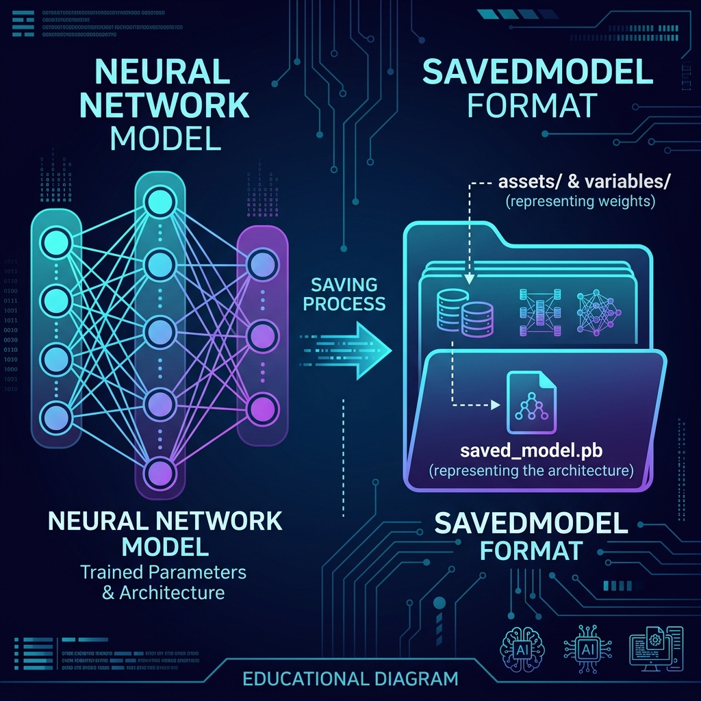
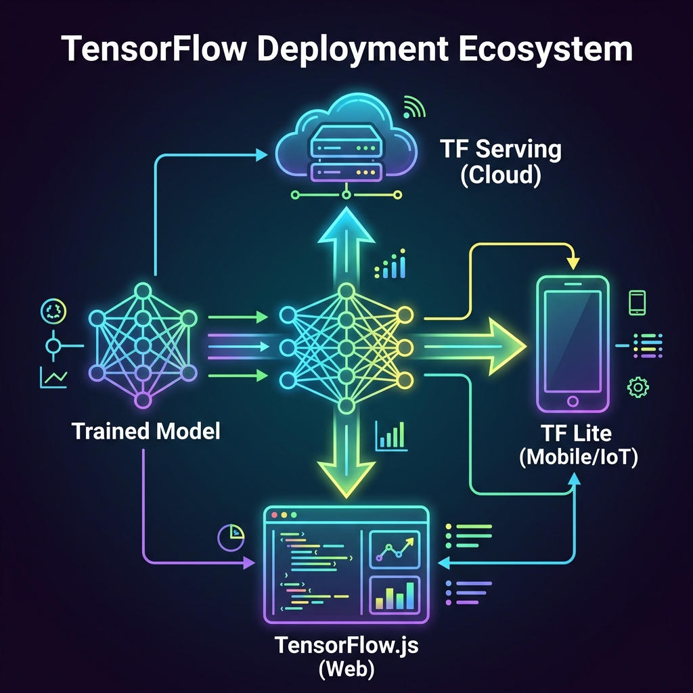

# 📘 Session 10 — Model Lifecycle & Deployment
### Course: Deep Learning Using Neural Networks | Aptech
### Duration: 2 Hours (TL10)
---

> **Professor's Opening Note:**
> *"Training an AI model is only 50% of the job. A model that only lives inside your Jupyter Notebook is useless to the real world. Today, we learn how to freeze a neural network's 'brain', save it to a hard drive, and deploy it to the cloud, to a smartphone, and to a web browser."*

---

## 📚 Table of Contents
1. [The Model Lifecycle Recap](#1-the-model-lifecycle-recap)
2. [Freezing the Brain (Saving Models)](#2-freezing-the-brain-saving-models)
3. [The TensorFlow Deployment Ecosystem](#3-the-tensorflow-deployment-ecosystem)
4. [Target 1: The Cloud (TF Serving)](#4-target-1-the-cloud-tf-serving)
5. [Target 2: Mobile & IoT (TF Lite)](#5-target-2-mobile--iot-tf-lite)
6. [Target 3: The Web (TF.js)](#6-target-3-the-web-tfjs)
7. [Recommended Videos](#7-recommended-videos)

---

## 1. The Model Lifecycle Recap

Let's summarize the exact steps to build a neural network using Keras:
1. **Define** the architecture (`keras.Sequential` or Functional API).
2. **Compile** the model (Define the `optimizer` like Adam, and the `loss` function).
3. **Train** the model (`model.fit` with your training data).
4. **Evaluate** the model (`model.evaluate` with your unseen test data).
5. **Deploy!** (Today's topic).

---

## 2. Freezing the Brain (Saving Models)

Once `model.fit()` finishes, the network contains perfectly tuned weights. If you close Python, those weights are deleted from RAM forever. You must save them to your hard drive.



### Option A: The Keras H5 Format (Legacy)
```python
model.save('my_model.h5')
```
This saves the entire architecture, weights, and optimizer state into one single file. It is easy to move around, but it is considered an older format.

### Option B: The TensorFlow SavedModel Format (Modern Standard)
```python
model.save('my_model_folder/')
```
This creates a folder containing:
- `saved_model.pb`: The architecture (the graph).
- `variables/`: A folder containing the actual weights and biases.
- `assets/`: Any external files the model needs.

**To Load it back into Python:**
```python
loaded_model = keras.models.load_model('my_model_folder/')
predictions = loaded_model.predict(new_data)
```

---

## 3. The TensorFlow Deployment Ecosystem

TensorFlow is the industry standard because it provides dedicated tools to convert your saved model into formats optimized for different hardware.



---

## 4. Target 1: The Cloud (TF Serving)

**Scenario:** You built an AI to detect credit card fraud. A bank wants to send you millions of transactions per second via an API.

**The Tool: TensorFlow Serving**
- You take your `SavedModel` folder.
- You wrap it in a **Docker Container** running TF Serving.
- It instantly creates a high-performance REST API or gRPC server.
- It is designed to handle massive traffic and can be scaled instantly on AWS, Google Cloud, or Azure.

---

## 5. Target 2: Mobile & IoT (TF Lite)

**Scenario:** You built an AI to detect plant diseases from photos. Farmers in rural areas need to use it on an Android phone without an internet connection.

**The Tool: TensorFlow Lite (TFLite)**
- Mobile phones have low battery, low RAM, and weak CPUs.
- You use the `TFLiteConverter` in Python to compress your massive `SavedModel` into a tiny `.tflite` file.
- It uses a technique called **Quantization** (converting heavy 32-bit float numbers into tiny 8-bit integers) to shrink the model size by 4x while barely losing any accuracy!

---

## 6. Target 3: The Web (TF.js)

**Scenario:** You built an AI that tracks human posture using a webcam. You want anyone to use it simply by visiting a website, without installing any software.

**The Tool: TensorFlow.js (TFJS)**
- Browsers cannot run Python code. They run JavaScript.
- You use the `tensorflowjs_converter` to translate your Python model into a `model.json` file.
- You import the `tfjs` library in your HTML file, load the JSON, and the model runs entirely inside the user's browser, utilizing WebGL to access their local GPU!

---

## 7. 🎬 Recommended Videos

### 🥇 Video 1 — The Serving Architecture
**"How to deploy a TensorFlow model with TFServing"**
- 📺 Channel: Search YouTube for this title.
- 🎯 Why Watch: A great visual demonstration of what TF Serving actually looks like running inside a Docker container.

### 🥈 Video 2 — Shrinking Models
**"TensorFlow Lite: ML for Mobile and Edge Devices"**
- 📺 Channel: **TensorFlow (Official)**
- 🎯 Why Watch: Explains the magic of "Quantization" and how you can fit a 100MB model onto a tiny microchip.

---
*© 2024 Aptech Limited | Deep Learning Using Neural Networks | Session 10*
