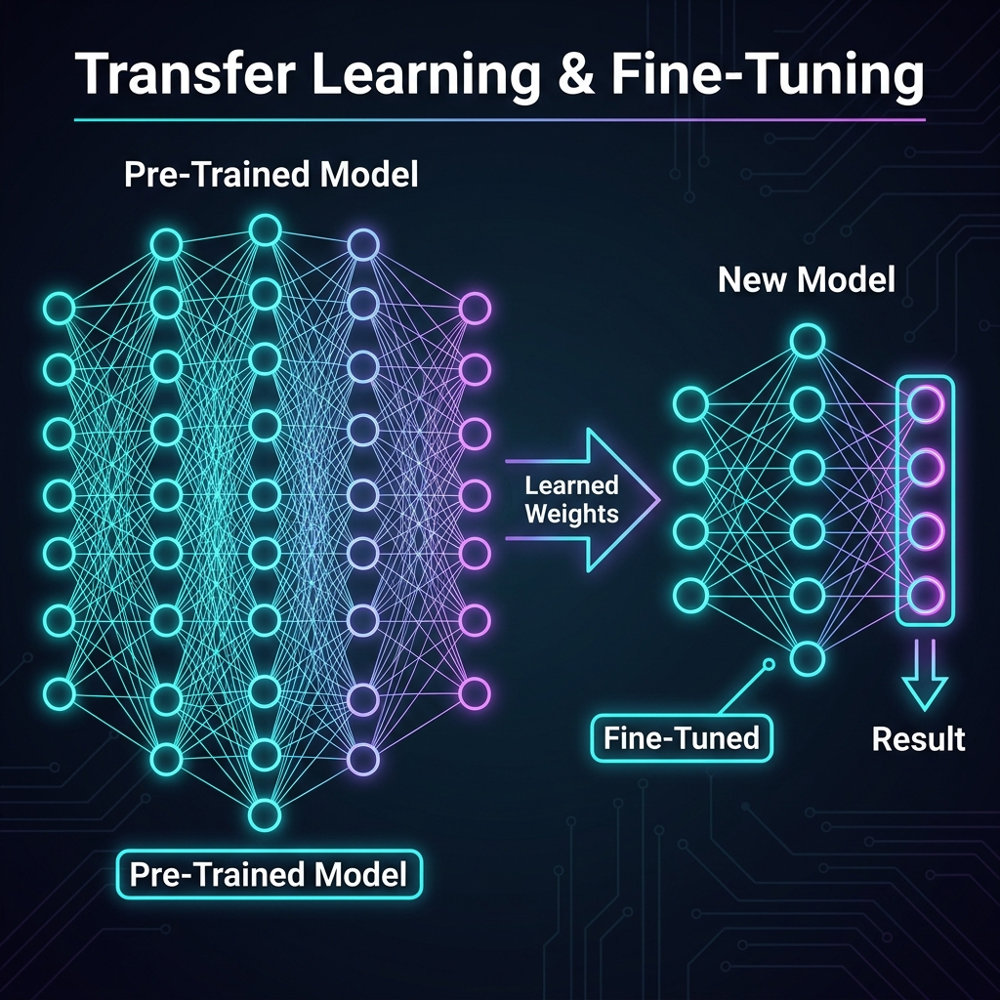
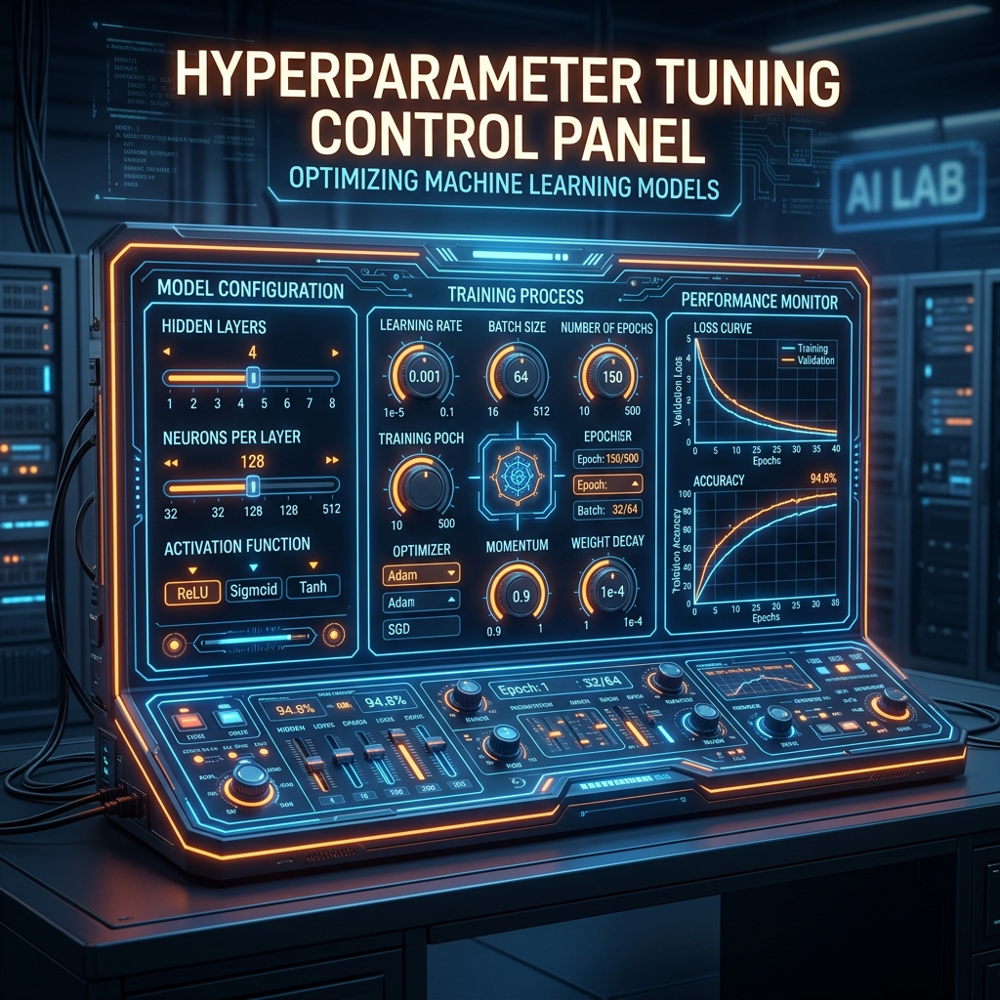

# 📘 Session 11 — Fine-Tuning & Hyperparameter Tuning
### Course: Deep Learning Using Neural Networks | Aptech
### Duration: 2 Hours (TL11)
---

> **Professor's Opening Note:**
> *"Today, we learn how to cheat—legally. Instead of spending weeks training a model from scratch, we will steal the 'brain' of a massive AI built by Google, and 'Fine-Tune' it to do exactly what we want. Then, we will learn how to build an automated machine that twists the dials and knobs of our network (Hyperparameter Tuning) until it finds the absolute perfect configuration."*

---

## 📚 Table of Contents
1. [What is Transfer Learning?](#1-what-is-transfer-learning)
2. [What is Fine-Tuning?](#2-what-is-fine-tuning)
3. [The Concept of Hyperparameters](#3-the-concept-of-hyperparameters)
4. [Keras Tuner: The Automated Scientist](#4-keras-tuner-the-automated-scientist)
5. [Recommended Videos](#5-recommended-videos)

---

## 1. What is Transfer Learning?

Imagine you want to teach someone to drive a massive 18-wheeler truck. 
- **Training from Scratch:** You find someone who has never seen a car before, teach them what a steering wheel is, what a road is, and eventually how to drive the truck. (This takes years).
- **Transfer Learning:** You find a professional Formula 1 racecar driver. They already know what steering wheels, pedals, and roads are. You just need to teach them how to handle the size of the truck. (This takes days).

In Deep Learning, **Transfer Learning** means downloading a model (like MobileNet, ResNet, or VGG16) that Google or Meta spent millions of dollars training on 14 million images (the ImageNet dataset). This model already knows how to see edges, curves, colors, and shapes. 

You take this pre-trained "base", cut off its final classification layer, and attach your own new layer (e.g., a layer that only predicts "Hotdog" or "Not Hotdog").

---

## 2. What is Fine-Tuning?

Transfer Learning and Fine-Tuning go hand-in-hand. 



1. **Step 1 (Feature Extraction):** You freeze the pre-trained base (you lock its weights so they cannot change). You only train your newly added final layer.
2. **Step 2 (Fine-Tuning):** Once your new layer is somewhat stable, you "unfreeze" the top few layers of the pre-trained base. You set your Learning Rate to be extremely small, and you train the network. This allows the pre-trained model to make tiny, delicate adjustments to its worldview to better fit your specific Hotdog dataset.

---

## 3. The Concept of Hyperparameters

In a neural network, **Parameters** are the weights and biases. The network learns these automatically during training. You do not touch them.

**Hyperparameters** are the architectural settings that *you* (the engineer) must choose *before* training begins. 



Common Hyperparameters include:
- The number of Hidden Layers (e.g., 2 vs 5).
- The number of Neurons per layer (e.g., 64 vs 256).
- The Learning Rate (e.g., 0.01 vs 0.0001).
- The Batch Size (e.g., 32 vs 128).
- The Activation Function (e.g., ReLU vs Swish).

Choosing the wrong hyperparameters can cause a model to fail completely. But how do you know which combination is best?

---

## 4. Keras Tuner: The Automated Scientist

In the old days, engineers used "Grid Search" (manually testing every single possible combination of hyperparameters) or "Random Search" (guessing). This took weeks.

Today, we use a library called **Keras Tuner**. 

Instead of writing:
```python
keras.layers.Dense(128, activation='relu')
```

You write:
```python
keras.layers.Dense(units=hp.Int('units', min_value=32, max_value=512, step=32))
```

Keras Tuner will automatically build hundreds of different models, train them all, evaluate them, and then hand you back the single best architecture for your dataset. It acts as an automated AI Scientist!

---

## 5. 🎬 Recommended Videos

### 🥇 Video 1 — The Automated Scientist
**"Tuning Hyperparameters using Keras Tuner | Tensorflow"**
- 📺 Channel: **GeoDev** or **Tirendaz Academy**
- 🔗 Link: Search YouTube for "Keras Tuner tutorial"
- 🎯 Why Watch: Seeing Keras Tuner automatically loop through and build different models in the terminal is a "lightbulb" moment for understanding how AI research is actually conducted.

### 🥈 Video 2 — Stealing the Brain
**"Transfer Learning with Keras and TensorFlow"**
- 📺 Channel: **Nicolai Nielsen**
- 🔗 Link: Search YouTube for this exact title.
- 🎯 Why Watch: Walks through exactly how to download a massive pre-trained model like MobileNet, freeze it, and attach your own custom "head" to it in just 10 lines of code.

---
*© 2024 Aptech Limited | Deep Learning Using Neural Networks | Session 11*
