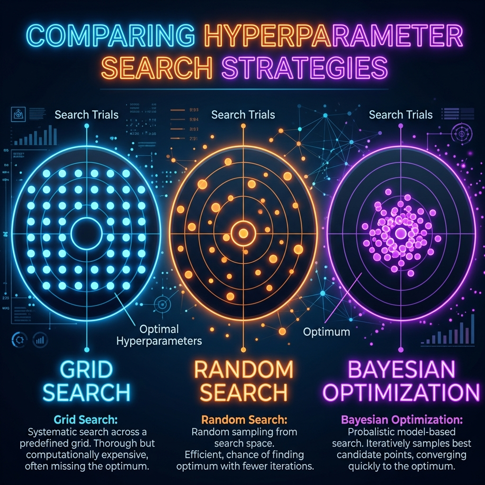

# 📘 Session 12 — Search Strategies & AutoML
### Course: Deep Learning Using Neural Networks | Aptech
### Duration: 2 Hours (TL12)
---

> **Professor's Opening Note:**
> *"In the previous session, we used Keras Tuner to find the best hyperparameters. But we used a 'Random Search'. Guessing blindly isn't very scientific, is it? Today, we analyze the exact mathematical search algorithms that AI uses to find optimal configurations, and we introduce the ultimate endgame of Machine Learning: AutoML."*

---

## 📚 Table of Contents
1. [The Problem with the Search Space](#1-the-problem-with-the-search-space)
2. [Strategy 1: Grid Search](#2-strategy-1-grid-search)
3. [Strategy 2: Random Search](#3-strategy-2-random-search)
4. [Strategy 3: Bayesian Optimization](#4-strategy-3-bayesian-optimization)
5. [The Endgame: What is AutoML?](#5-the-endgame-what-is-automl)
6. [Recommended Videos](#6-recommended-videos)

---

## 1. The Problem with the Search Space

Imagine you are trying to find the best configuration for a neural network. You need to choose:
- **Neurons:** [32, 64, 128, 256, 512] (5 options)
- **Learning Rate:** [0.01, 0.001, 0.0001] (3 options)
- **Activation:** [ReLU, Swish, ELU] (3 options)

To test every single combination, you would need to train **5 × 3 × 3 = 45 different neural networks**.
If each network takes 1 hour to train, that's almost 2 days of waiting! We need a strategy to search this space efficiently.

---

## 2. Strategy 1: Grid Search

**How it works:**
Grid Search is the brute-force method. It tests absolutely every single combination in the list.

**Pros & Cons:**
- ✅ **Pro:** Guaranteed to find the absolute best combination *within the grid you defined*.
- ❌ **Con:** Exponentially slow. If you add one more hyperparameter with 5 options, your 45 tests jump to 225 tests. It is practically impossible to use Grid Search for large Deep Learning models.

---

## 3. Strategy 2: Random Search

**How it works:**
Instead of testing everything, Random Search randomly picks combinations. You tell it, *"Try exactly 10 random combinations and stop."*

**Why is it actually better than Grid Search?**
In deep learning, some hyperparameters (like Learning Rate) matter much more than others (like Batch Size). Grid Search wastes a lot of time testing useless batch sizes while keeping the learning rate the same. Random Search explores a much wider variety of the *important* hyperparameters in far less time.

---

## 4. Strategy 3: Bayesian Optimization

**How it works:**
This is the intelligent approach. 
1. It tests a few random combinations first.
2. It looks at the results and asks: *"Okay, when I used 128 neurons, the accuracy went up. When I used 32, it went down."*
3. It uses a **Surrogate Model** (an AI managing the AI) to predict where the "bullseye" is.
4. It intelligently focuses its next tests strictly in the high-performance areas.

**Pros & Cons:**
- ✅ **Pro:** Finds the best hyperparameters incredibly fast because it learns from its past mistakes.
- ❌ **Con:** Complex to implement from scratch (luckily, Keras Tuner does it for us!).

---

## 5. The Endgame: What is AutoML?

**AutoML (Automated Machine Learning)** is the philosophy of removing the human engineer from the pipeline entirely.

Instead of a human writing Python code to clean data, pick an algorithm, and tune hyperparameters, you simply feed the raw data into an AutoML platform (like Google Cloud AutoML, AutoKeras, or H2O.ai).

The AutoML machine will:
1. **Automate Feature Engineering:** Clean the data and fill in missing values.
2. **Automate Architecture Search (NAS):** Try Random Forests, XGBoost, and Neural Networks automatically.
3. **Automate Hyperparameter Tuning:** Run Bayesian Optimization.
4. **Deploy:** Hand you a perfectly optimized, ready-to-use API endpoint.

AutoML is democratizing AI, allowing non-programmers to build world-class models.

---

## 6. 🎬 Recommended Videos

### 🥇 Video 1 — Search Strategies Explained Visually
**"Hyperparameters Optimization Strategies: GridSearch, Bayesian, & Random Search"**
- 📺 Channel: Search YouTube for this exact title format.
- 🎯 Why Watch: Visualizing how Bayesian Optimization "hunts" for the best result using past history is much easier to grasp when seen animated.

### 🥈 Video 2 — AutoML in Action
**"What is AutoML? (Automated Machine Learning Explained)"**
- 📺 Channel: Search YouTube for introductions to Google Cloud AutoML.
- 🎯 Why Watch: See a real-world platform take raw CSV data and produce a deployed model with zero lines of code written.

---
*© 2024 Aptech Limited | Deep Learning Using Neural Networks | Session 12*
