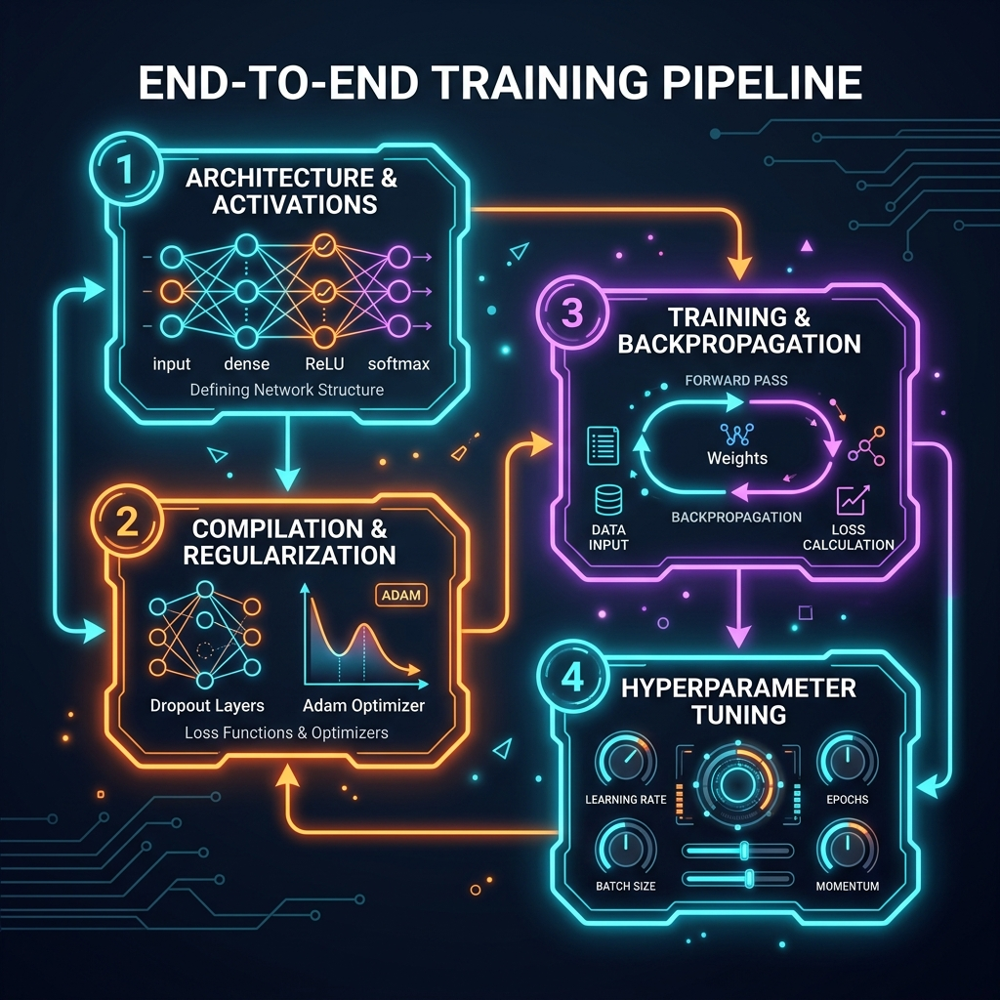
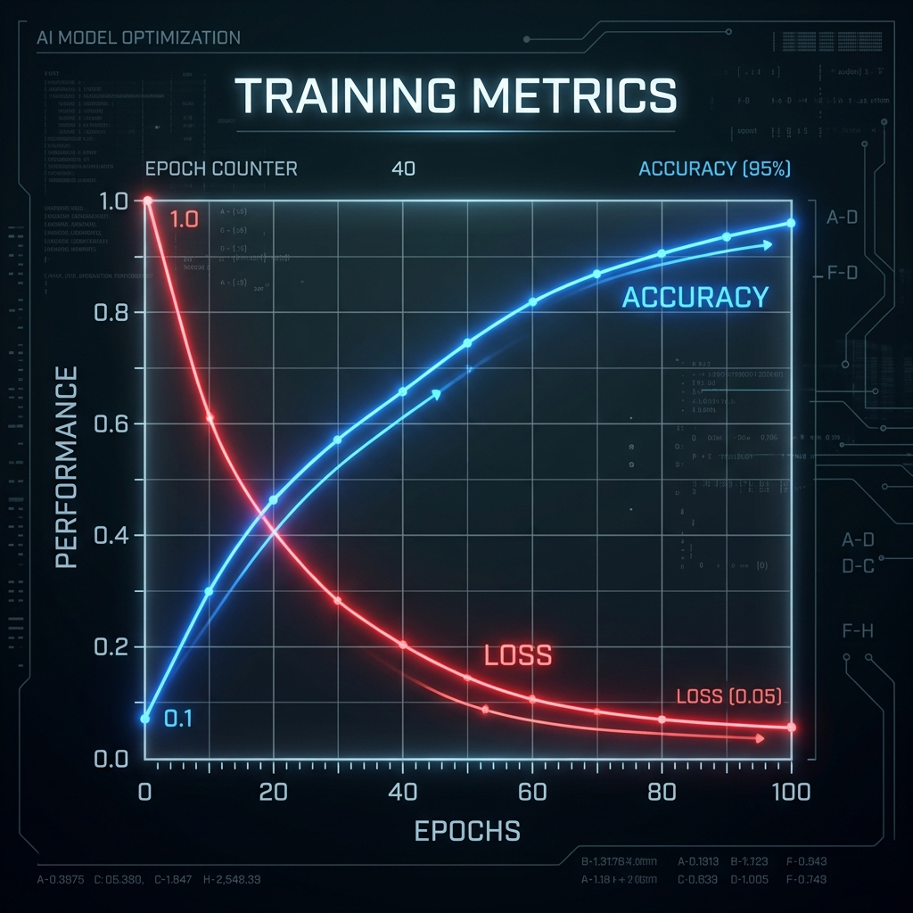

# 📘 Session 13 — Workshop: End-to-End Training
### Course: Deep Learning Using Neural Networks | Aptech
### Duration: 2 Hours (TL13)
---

> **Professor's Opening Note:**
> *"Over the last several sessions, we have learned how the individual pieces of a neural network function. We learned about Activation Functions (Session 6), Backpropagation (Session 7), Regularization (Session 8), and the Keras API (Session 9). Today, the theory ends. You are going to put all of these pieces together and actually watch a neural network learn from data in real-time."*

---

## 📚 Table of Contents
1. [The "Try It Yourself" Philosophy](#1-the-try-it-yourself-philosophy)
2. [The End-to-End Pipeline](#2-the-end-to-end-pipeline)
3. [Understanding Training Metrics](#3-understanding-training-metrics)
4. [Today's Dataset: CIFAR-10](#4-todays-dataset-cifar-10)

---

## 1. The "Try It Yourself" Philosophy

This session covers the **"Try It Yourself"** questions from Sessions 4 through 7 of your textbook. 

Instead of answering these questions on paper, we are conducting a hands-on coding workshop. You will be provided with a starter script that has "holes" in it. You must use the knowledge you've gained over the last several weeks to fill in the missing code, successfully compile the model, and execute the training loop.

---

## 2. The End-to-End Pipeline

To successfully train a model from scratch, you must execute these four major steps in order:

1. **Architecture & Activations:** Defining the layers. You must choose between ReLU, ELU, Swish, or Sigmoid depending on the layer's purpose.
2. **Compilation & Regularization:** Adding Dropout layers to prevent overfitting, and selecting an Optimizer (like Adam) to handle the gradient descent.
3. **Training & Backpropagation:** Calling `model.fit()` and passing your training data, labels, and deciding on a `batch_size`.
4. **Evaluation:** Testing the model on unseen data.

---

## 3. Understanding Training Metrics

When you start the training process today, your terminal will begin printing out numbers for every Epoch.

You are looking for two things to happen simultaneously:
- **Loss must go DOWN:** Loss represents "error" or "mistakes". The closer to 0.00, the better.
- **Accuracy must go UP:** Accuracy represents correct predictions. The closer to 1.00 (100%), the better.

If your Training Accuracy goes up to 99%, but your Validation Accuracy stops at 60%, what is happening? **Overfitting!** This is why we learned about Regularization in Session 8.

---

## 4. Today's Dataset: CIFAR-10

We will be training our model on the **CIFAR-10** dataset. 
- It contains 60,000 color images.
- The images are divided into 10 categories: *Airplanes, Cars, Birds, Cats, Deer, Dogs, Frogs, Horses, Ships, and Trucks*.
- The images are very small (32x32 pixels), which means training will be fast, but achieving high accuracy will require excellent architecture and hyperparameter choices.

*Proceed to the `02_Try_It_Yourself_Lab.md` to begin the workshop.*

---
*© 2024 Aptech Limited | Deep Learning Using Neural Networks | Session 13*
