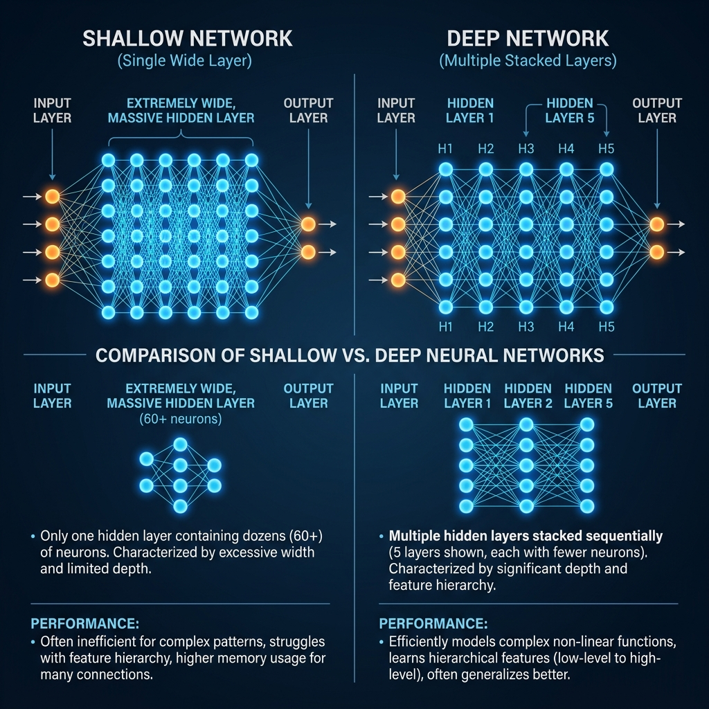
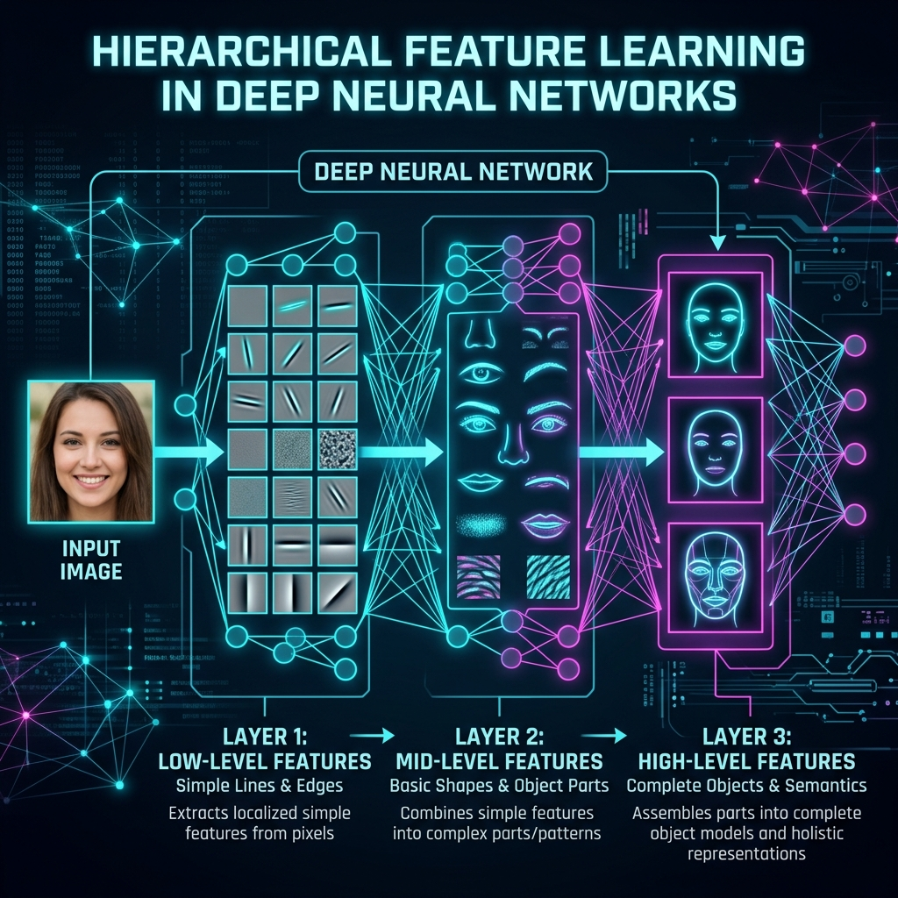

# 📘 Session 14 — Deep vs. Shallow Networks
### Course: Deep Learning Using Neural Networks | Aptech
### Duration: 2 Hours (TL14)
---

> **Professor's Opening Note:**
> *"In the previous session, you saw firsthand how difficult it is to get high accuracy on complex images using a basic neural network. You tried making the network 'wider' by adding 512 neurons, but it only helped a little. Today, we answer the most important question in modern AI: Why is it called 'Deep' Learning, and not 'Wide' Learning?"*

---

## 📚 Table of Contents
1. [The Universal Approximation Theorem](#1-the-universal-approximation-theorem)
2. [Anatomy of a Shallow Network](#2-anatomy-of-a-shallow-network)
3. [Anatomy of a Deep Network](#3-anatomy-of-a-deep-network)
4. [Hierarchical Feature Learning (Why Deep Wins)](#4-hierarchical-feature-learning-why-deep-wins)
5. [Recommended Videos](#5-recommended-videos)

---

## 1. The Universal Approximation Theorem

There is a mathematical theorem in AI that states:
> *"A neural network with just **one** hidden layer can learn to compute absolutely any mathematical function, provided that hidden layer is wide enough (has enough neurons)."*

Based on this theorem, you might think we only ever need one layer! If a single layer with 10,000 neurons can solve any problem, why do we build networks with 100 layers?

The answer comes down to **efficiency** and **generalization**. While a massive single layer *can* memorize the training data, it is terribly inefficient and prone to severe overfitting. 

---

## 2. Anatomy of a Shallow Network

A **Shallow Network** typically has 1 or 2 hidden layers. To make it "smarter", engineers make it **Wider** (adding more neurons per layer).

**Characteristics:**
- ✅ Very fast to compute mathematically.
- ✅ Rarely suffers from Vanishing Gradients.
- ❌ Requires an exponential number of neurons to solve complex problems.
- ❌ Terrible at computer vision and natural language processing.

---

## 3. Anatomy of a Deep Network

A **Deep Network** has many hidden layers (sometimes 5, 50, or even 152 layers like ResNet). To make it "smarter", engineers make it **Deeper**.

**Characteristics:**
- ❌ Mathematically heavy; requires GPUs.
- ❌ Harder to train (requires ReLU, Batch Normalization, and advanced optimizers).
- ✅ Requires exponentially *fewer* total neurons to achieve the same accuracy as a wide shallow network.
- ✅ Unlocks the superpower of AI: **Hierarchical Feature Learning**.

---

## 4. Hierarchical Feature Learning (Why Deep Wins)

Think about how you recognize a human face. You don't look at 10,000 individual skin pores simultaneously. You look at lines, which form an eye, which sits next to a nose, which makes a face. Your brain works in a *hierarchy*.

Deep Networks do the exact same thing.

1. **Layer 1 (Low-Level):** Looks at raw pixels and only understands basic horizontal and vertical lines.
2. **Layer 2 (Mid-Level):** Combines those lines to understand curves, circles, and textures.
3. **Layer 3 (High-Level):** Combines the curves to understand eyes, ears, and wheels.
4. **Final Layer:** Combines the concepts to output "This is a picture of a Cat".

A Shallow Network cannot do this. Because it only has one layer, it tries to learn the raw pixels and the final "Cat" concept at the exact same time, which is incredibly difficult. **Depth allows the network to build abstract concepts step-by-step.**

---

## 5. 🎬 Recommended Videos

### 🥇 Video 1 — The Concept of Depth
**"Why Deep Neural Networks Beat Shallow Ones"**
- 📺 Channel: Search YouTube for this title.
- 🎯 Why Watch: An excellent animated explanation of how multiple layers work together to "reason" and categorize information, stepping from pixels to high-level abstractions.

### 🥈 Video 2 — Visualizing the Layers
**"Why Do CNNs Use Hierarchical Feature Learning?"**
- 📺 Channel: Search YouTube for videos explaining "Hierarchical Features".
- 🎯 Why Watch: You will actually see images of what Layer 1 "sees" versus what Layer 50 "sees", proving that the network learns just like a human brain does.

---
*© 2024 Aptech Limited | Deep Learning Using Neural Networks | Session 14*
