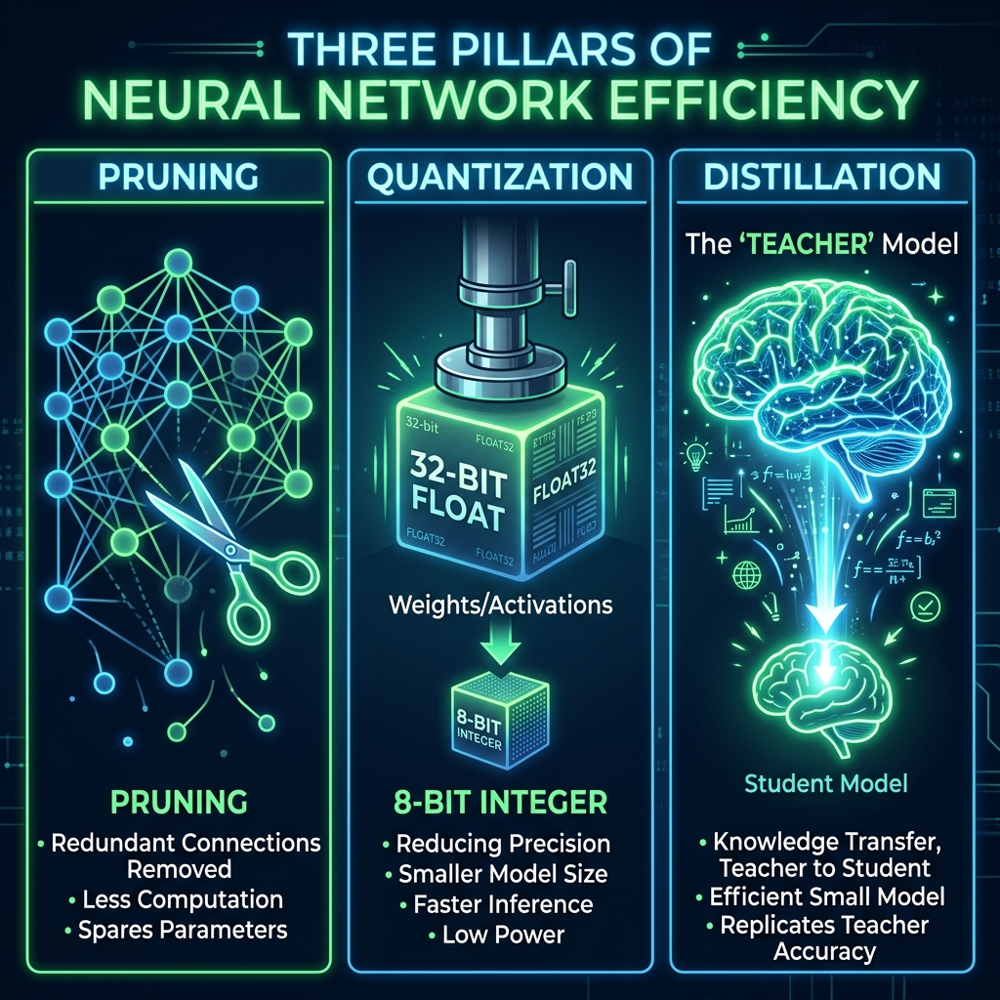

# 📘 Session 15 — Network Efficiency
### Course: Deep Learning Using Neural Networks | Aptech
### Duration: 2 Hours (TL15)
---

> **Professor's Opening Note:**
> *"Congratulations on reaching the final session! You now know how to build massive, highly accurate deep networks. But what happens when you try to put a 5GB neural network onto an Apple Watch? It crashes. Today, we learn the dark arts of Model Compression: How to shrink massive AI models into tiny, hyper-efficient packages without losing their intelligence."*

---

## 📚 Table of Contents
1. [The Need for Efficiency](#1-the-need-for-efficiency)
2. [Strategy 1: Weight Pruning](#2-strategy-1-weight-pruning)
3. [Strategy 2: Quantization](#3-strategy-2-quantization)
4. [Strategy 3: Knowledge Distillation](#4-strategy-3-knowledge-distillation)
5. [Recommended Videos](#5-recommended-videos)

---

## 1. The Need for Efficiency

As we learned in Session 14, making networks deeper allows them to learn complex hierarchies. The downside is that they become incredibly heavy.
A model like GPT-3 has 175 Billion parameters. It requires supercomputers to run.

If we want AI on mobile phones, pacemakers, IoT devices, and smartwatches, we must focus on **Inference Efficiency** (how fast the model can make a prediction) and **Memory Footprint** (how much RAM the model takes up).

---

## 2. Strategy 1: Weight Pruning

In a neural network, not every neuron is useful. Some weights might be completely ignored by the network.

**Weight Pruning** is the process of taking a trained neural network and literally cutting out the connections that have a weight close to zero.
- You can remove up to 50% of the connections in a network and suffer almost **zero drop in accuracy**.
- It makes the model lighter and faster because the computer doesn't have to multiply numbers by zero anymore.

---

## 3. Strategy 2: Quantization

By default, TensorFlow saves every single weight as a **32-bit Floating Point Number** (e.g., `0.12345678`).
These numbers are highly precise, but they take up a lot of memory.

**Quantization** is the process of squishing those high-precision numbers into **8-bit Integers** (e.g., rounding it to just `0.1`).
- This instantly reduces the size of your model by **4x** (from 32 bits down to 8 bits).
- Surprisingly, neural networks are very resilient. Even when you "dumb down" the precision of the numbers, the overall accuracy barely drops!

---

## 4. Strategy 3: Knowledge Distillation

What if you *must* use a tiny model, but the tiny model isn't smart enough to learn the data? You use Distillation.

**How it works:**
1. You train a massive, complex **Teacher Model** on a supercomputer until it has 99% accuracy.
2. You create a tiny **Student Model**.
3. Instead of teaching the Student using the raw data, you have the Student try to copy the *exact probabilities* that the Teacher outputs (called "Soft Targets").
4. The tiny Student learns incredibly fast, achieving accuracies it could never have reached on its own!

---

## 5. 🎬 Recommended Videos

### 🥇 Video 1 — The Masterclass on Shrinking
**"Model Compression Explained: Making AI Smaller & Faster"**
- 📺 Channel: Search YouTube for this exact title.
- 🎯 Why Watch: An excellent beginner overview covering the exact three pillars (Pruning, Quantization, Distillation) in a structured, easy-to-digest format.

### 🥈 Video 2 — The Math Behind Distillation
**"Knowledge Distillation in Machine Learning"**
- 📺 Channel: Search YouTube for "Knowledge Distillation explained".
- 🎯 Why Watch: To understand how "Soft Targets" actually work, and why a Teacher predicting "80% Dog, 20% Cat" is actually far more helpful to a student than just predicting "Dog".

---
*© 2024 Aptech Limited | Deep Learning Using Neural Networks | Session 15*
