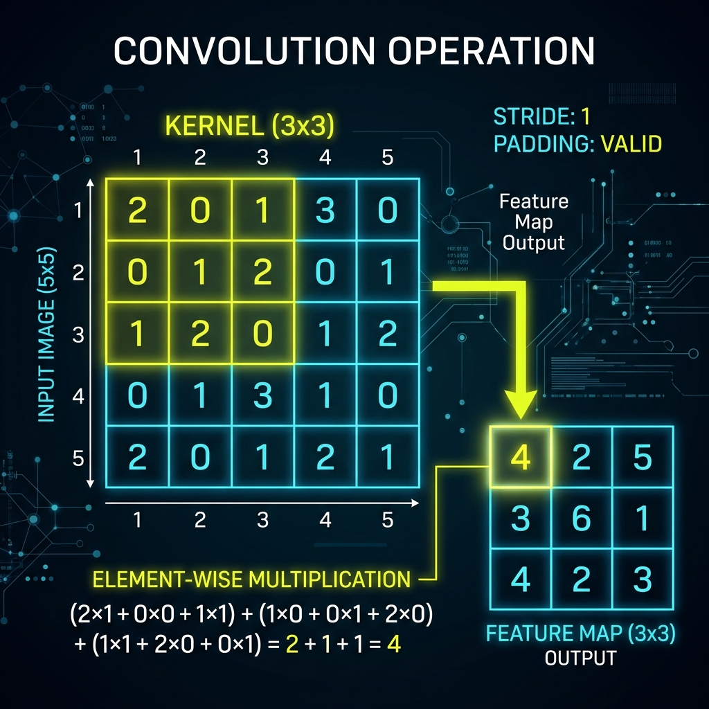
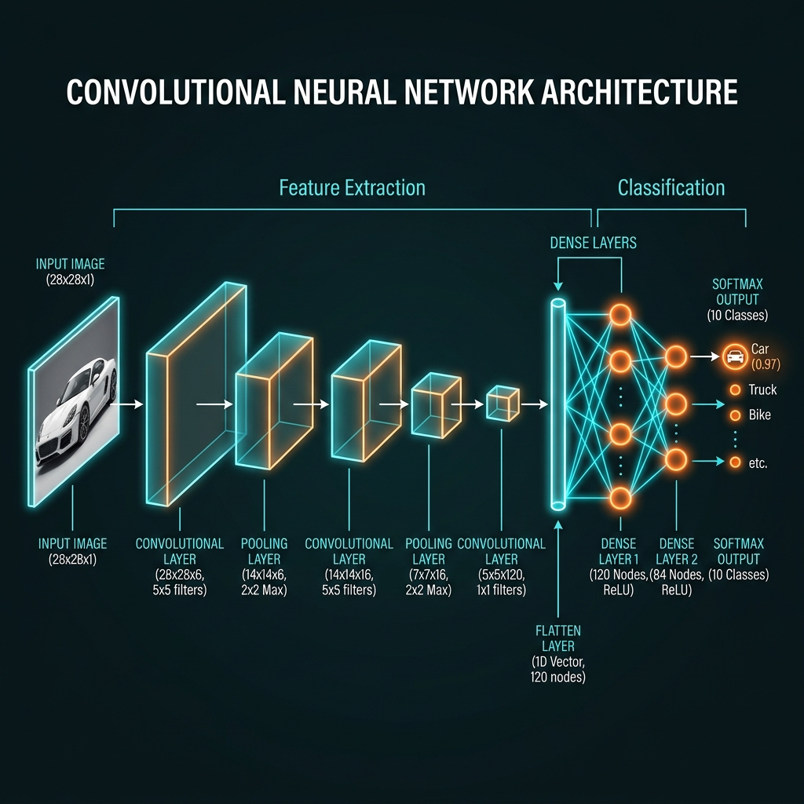

# 📘 Session 16 — Convolutional Neural Networks (CNNs)
### Course: Deep Learning Using Neural Networks | Aptech
### Duration: 2 Hours (TL16)
---

> **Professor's Opening Note:**
> *"In our last workshop, we tried to classify CIFAR-10 images using standard Dense layers. We struggled to get past 55% accuracy. Why? Because Dense layers flatten 2D images into 1D arrays, destroying all spatial relationships. An eye is an eye because of the pixels surrounding it. Today, we introduce Convolutional Neural Networks—the undisputed kings of computer vision."*

---

## 📚 Table of Contents
1. [The Problem with Dense Networks for Images](#1-the-problem-with-dense-networks-for-images)
2. [The Convolution Operation (Kernels/Filters)](#2-the-convolution-operation-kernelsfilters)
3. [The Pooling Operation (Downsampling)](#3-the-pooling-operation-downsampling)
4. [The Full CNN Architecture](#4-the-full-cnn-architecture)
5. [Recommended Videos](#5-recommended-videos)

---

## 1. The Problem with Dense Networks for Images

When you feed a 28x28 pixel image into a standard `Dense` network, the first thing you do is use a `Flatten` layer. You turn a beautiful 2D square of pixels into a single, straight line of 784 numbers.

This destroys **Spatial Hierarchy**.
If pixel 12 is part of a dog's ear, and pixel 13 is part of the background, flattening them treats them identically. Dense layers cannot easily understand that pixels near each other are related.

**Convolutional Neural Networks (CNNs)** solve this by keeping the image in its original 2D (or 3D color) shape!

---

## 2. The Convolution Operation (Kernels/Filters)

How does a CNN look at a 2D image? It uses a **Kernel** (also called a Filter).

Imagine a tiny 3x3 square magnifying glass. The CNN places this magnifying glass at the top-left corner of the image, performs a mathematical calculation (a dot product), outputs a single number, and then *slides* the magnifying glass over by one pixel.

- These kernels detect specific features: One kernel might slide over the image and exclusively light up when it sees a horizontal line. Another kernel might look for vertical edges.
- **The Magic:** We don't program the kernels! The neural network *learns* what the kernels should be during backpropagation.

---

## 3. The Pooling Operation (Downsampling)

After passing the image through several Kernels, we end up with a very large "Feature Map". If we keep doing this, the network will run out of memory.

We solve this using **Max Pooling**.
- Pooling takes a small grid (e.g., 2x2) and simply asks: *"What is the largest number in this grid?"*
- It keeps that largest number and throws the rest away.
- **Why?** It cuts the image size in half! This forces the network to focus only on the most prominent, important features (like the brightest edge of an eye) and ignore the noise.

---

## 4. The Full CNN Architecture

A classic CNN always follows this specific pattern:

1. **Input Image:** Raw 2D/3D pixels.
2. **Convolution Layer:** Extracts basic features (edges).
3. **Pooling Layer:** Shrinks the image size, focusing on the most important parts.
4. **Convolution Layer:** Extracts complex features (shapes).
5. **Pooling Layer:** Shrinks it again.
6. **Flatten Layer:** Once the image is reduced to tiny, dense concepts, we finally flatten it into a 1D array.
7. **Dense Layers:** Standard neurons that make the final classification (e.g., "This is a dog").

---

## 5. 🎬 Recommended Videos

### 🥇 Video 1 — Visualizing the Math
**"Simple explanation of convolutional neural network"**
- 📺 Channel: **Codebasics**
- 🎯 Why Watch: The best beginner-friendly explanation of how the 3x3 kernel math actually works without making it overly complicated.

### 🥈 Video 2 — The Full Pipeline
**"Convolutional Neural Networks (CNNs) - Explained"**
- 📺 Channel: **Datamlistic**
- 🎯 Why Watch: A fantastic modern visual breakdown of how an image flows through multiple Convolution and Pooling layers before finally hitting the Dense output.

---
*© 2024 Aptech Limited | Deep Learning Using Neural Networks | Session 16*
