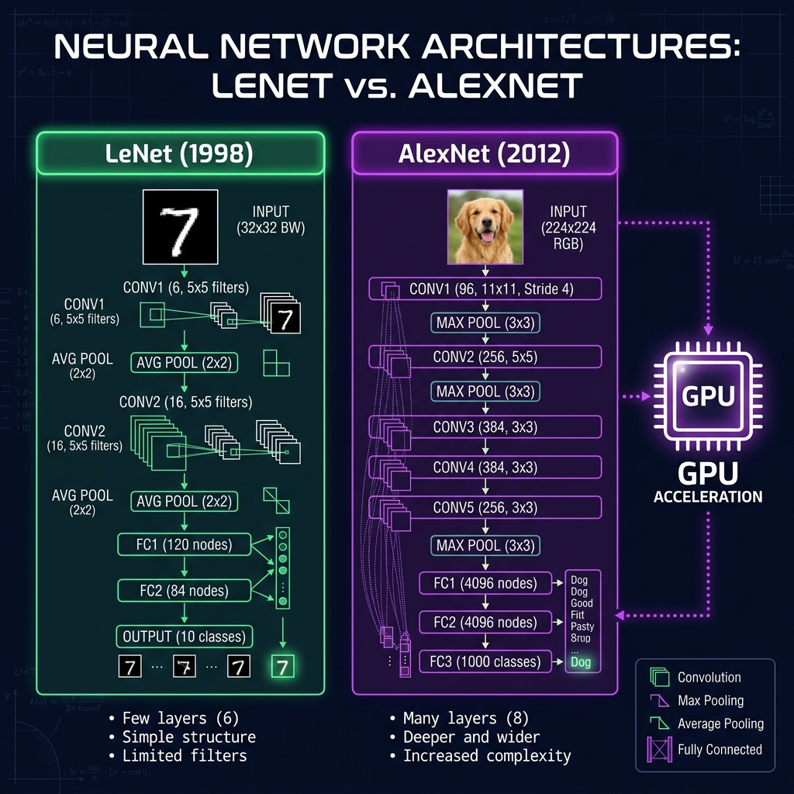
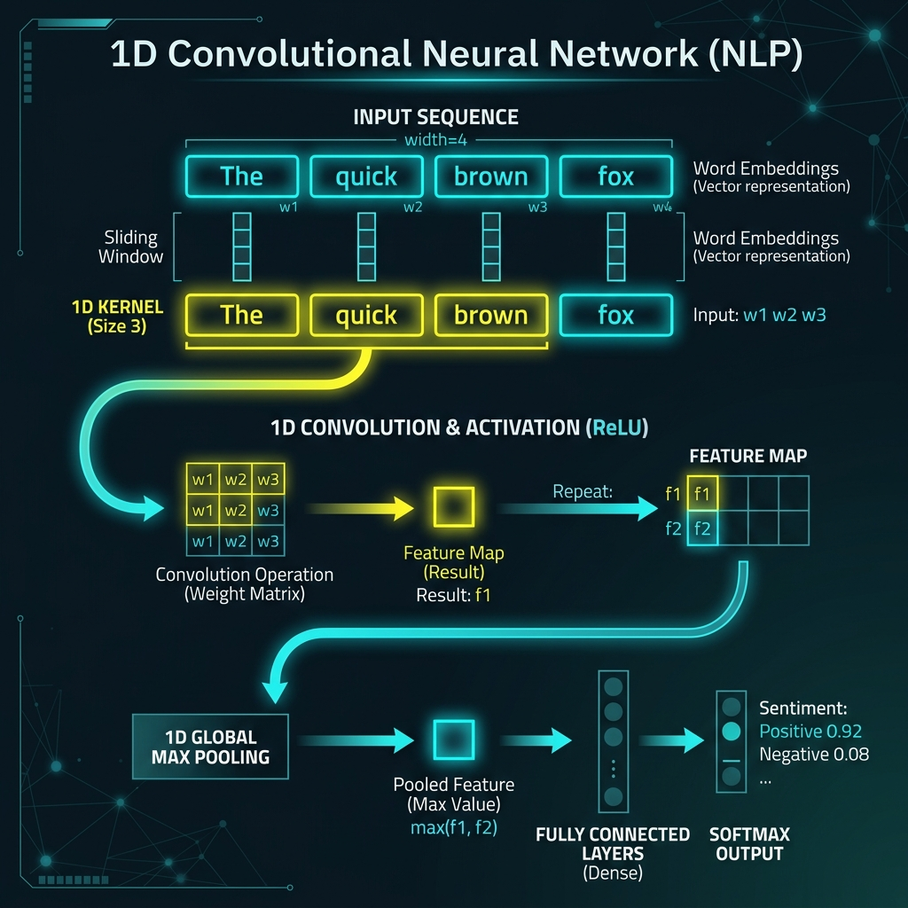

# 📘 Session 17 — Classic CNNs and NLP
### Course: Deep Learning Using Neural Networks | Aptech
### Duration: 2 Hours (TL17)
---

> **Professor's Opening Note:**
> *"Today, we take a brief walk through history to see how CNNs evolved from reading handwritten checks in the 1990s to revolutionizing the entire field of AI in 2012. Then, we will look at a surprising twist: What happens when we use a 'Computer Vision' network to read text?"*

---

## 📚 Table of Contents
1. [The Pioneer: LeNet-5 (1998)](#1-the-pioneer-lenet-5-1998)
2. [The Revolution: AlexNet (2012)](#2-the-revolution-alexnet-2012)
3. [A Plot Twist: CNNs for Text (NLP)](#3-a-plot-twist-cnns-for-text-nlp)
4. [1D Convolutions](#4-1d-convolutions)
5. [Recommended Videos](#5-recommended-videos)

---

## 1. The Pioneer: LeNet-5 (1998)

In 1998, Yann LeCun invented **LeNet-5**, one of the very first Convolutional Neural Networks. 

**Core Characteristics:**
- **Purpose:** Built for banks to automatically read handwritten numbers on checks (the MNIST dataset).
- **Architecture:** Extremely small. Just 2 Convolutional layers, 2 Pooling layers, and some Dense layers.
- **Limitations:** It was trained on CPUs. It took weeks to train and could only process tiny 32x32 pixel black-and-white images.

---

## 2. The Revolution: AlexNet (2012)

For 14 years, AI was largely ignored because computers weren't fast enough. Then, in 2012, **AlexNet** destroyed the competition in the ImageNet challenge (classifying 1 million high-resolution color photos into 1,000 categories).

**Why was AlexNet Revolutionary?**
1. **GPUs:** It was the first major model programmed to run on NVIDIA gaming GPUs, speeding up training by 50x.
2. **Depth:** It had 5 Convolutional Layers, extracting incredibly deep hierarchical features.
3. **ReLU Activation:** It abandoned the old 'Sigmoid' function for 'ReLU', solving the vanishing gradient problem.
4. **Dropout:** It introduced Dropout to prevent the massive network from overfitting.

Because of AlexNet, CNNs are now used in medical imaging (finding tumors), self-driving cars (Tesla Autopilot), and facial recognition.

---

## 3. A Plot Twist: CNNs for Text (NLP)

For the last two sessions, we learned that CNNs slide a 2D magnifying glass over a 2D image. But can a CNN read a book? Yes!

In Natural Language Processing (NLP), a sentence is just a sequence of words:
`["The", "quick", "brown", "fox"]`

Instead of sliding a 2D box over pixels, we can slide a **1D Box** over words!

---

## 4. 1D Convolutions

When applying a CNN to text, we use `Conv1D` instead of `Conv2D`.

- **The Kernel:** Instead of a 3x3 square, the kernel is a 1D line of length 3 (it looks at 3 words at a time).
- **Feature Extraction:** As the kernel slides across the sentence, it learns to group words together. It learns that "New" and "York" belong together as a single feature, or that "not" and "good" combine to create a negative sentiment.
- **Speed:** CNNs are exceptionally fast at reading text, often much faster than traditional text-based models (like RNNs or LSTMs), making them great for real-time sentiment analysis on social media.

---

## 5. 🎬 Recommended Videos

### 🥇 Video 1 — The History Lesson
**"Classic CNN Architectures Explained (LeNet, AlexNet, VGG)"**
- 📺 Channel: Search YouTube for "LeNet and AlexNet explained".
- 🎯 Why Watch: To understand the historical leap from 1998 to 2012 and why GPUs changed the world.

### 🥈 Video 2 — Sliding over Words
**"1D Convolutional Neural Network | 1D CNN vs 2D CNN"**
- 📺 Channel: Search YouTube for "1D CNN vs 2D CNN explained".
- 🎯 Why Watch: The best visual explanation of how a filter slides across an array of words instead of an array of pixels.

---
*© 2024 Aptech Limited | Deep Learning Using Neural Networks | Session 17*
