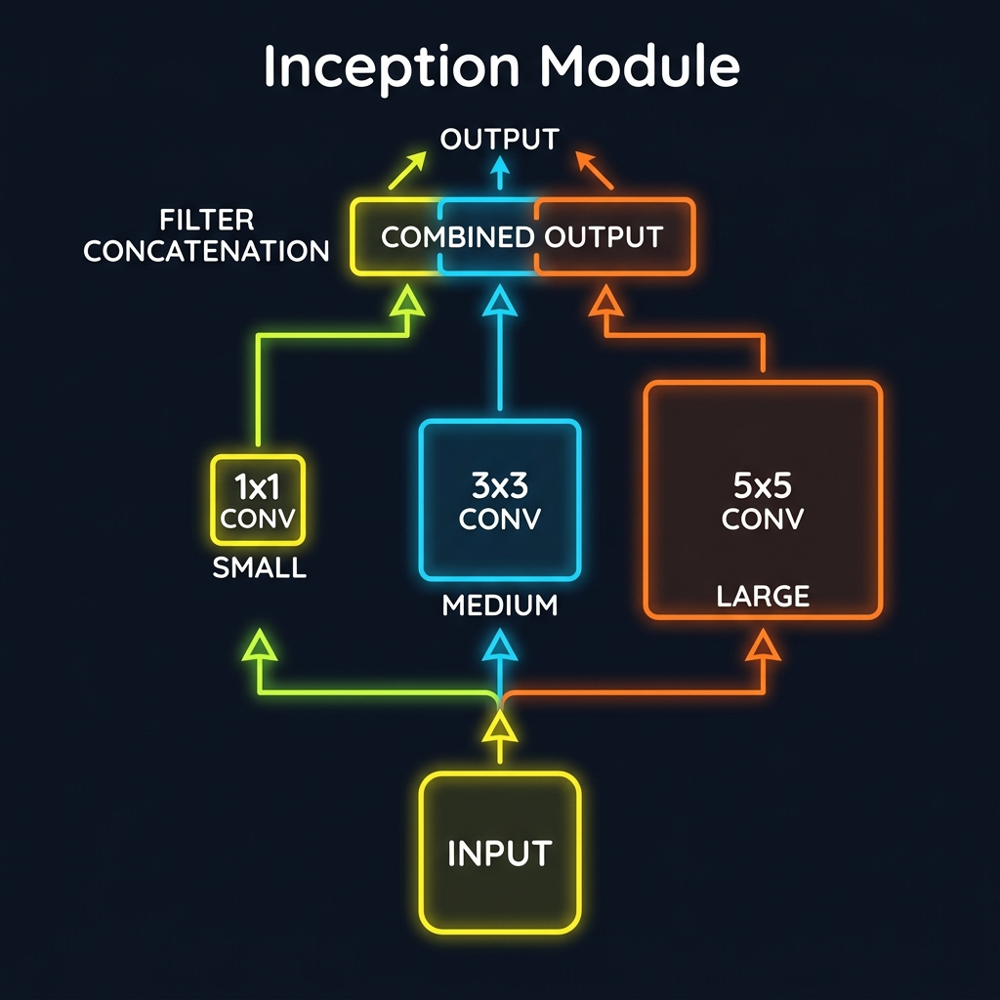
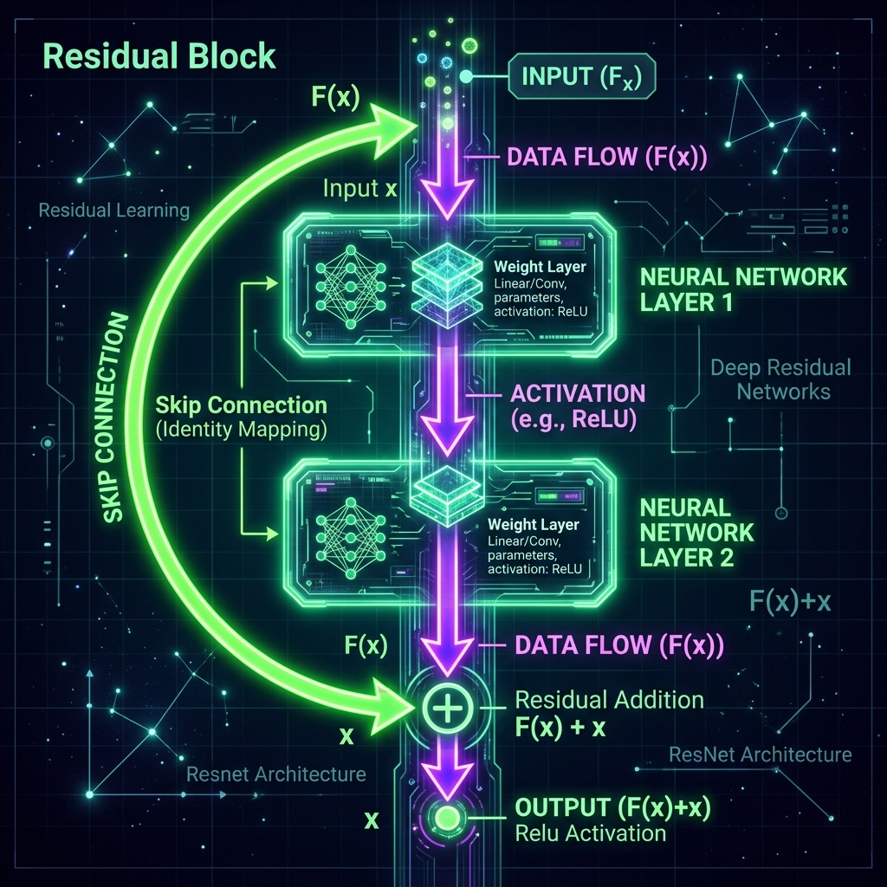

# 📘 Session 18 — Advanced CNN Architectures
### Course: Deep Learning Using Neural Networks | Aptech
### Duration: 2 Hours (TL18)
---

> **Professor's Opening Note:**
> *"After AlexNet proved that Deep Learning worked in 2012, researchers began a massive race to build better, deeper, and faster CNNs. Today, we will look at three famous architectures—VGGNet, InceptionNet, and ResNet—and learn the specific tricks they invented to conquer the ImageNet challenge."*

---

## 📚 Table of Contents
1. [VGGNet: The Power of Simplicity](#1-vggnet-the-power-of-simplicity)
2. [InceptionNet (GoogLeNet): The Power of Parallelism](#2-inceptionnet-googlenet-the-power-of-parallelism)
3. [ResNet: Conquering the Vanishing Gradient](#3-resnet-conquering-the-vanishing-gradient)
4. [Recommended Videos](#4-recommended-videos)

---

## 1. VGGNet: The Math of 3x3 Kernels

Invented by the Visual Geometry Group at Oxford, **VGGNet** (specifically VGG16) is famous for its extreme simplicity. Prior to VGG, researchers used large kernels (like 11x11 or 7x7) to capture large features. VGG proved that you only ever need tiny **3x3 kernels**, provided you stack them deep enough.

### Why 3x3? The Parameter Calculation
Let's look at the math to understand *why* VGG threw away 5x5 kernels.

Imagine you want a Receptive Field (the area the network "sees") of 5x5 pixels.
- **Option A (One 5x5 Kernel):**
  A 5x5 kernel requires **25 parameters** (weights to learn).
  
- **Option B (Two 3x3 Kernels Stacked):**
  If you pass an image through a 3x3 kernel, and then pass *that* output through another 3x3 kernel, the final layer effectively "sees" a 5x5 area of the original image.
  How many parameters does this take?
  $3 \times 3 = 9$ parameters for the first layer.
  $3 \times 3 = 9$ parameters for the second layer.
  Total: **18 parameters.**

By stacking two 3x3 kernels, VGG achieves the exact same spatial coverage as a 5x5 kernel, but uses **28% fewer parameters** (18 vs 25). It also gets to apply a ReLU activation function *twice* instead of once, making the network highly non-linear and smarter.

- **The Problem:** Because VGG16 stacks 16 layers and uses many filters (up to 512 per layer), the Dense layers at the end bloat the network to 138 Million parameters. It is mathematically beautiful, but computationally heavy.

---

## 2. InceptionNet: The 1x1 Bottleneck

Google wanted to solve VGG's weight problem. They realized a problem with traditional CNNs: *Should I use a 3x3 kernel to look for small details, or a 5x5 kernel to look for large shapes?* Google's answer: **Run them all in parallel.**

### The Inception Block
Instead of one layer feeding into the next sequentially, the data splits into multiple parallel paths: a 1x1, a 3x3, and a 5x5 convolution all happen simultaneously. Their outputs are then concatenated (glued together along the depth axis). 

### The Genius of the 1x1 Convolution
Running a 5x5 convolution on a deep image (e.g., an image with 512 channels) requires hundreds of millions of multiplications. To solve this, Google heavily utilized the **1x1 Convolution** as a "Bottleneck".

**What does a 1x1 convolution do?** 
Spatially, it does nothing (it looks at 1 pixel at a time). However, it operates across the *depth* (channels).
If you have an input of shape `(28, 28, 512)` and you apply 64 filters of size 1x1, the output becomes `(28, 28, 64)`. 
Google used 1x1 convolutions to squash the depth from 512 down to 64 *before* running the expensive 3x3 and 5x5 operations. This drastically reduced the computational load, allowing InceptionNet to be 22 layers deep but use only 5 Million parameters (compared to VGG's 138 Million).

---

## 3. ResNet: Conquering the Vanishing Gradient

By 2015, researchers hit a wall. If they tried to build a network with 50 or 100 layers, the accuracy plummeted. This was the **Vanishing Gradient Problem**. During backpropagation, the error signal must be multiplied backward through the layers. Multiplying small numbers (gradients < 1) 100 times causes the signal to shrink to zero. The early layers never update.

Microsoft solved this by inventing **ResNet (Residual Networks)** and introducing the **Skip Connection**.

### The Mathematics of the Skip Connection
Normally, a layer learns a mapping function, let's call it $F(x)$.
In a Residual Block, the input $x$ takes a shortcut around the convolutional layers and is added directly to the output. 
The new function becomes:
$$H(x) = F(x) + x$$

**Why does this solve the Vanishing Gradient?**
Recall basic calculus. The gradient (derivative) of $x$ with respect to $x$ is **1**.
During backpropagation, the error signal travels backward. Because of the $+ x$ term, the gradient always has a base value of $1$ that travels completely unimpeded down the "skip connection" superhighway. The gradient physically cannot vanish. 

This mathematical trick allowed ResNet to successfully train networks that were 152 layers deep, crushing the ImageNet competition.

---

## 4. 🎬 Recommended Videos

### 🥇 Video 1 — The Math of Skip Connections
**"ResNet Explained Simply (Skip Connections Guide)"**
- 📺 Channel: Search YouTube for this exact title.
- 🎯 Why Watch: The absolute best explanation of how the $+ x$ term acts as a "highway" to guarantee a gradient of 1.

### 🥈 Video 2 — 1x1 Convolutions
**"1x1 Convolution - Andrew Ng"**
- 📺 Channel: Search YouTube for "Andrew Ng 1x1 convolution".
- 🎯 Why Watch: A brilliant whiteboard breakdown of how 1x1 filters reduce computational cost by squashing channels.

---
*© 2024 Aptech Limited | Deep Learning Using Neural Networks | Session 18*
