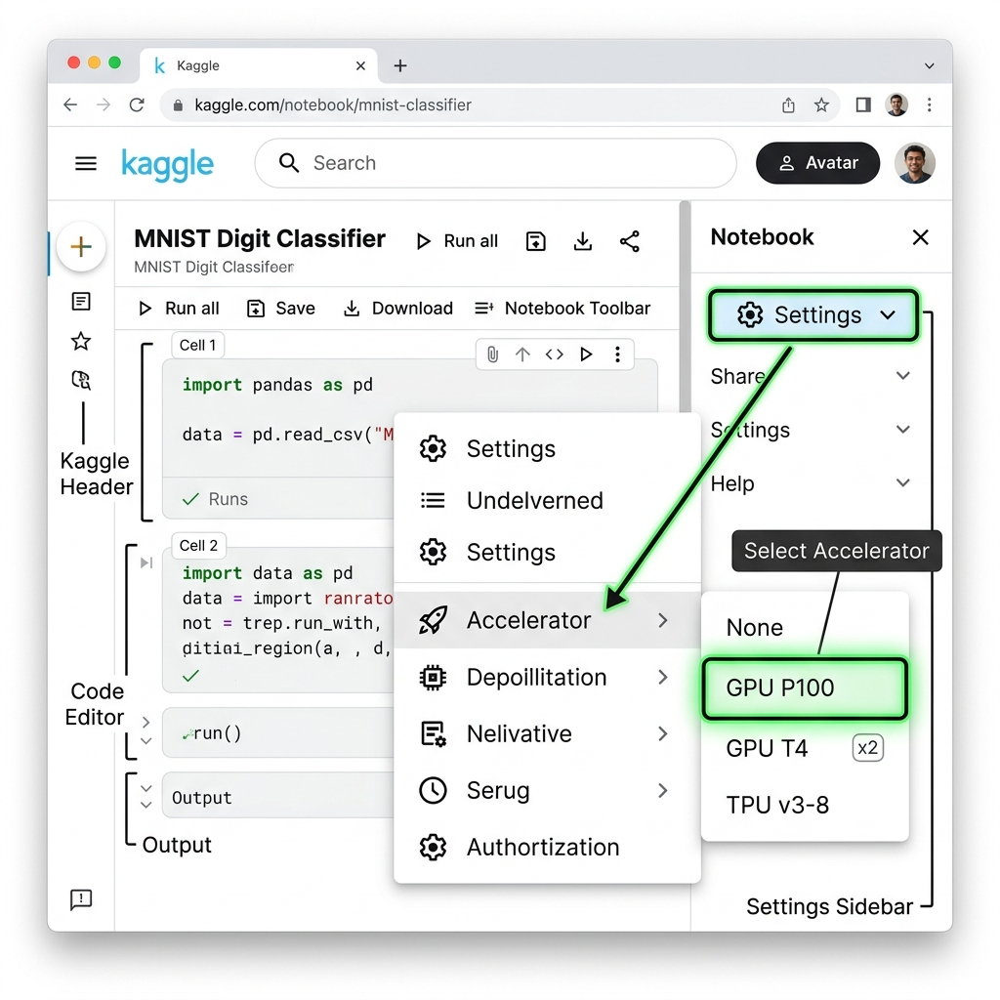
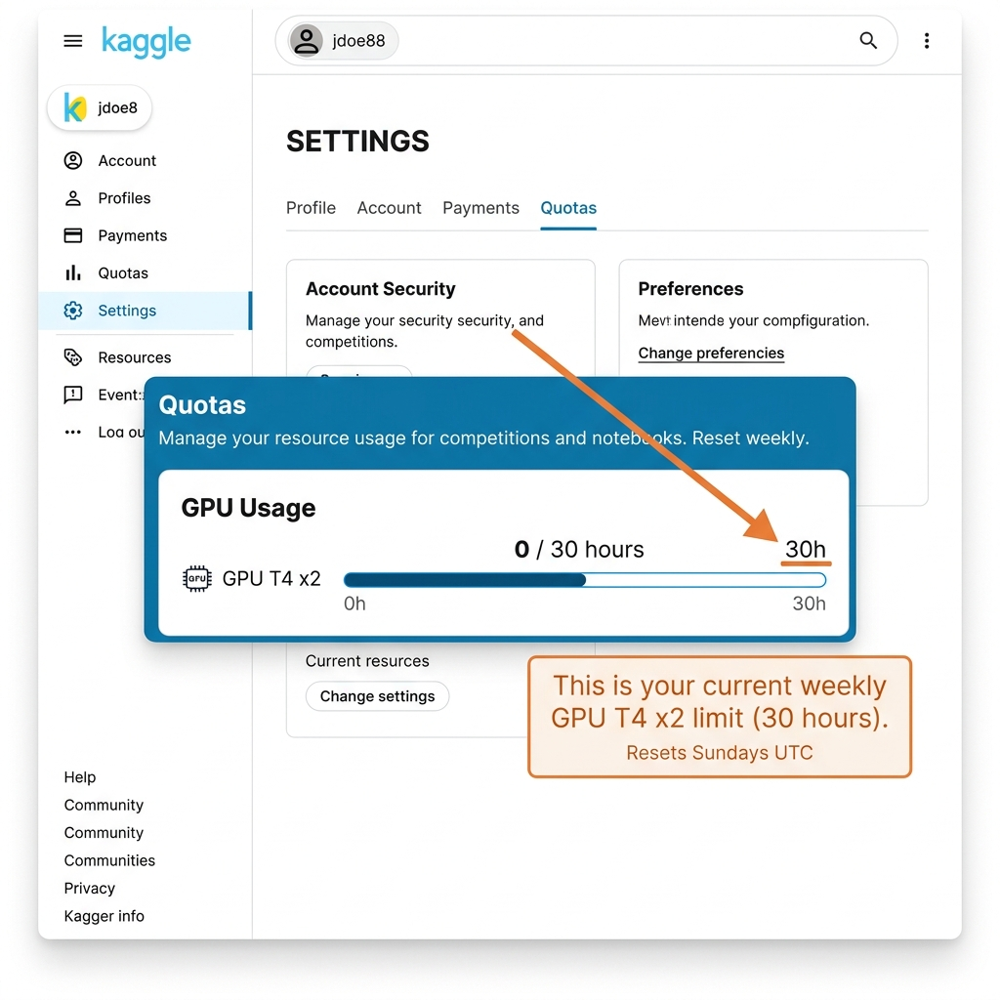

# 📘 Session 19 — The "Zero-to-Hero" Environment Setup
### Course: Deep Learning Using Neural Networks | Aptech
### Duration: 2 Hours (TL19)
---

> **Professor's Opening Note:**
> *"Up until now, we have talked a lot about the math and architecture of Neural Networks. Today, we step out of the classroom and into the laboratory. You will learn exactly how to open a cloud-computing environment, turn on a massive GPU, and execute a Deep Learning script from scratch."*

---

## 📚 Table of Contents
1. [What is Kaggle?](#1-what-is-kaggle)
2. [Step 1: Creating an Account & Phone Verification](#2-step-1-creating-an-account--phone-verification)
3. [Step 2: Starting a New Notebook](#3-step-2-starting-a-new-notebook)
4. [Step 3: Turning on the GPU](#4-step-3-turning-on-the-gpu)
5. [The 30-Hour Quota Limit](#5-the-30-hour-quota-limit)
6. [Step 4: The 'Play' Button](#6-step-4-the-play-button)

---

## 1. What is Kaggle?

**Kaggle** is a massive online community for data scientists. More importantly for us, it provides **free cloud computers** called "Notebooks". 

Instead of buying a $3,000 computer to run Neural Networks, you can just log into Kaggle in your web browser, and they will lend you one of their supercomputers for free.

---

## 2. Step 1: Creating an Account & Phone Verification

1. Go to **[Kaggle.com](https://www.kaggle.com/)** and click "Register".
2. You can sign up using your Google account or an email address.
3. **CRITICAL STEP — Phone Verification:** 
   Kaggle protects its free supercomputers from spam bots. You *must* verify your phone number to unlock the GPUs.
   - Click your profile picture in the top right corner.
   - Click **Settings**.
   - Scroll down to the **Phone Verification** section.
   - Enter your phone number and verify the SMS code.

---

## 3. Step 2: Starting a New Notebook

A "Notebook" is just a document where you can write code, and the cloud computer will read it and execute it.

1. On the left-hand menu of Kaggle, click **Code**.
2. Near the top right, click the black **New Notebook** button.
3. You are now looking at an empty Python environment running on a server hundreds of miles away!

---

## 4. Step 3: Turning on the GPU

By default, Kaggle gives you a standard CPU. Deep Learning requires a GPU.

1. Look at the top menu bar of your new Notebook.
2. Click **Settings**.
3. Hover over **Accelerator**.
4. Select **GPU P100** or **GPU T4 x2**.
   *(Note: If these options are grayed out, it means you did not complete the Phone Verification in Step 1!)*
5. The notebook will briefly reboot. When it turns back on, you have a massive graphics card at your disposal!

## 5. The 30-Hour Quota Limit

Kaggle gives every user **30 free hours of GPU usage per week**. Once you hit 30 hours, you have to wait until the next week to use the GPU again (though standard CPUs are always unlimited).

**How to check your hours:**
1. Click your Profile Picture in the top right of Kaggle.
2. Click **Settings**.
3. Scroll down to the **Quotas** section. Here you will see a progress bar showing exactly how many of your 30 hours you have consumed.
*(Tip: Always click the "Stop Session" power button in your notebook when you are done working so you don't waste hours!)*

---

## 6. Step 4: The 'Play' Button

In a Notebook, you write code inside blocks called "Cells".

1. Click on the empty gray box (the cell) in your notebook.
2. Type exactly this: `print("Hello AI!")`
3. Hover your mouse over the left side of the cell. A blue "Play" button (triangle) will appear.
4. **Click the Play button.**
5. Wait a second, and you will see the computer output `Hello AI!` right beneath the cell.

You are now ready to write Deep Learning code!

---
*© 2024 Aptech Limited | Deep Learning Using Neural Networks | Session 19*
