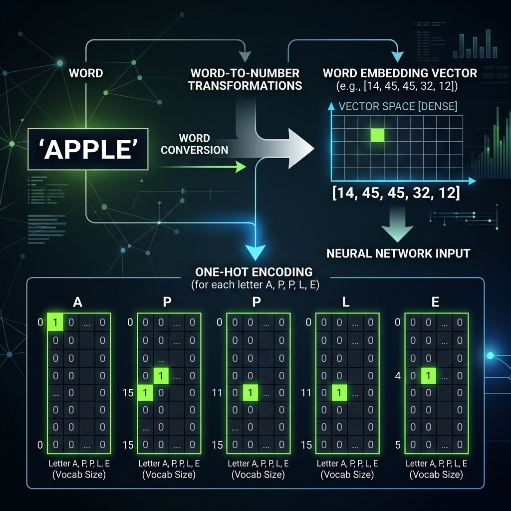
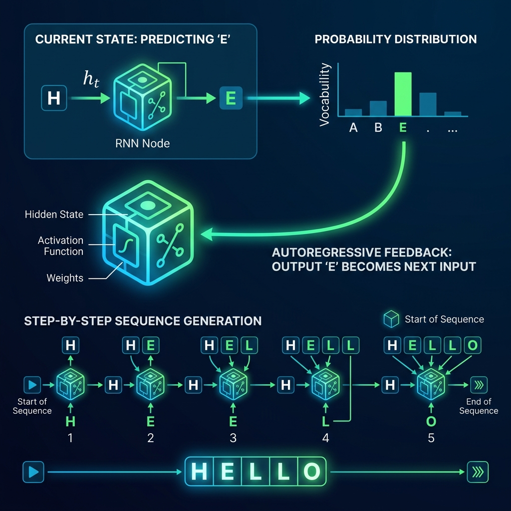

# 📘 Session 21 — RNN Text Generation
### Course: Deep Learning Using Neural Networks | Aptech
### Duration: 2 Hours (TL21)
---

> **Professor's Opening Note:**
> *"Now that we know how Recurrent Neural Networks (RNNs) remember the past, we can start doing magic. Today, we will learn how to feed words into a computer and use an RNN to generate entirely new text, character by character."*

---

## 📚 Table of Contents
1. [Sequential Data Representation: Words to Numbers](#1-sequential-data-representation-words-to-numbers)
2. [The Concept of the "Next Character"](#2-the-concept-of-the-next-character)
3. [Autoregressive Text Generation](#3-autoregressive-text-generation)
4. [Recommended Videos](#4-recommended-videos)

---

## 1. Sequential Data Representation: Words to Numbers

Neural networks cannot read English. They only understand math. Before we can ask an RNN to generate text, we must translate our text into numbers.

### Step A: Building a Vocabulary (The Dictionary)
First, we find all the unique characters in our dataset. For example, if our dataset is just the word `"HELLO"`, our unique characters are: `['H', 'E', 'L', 'O']`.

We then assign an **integer** to each character:
- `H` = 0
- `E` = 1
- `L` = 2
- `O` = 3

The word `"HELLO"` mathematically becomes: `[0, 1, 2, 2, 3]`.

### Step B: One-Hot Encoding
Integers can confuse neural networks. The network might think the letter 'O' (3) is "greater" than the letter 'H' (0). To fix this, we convert the integers into **One-Hot Vectors**. 

Since we have 4 total unique characters in our vocabulary, each character becomes a list of 4 numbers, consisting of mostly zeros, with a single `1` indicating its identity:
- `H`: `[1, 0, 0, 0]`
- `E`: `[0, 1, 0, 0]`
- `L`: `[0, 0, 1, 0]`
- `O`: `[0, 0, 0, 1]`

Now, the text is a pure mathematical matrix that the RNN can multiply weights against!

---

## 2. The Concept of the "Next Character"

To train an AI to write, we play a guessing game. We give it a sequence of letters and ask it to predict the *very next letter*. 

If our dataset is `"HELLO WORLD"`, we slice it into input sequences and target labels:
- **Input:** `"H E L L"` 👉 **Target:** `"O"`
- **Input:** `"E L L O"` 👉 **Target:** `" "` (space)
- **Input:** `"L L O "` 👉 **Target:** `"W"`

The RNN processes the Input sequence, combines it with its Hidden State (memory), and outputs a **probability distribution** over the entire vocabulary. For example, it might say: *"I am 80% sure the next letter is 'O', 15% sure it is 'E', and 5% sure it is 'H'."*

---

## 3. Autoregressive Text Generation

Once the RNN is fully trained on how to predict the next letter, how do we get it to write a whole paragraph? We use a process called **Autoregression**.

Autoregression simply means feeding the output back in as the new input in a continuous loop.

### The Generation Loop:
1. **The Seed:** We give the network a starting prompt, like `"H"`.
2. The network processes `"H"` and predicts the next letter is `"E"`.
3. We take that `"E"` and glue it to our prompt, making it `"H E"`.
4. We feed the new sequence `"H E"` back into the network. It predicts `"L"`.
5. We glue it together: `"H E L"`.
6. We loop this process 100 times, and suddenly the AI has written a full sentence!

---

## 4. 🎬 Recommended Videos

### 🥇 Video 1 — The Concept
**"Text Generation with an RNN (TensorFlow Tutorial)"**
- 📺 Channel: Search YouTube for "Tensorflow text generation RNN".
- 🎯 Why Watch: This is the gold-standard explanation from Google on how to chop text into sequences and train the network.

### 🥈 Video 2 — Building from Scratch
**"Build an AI Storyteller from Scratch | Character-Level Text Generation"**
- 📺 Channel: Search YouTube for this exact title.
- 🎯 Why Watch: An excellent beginner project that shows exactly how characters are converted to numbers and fed into the network loop.

---
*© 2024 Aptech Limited | Deep Learning Using Neural Networks | Session 21*
