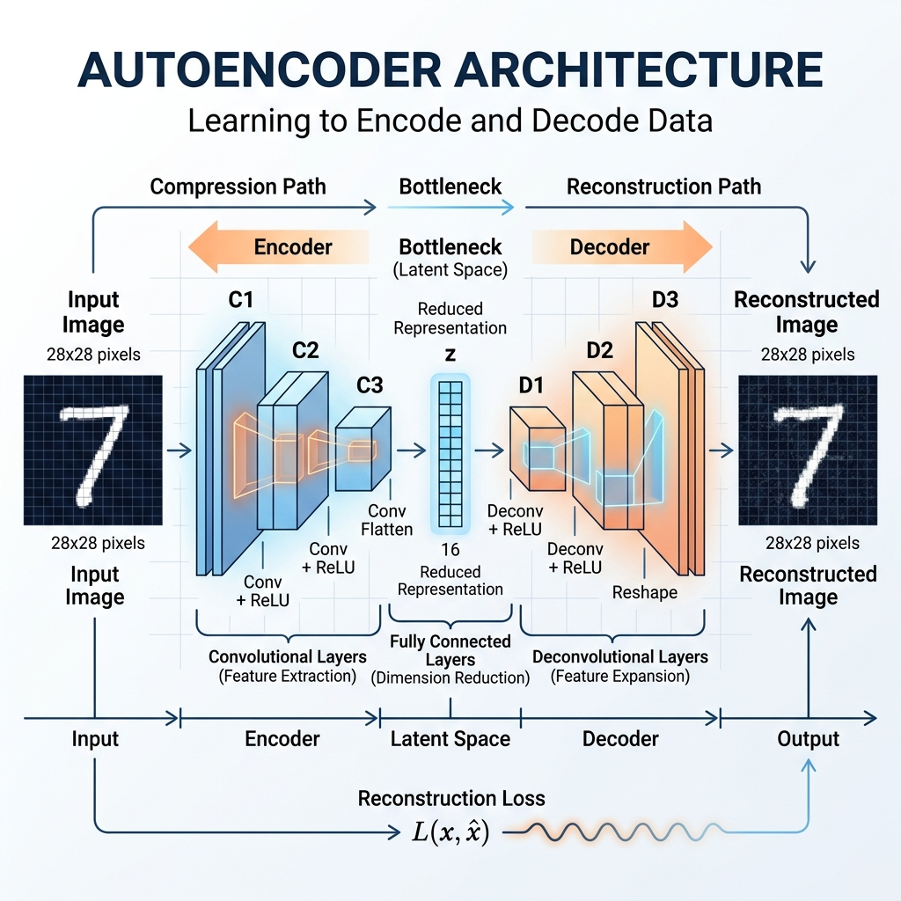
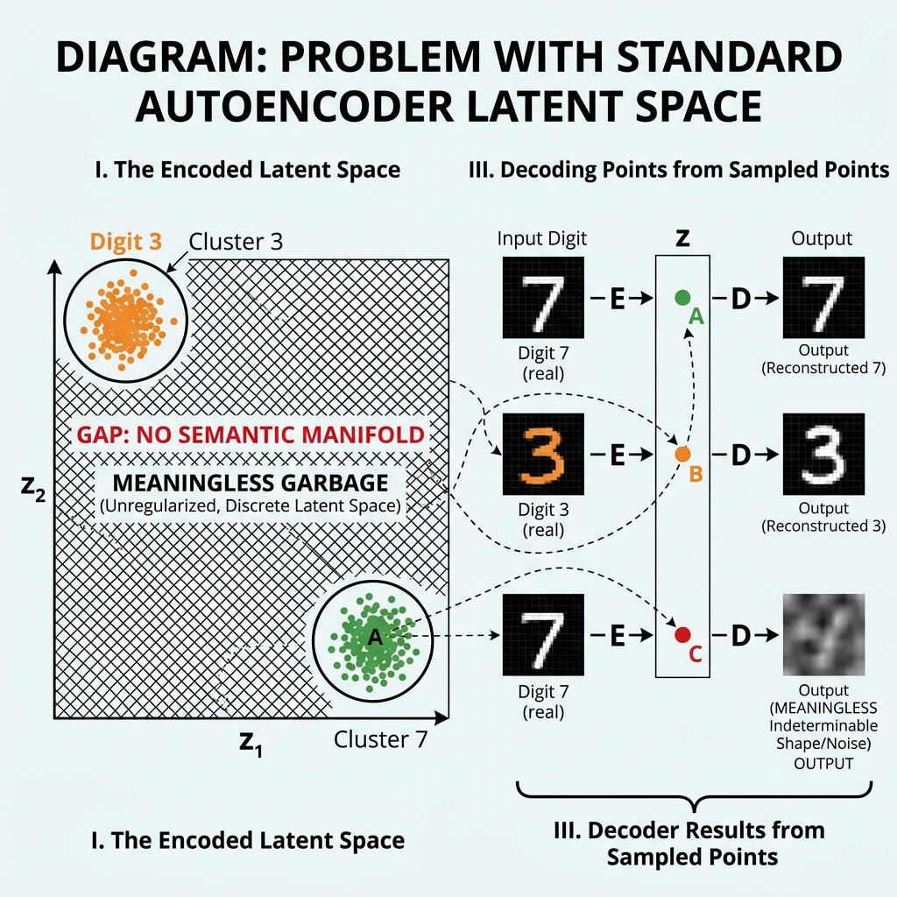
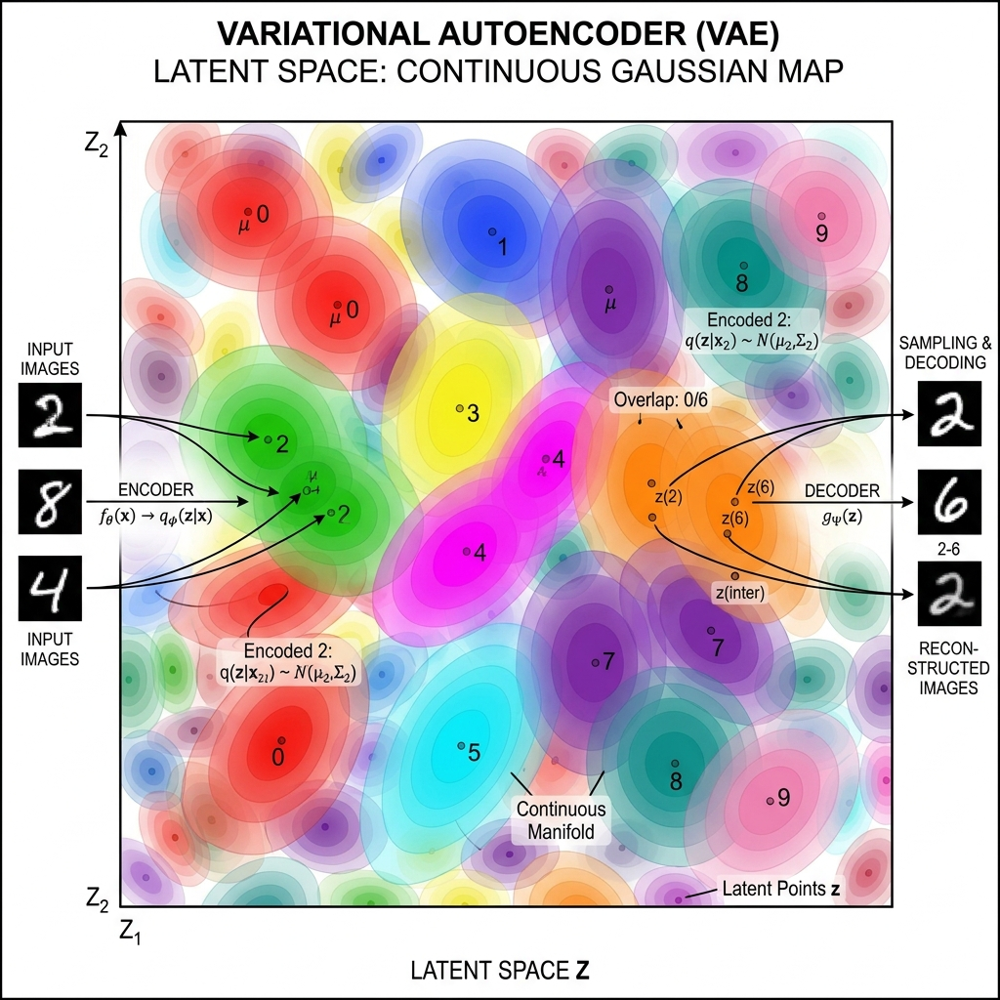
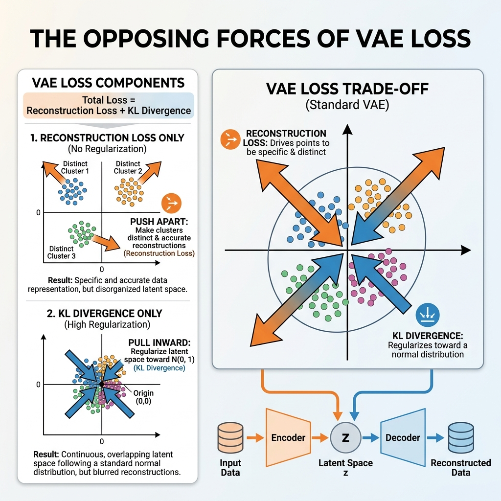

# Session 22 -- Variational Autoencoder (VAE)
### Course: Deep Learning Using Neural Networks | Aptech
### Duration: 2 Hours (TL22)
---

> **Professor's Opening Note:**
> *"So far, our neural networks have been classifiers -- they look at an image and say 'this is a cat.' Today, we flip the script entirely. We are going to build a network that creates brand new images that have never existed before. Welcome to the world of Generative Models."*

---

## Table of Contents
1. [What is an Autoencoder?](#1-what-is-an-autoencoder)
2. [The Problem with Regular Autoencoders](#2-the-problem-with-regular-autoencoders)
3. [The Variational Autoencoder (VAE)](#3-the-variational-autoencoder-vae)
4. [The VAE Loss Function](#4-the-vae-loss-function)
5. [The Reparameterization Trick](#5-the-reparameterization-trick)
6. [Real-World Applications](#6-real-world-applications)
7. [Recommended Videos](#7-recommended-videos)

---

## 1. What is an Autoencoder?

Before we learn the "Variational" part, we need to understand a plain **Autoencoder (AE)**.

### The Suitcase Analogy

Imagine you are packing for a trip. You have a huge pile of clothes, shoes, books, and gadgets. Your job is to compress everything into a tiny carry-on suitcase (the **Bottleneck**), fly to your destination, and then unpack it perfectly to recreate the exact same pile.

An Autoencoder does the same thing with data:

1. **The Encoder** takes a large input (like a 28x28 image = 784 numbers) and *compresses* it down to a tiny vector (say, just 2 numbers). This tiny vector is called the **Latent Representation** or **Latent Code**.
2. **The Decoder** takes that tiny vector and tries to *reconstruct* the original image from it.



```
INPUT IMAGE (784 pixels)
        |
   [ ENCODER ]
   Dense(512) -> Dense(256) -> Dense(2)
        |
   LATENT CODE (just 2 numbers!)
        |
   [ DECODER ]
   Dense(256) -> Dense(512) -> Dense(784)
        |
RECONSTRUCTED IMAGE (784 pixels)
```

### Why is the Bottleneck Important?

If the network could just copy all 784 numbers through, it would learn nothing. By forcing the data through a tiny bottleneck (e.g., just 2 numbers), the network is forced to learn the *most important features* of the data. For handwritten digits, those 2 numbers might encode things like "how slanted the digit is" and "how round it is."

### The Training Objective

The Autoencoder is trained to minimize the difference between the input image and the reconstructed output image. This is called the **Reconstruction Loss**:

$$L_{reconstruction} = \frac{1}{n}\sum_{i=1}^{n}(x_i - \hat{x}_i)^2$$

### Plain English Translation:
- $x_i$ = the original pixel value
- $\hat{x}_i$ = the reconstructed pixel value  
- We square the difference so negatives don't cancel out positives
- We average across all pixels
- **In short:** "How different is my reconstruction from the original? Make that number as small as possible."

---

## 2. The Problem with Regular Autoencoders

A regular Autoencoder is great at compressing and reconstructing. But what if we want to **generate brand new images** that never existed in the training set?

Here is the problem: The Encoder maps each training image to a specific point in the latent space. But the space *between* those points is empty and meaningless.

### The Map with Holes

Think of the latent space as a map. A regular autoencoder places each digit image at a specific GPS coordinate on the map:
- All the "7"s cluster at coordinate (2.1, -0.5)
- All the "3"s cluster at coordinate (-1.8, 0.9)

But what happens if you pick a random coordinate *between* those clusters, like (0.0, 0.0), and feed it to the Decoder? You get garbage -- a blurry meaningless blob. The autoencoder never learned what belongs at that point on the map.



**This is the core limitation:** Regular autoencoders are good at *compression* but terrible at *generation*.

---

## 3. The Variational Autoencoder (VAE)

The **Variational Autoencoder** (Kingma & Welling, 2013) solves the "holes in the map" problem with one brilliant trick: Instead of encoding each image as a single fixed point, it encodes each image as a **probability distribution** (a cloud of possibilities).

### The "Blurry GPS" Analogy

Instead of saying "this digit 7 is at exactly coordinate (2.1, -0.5)," the VAE says:
- "This digit 7 is *somewhere around* (2.1, -0.5), give or take some randomness."
- Mathematically, it outputs a **mean** ($\mu$) and a **variance** ($\sigma^2$) for each latent dimension.

Because every image now maps to a *cloud* instead of a *dot*, the clouds overlap and fill the gaps in the latent space. Now, every point on the map produces something meaningful!



### The VAE Architecture

```
INPUT IMAGE (784 pixels)
        |
   [ ENCODER ]
   Dense(512) -> Dense(256)
        |            |
   [ mu layer ]  [ log_var layer ]
   Dense(2)      Dense(2)
        |            |
        v            v
      mu = 2.1    log_var = -0.5
        |            |
   [ REPARAMETERIZATION TRICK ]
   z = mu + sigma * epsilon
        |
   LATENT CODE z (2 numbers, but sampled!)
        |
   [ DECODER ]
   Dense(256) -> Dense(512) -> Dense(784)
        |
RECONSTRUCTED IMAGE (784 pixels)
```

The key difference from a regular autoencoder: **two output heads** from the encoder (mu and log_var) instead of one, plus random sampling in the middle.

---

## 4. The VAE Loss Function

The VAE is trained using a special loss that combines two forces:

$$L_{VAE} = L_{reconstruction} + L_{KL}$$

### Force 1: Reconstruction Loss

This is the same as before -- "make the output look like the input." It keeps the Decoder honest.

$$L_{reconstruction} = \frac{1}{n}\sum_{i=1}^{n}(x_i - \hat{x}_i)^2$$

### Force 2: KL Divergence

This is the new part. **KL Divergence** measures how different the encoder's learned distribution is from a standard Normal distribution $N(0, 1)$.

$$L_{KL} = -\frac{1}{2}\sum_{j=1}^{d}(1 + \log(\sigma_j^2) - \mu_j^2 - \sigma_j^2)$$

### Plain English Translation:

Think of two opposing forces pulling on a rubber band:

- **Force 1 (Reconstruction Loss)** says: *"Spread the digit clusters far apart so each digit is perfectly distinguishable and easy to reconstruct!"* This force wants the clusters to be as far apart and as tight as possible.

- **Force 2 (KL Divergence)** says: *"Pull everything toward the center! Make all the distributions look like a standard bell curve centered at zero!"* This force wants the clusters to overlap and merge.

The battle between these two forces creates a **sweet spot**: the clusters are spread enough to be distinguishable, but close enough that the space between them is smooth and continuous. This is what allows us to generate new, realistic images by sampling from *anywhere* in the latent space.



### Why log_var Instead of var?

You may have noticed the Encoder outputs `log_var` (the logarithm of variance) instead of variance directly. This is a practical trick:
- Variance must always be positive ($\sigma^2 > 0$)
- The logarithm can be any real number (positive or negative)
- Using log_var means the network's output layer doesn't need special constraints
- To get variance back: $\sigma^2 = e^{\log(\sigma^2)}$

---

## 5. The Reparameterization Trick

There is a critical engineering problem with VAEs: we need to **sample randomly** from the distribution (the cloud), but random sampling is not differentiable -- backpropagation cannot flow through randomness.

### The Solution

Instead of sampling $z$ directly from $N(\mu, \sigma^2)$, we rearrange the math:

1. Sample $\epsilon$ from a standard Normal $N(0, 1)$ -- this is "external" randomness.
2. Compute $z = \mu + \sigma \cdot \epsilon$

$$z = \mu + \sigma \odot \epsilon, \quad \epsilon \sim N(0, 1)$$

### Plain English Translation:

Imagine you want to go to a restaurant that is "somewhere near downtown" (your distribution). Instead of randomly teleporting there (non-differentiable), you:
1. Stand at the center of downtown ($\mu$)
2. Roll a die to get a random direction and distance ($\epsilon$)
3. Walk $\sigma$ blocks in that random direction

The final position $z$ is still random, but now the math *knows* about $\mu$ and $\sigma$, so gradients can flow through them during backpropagation. The randomness is isolated in $\epsilon$, which we treat as a constant during training.

### In Code:

```python
def reparameterize(mu, log_var):
    sigma = tf.exp(0.5 * log_var)       # Convert log_var to standard deviation
    epsilon = tf.random.normal(shape=mu.shape)  # Random noise
    z = mu + sigma * epsilon             # Shift and scale
    return z
```

---

## 6. Real-World Applications

### Application 1: Generating New Faces
Companies like NVIDIA have used VAEs (and more advanced variants) to generate photorealistic faces of people who do not exist. The website "thispersondoesnotexist.com" demonstrates this concept.

### Application 2: Drug Discovery
Pharmaceutical companies encode the chemical structure of known drug molecules into a latent space. They then explore *new regions* of that latent space to discover entirely new molecules that might cure diseases. The VAE ensures that decoded molecules are chemically valid.

### Application 3: Anomaly Detection
A VAE trained on "normal" data (e.g., normal X-ray images) will produce high reconstruction loss when it encounters an abnormal image (e.g., a tumor). The unusual data does not match the learned distribution, causing a spike in the loss. Factories use this technique to detect defective products on assembly lines.

### Application 4: Data Augmentation
When your training dataset is too small (common in medical imaging where labeled scans are scarce), a VAE can generate realistic synthetic training examples to expand your dataset.

---

## 7. Recommended Videos

### Video 1 -- The Visual Explanation
**"Variational Autoencoders" by Arxiv Insights**
- Search YouTube for: "Arxiv Insights Variational Autoencoders"
- Why Watch: One of the most cited visual explanations of VAEs on YouTube. It covers the latent space, the loss function, and the reparameterization trick with excellent animations.

### Video 2 -- The Code Walkthrough
**"Build a Variational Autoencoder from Scratch in TensorFlow/Keras"**
- Search YouTube for: "VAE TensorFlow Keras tutorial from scratch"
- Why Watch: A hands-on coding tutorial that mirrors exactly what you will do in the In-Class Task. Watch this if you want to preview the code before class.

---
*Session 22 | Deep Learning Using Neural Networks | Aptech*
