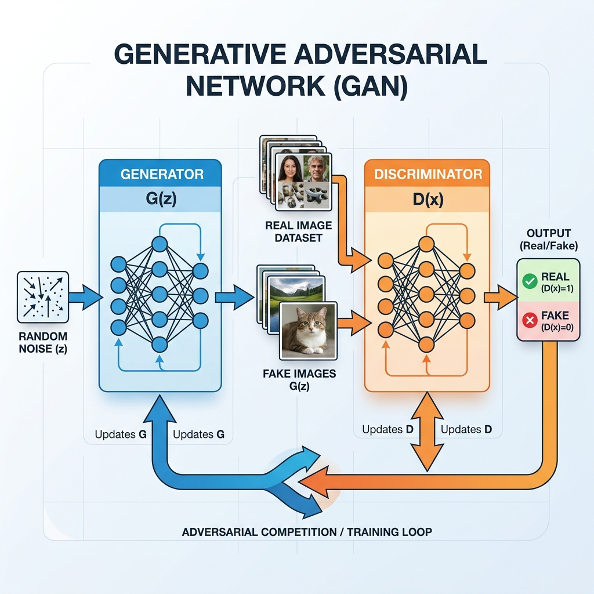
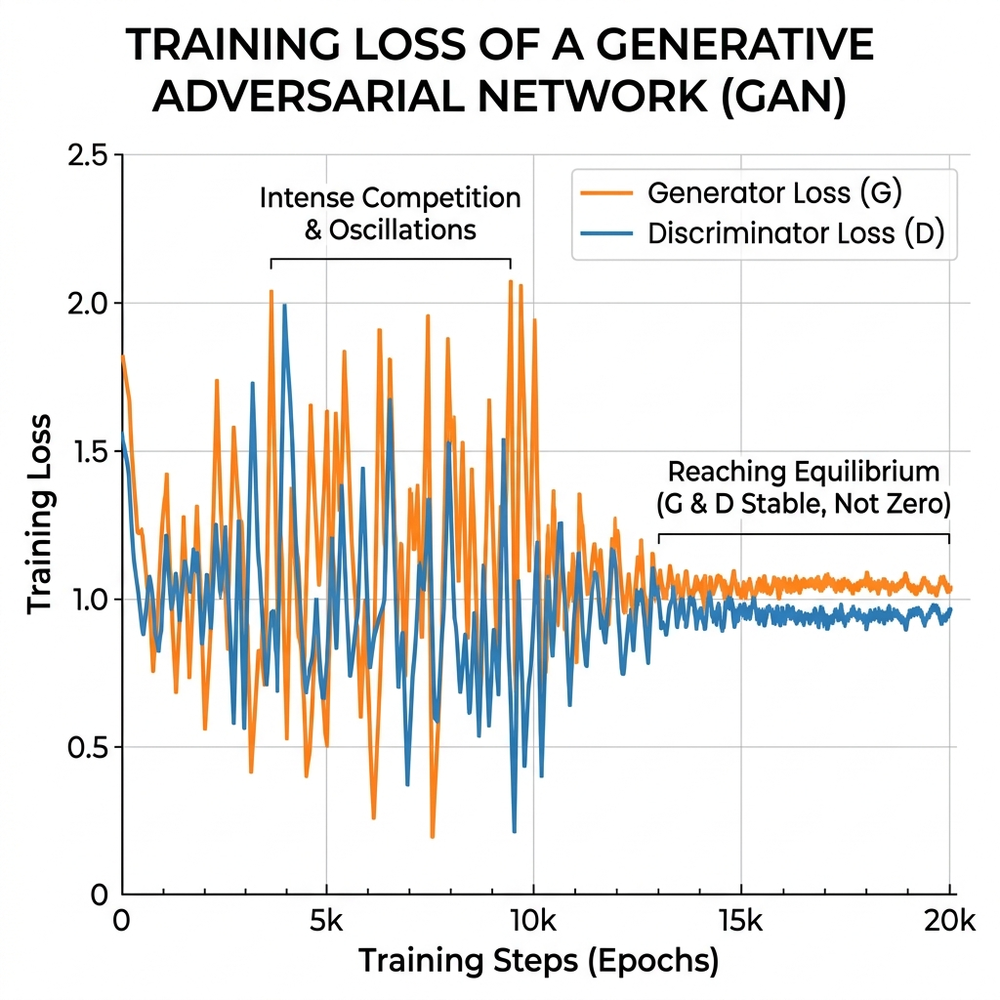

# Session 23 -- Generative Adversarial Networks (GANs)
### Course: Deep Learning Using Neural Networks | Aptech
### Duration: 2 Hours (TL23)
---

> **Professor's Opening Note:**
> *"Last session, our VAE generated new images, but they were blurry. Today, we introduce a radically different approach -- two neural networks that compete against each other like rivals. This competition produces images so sharp and realistic that even humans cannot tell they are fake. Welcome to GANs."*

---

## Table of Contents
1. [Generative vs Discriminative Models](#1-generative-vs-discriminative-models)
2. [The GAN Architecture](#2-the-gan-architecture)
3. [The Adversarial Training Loop](#3-the-adversarial-training-loop)
4. [GAN Loss Functions](#4-gan-loss-functions)
5. [The Nash Equilibrium](#5-the-nash-equilibrium)
6. [Real-World Applications](#6-real-world-applications)
7. [Recommended Videos](#7-recommended-videos)

---

## 1. Generative vs Discriminative Models

Before we dive into GANs, let's clarify two fundamental types of models:

### Discriminative Models (What We've Built So Far)
A **discriminative model** looks at an input and classifies it. It answers the question: *"What is this?"*
- Input: An image of a cat -> Output: "Cat" (95% confidence)
- Examples: All our classifiers from Sessions 1-18 (CNNs, feedforward networks)

### Generative Models (The New Frontier)
A **generative model** learns the underlying patterns of data so well that it can *create new data* from scratch. It answers the question: *"What would a new example look like?"*
- Input: Random noise -> Output: A brand new image of a cat that never existed
- Examples: VAEs (Session 22), and now GANs

### The Art Forger Analogy

Think of it this way:
- A **discriminative model** is like an **art critic** -- show it a painting, and it tells you whether it is a Picasso or a Monet.
- A **generative model** is like an **art forger** -- it studies hundreds of Picasso paintings and then creates a brand new painting that *looks like* a Picasso but is entirely original.

---

## 2. The GAN Architecture

A **Generative Adversarial Network** (Goodfellow et al., 2014) consists of exactly two neural networks that are locked in a competition:

### The Generator (The Forger)
The Generator takes **random noise** (a vector of random numbers) as input and produces a **fake image** as output. Its goal is to create images so realistic that they fool the Discriminator.

### The Discriminator (The Detective)
The Discriminator takes an image as input and outputs a **single number between 0 and 1**:
- Output close to **1.0** = "I believe this image is REAL"
- Output close to **0.0** = "I believe this image is FAKE"

The Discriminator sees both real images from the training set AND fake images from the Generator, and must learn to tell them apart.



```
RANDOM NOISE (e.g., 100 random numbers)
        |
   [ GENERATOR ]
   Dense(256) -> Dense(512) -> Dense(784)
        |
   FAKE IMAGE (28x28)
        |
        v
   [ DISCRIMINATOR ] <--- also receives REAL IMAGES from dataset
   Dense(512) -> Dense(256) -> Dense(1, sigmoid)
        |
   OUTPUT: 0.0 (Fake) to 1.0 (Real)
```

### The Key Insight
The Generator **never sees the real images directly**. It only learns from the Discriminator's feedback. If the Discriminator says "this fake image scored 0.2" (very fake-looking), the Generator adjusts its weights to do better next time. The Generator is essentially learning to paint *blindfolded*, guided only by a critic's scores.

---

## 3. The Adversarial Training Loop

Training a GAN is a carefully orchestrated dance between the two networks. Each training step has two phases:

### Phase 1: Train the Discriminator
1. Take a batch of **real images** from the training dataset.
2. Generate a batch of **fake images** using the Generator (with random noise as input).
3. Show the Discriminator **both batches** (mixed together).
4. The Discriminator predicts a score for each image.
5. We calculate the loss: it should output 1.0 for real images and 0.0 for fake images.
6. Update the Discriminator's weights using backpropagation.

### Phase 2: Train the Generator
1. Generate a new batch of **fake images**.
2. Feed them to the Discriminator (but do NOT update the Discriminator this time).
3. The Generator wants the Discriminator to output **1.0** for its fake images (it wants to fool the detective).
4. Calculate the Generator's loss based on how far the Discriminator's output is from 1.0.
5. Update the Generator's weights using backpropagation.

### The Arms Race

```
ROUND 1: Generator produces terrible scribbles.
         Discriminator easily spots them. Score: 0.01 (very fake).

ROUND 100: Generator improves. Produces vaguely digit-shaped blobs.
           Discriminator still catches most. Score: 0.3.

ROUND 1000: Generator produces decent digits.
            Discriminator struggles. Score: 0.5 (coin flip!).

ROUND 5000: Generator produces sharp, realistic digits.
            Discriminator cannot tell real from fake. Score: ~0.5.
```

This competitive loop is why GANs produce such sharp images -- the Generator is constantly pushed to improve by an increasingly skilled opponent.

---

## 4. GAN Loss Functions

### Discriminator Loss

The Discriminator wants to correctly classify real images as real (1) and fake images as fake (0). It uses **Binary Cross-Entropy (BCE)**:

$$L_D = -\frac{1}{m}\sum_{i=1}^{m}[\log D(x_i) + \log(1 - D(G(z_i)))]$$

### Plain English Translation:
- $D(x_i)$ = Discriminator's score for a real image $x_i$. We want this close to 1, so $\log(1) = 0$ (zero loss -- perfect!).
- $D(G(z_i))$ = Discriminator's score for a fake image $G(z_i)$. We want this close to 0, so $1 - 0 = 1$, and $\log(1) = 0$ (zero loss -- perfect!).
- The negative sign flips it into a minimization problem.
- **In short:** "Punish the Discriminator whenever it is wrong."

### Generator Loss

The Generator wants the Discriminator to believe its fake images are real. Its loss is:

$$L_G = -\frac{1}{m}\sum_{i=1}^{m}\log D(G(z_i))$$

### Plain English Translation:
- $D(G(z_i))$ = Discriminator's score for the Generator's fake image. The Generator wants this close to 1.
- If $D(G(z_i)) = 1$, then $\log(1) = 0$ (zero loss -- the Discriminator was completely fooled!).
- If $D(G(z_i)) = 0$, then $\log(0) = -\infty$ (huge loss -- the Discriminator caught the fake immediately).
- **In short:** "Punish the Generator whenever the Discriminator catches its fakes."



---

## 5. The Nash Equilibrium

### When Does Training Stop?

In game theory, a **Nash Equilibrium** is a state where neither player can improve by changing their strategy alone. For a GAN:

- The **Generator** produces images indistinguishable from real data.
- The **Discriminator** outputs 0.5 for every image (it literally cannot tell real from fake and is randomly guessing).

At this point, the system has converged. The Generator has learned the true data distribution.

### The Honest Truth: GANs Are Hard to Train

In practice, reaching a perfect Nash Equilibrium is very difficult. Common problems include:

1. **Mode Collapse:** The Generator finds ONE type of image that fools the Discriminator and keeps producing only that. For example, it might generate only the digit "1" over and over, ignoring all other digits.

2. **Training Instability:** The Discriminator might become too strong too fast, leaving the Generator no useful gradient to learn from. Or vice versa.

3. **Oscillation:** Instead of converging, the Generator and Discriminator keep "chasing" each other in circles.

We will learn solutions to these problems in Session 24.

---

## 6. Real-World Applications

### Application 1: Face Generation
NVIDIA's StyleGAN generates photorealistic faces of people who have never existed. These are used in gaming, movie production, and virtual avatars.

### Application 2: Image Super-Resolution
GANs can take a blurry, low-resolution image and generate a sharp, high-resolution version. This is used in satellite imagery, medical imaging, and enhancing old photos.

### Application 3: Data Augmentation for Rare Events
In medical imaging, certain diseases are rare, so there are very few training examples. GANs can generate synthetic but realistic medical images to augment the training set.

### Application 4: Art and Design
Apps like Prisma and Artbreeder use GAN-based models to transform photos into artwork or blend faces together. Fashion companies use GANs to prototype new clothing designs.

### Application 5: Video Game Level Generation
Game developers use GANs to procedurally generate new game levels, textures, and character designs, reducing the cost of manual content creation.

---

## 7. Recommended Videos

### Video 1 -- The Concept (Must Watch)
**"A Friendly Introduction to Generative Adversarial Networks (GANs)" by Serrano Academy**
- Search YouTube for: "Serrano Academy GANs"
- Why Watch: Luis Serrano explains the GAN concept using simple visual analogies. Perfect for beginners.

### Video 2 -- The Training Process
**"Generative Adversarial Networks (GANs) in 5 Minutes"**
- Search YouTube for: "GANs explained 5 minutes"
- Why Watch: A concise overview of the training loop and loss functions with animations.

---
*Session 23 | Deep Learning Using Neural Networks | Aptech*
