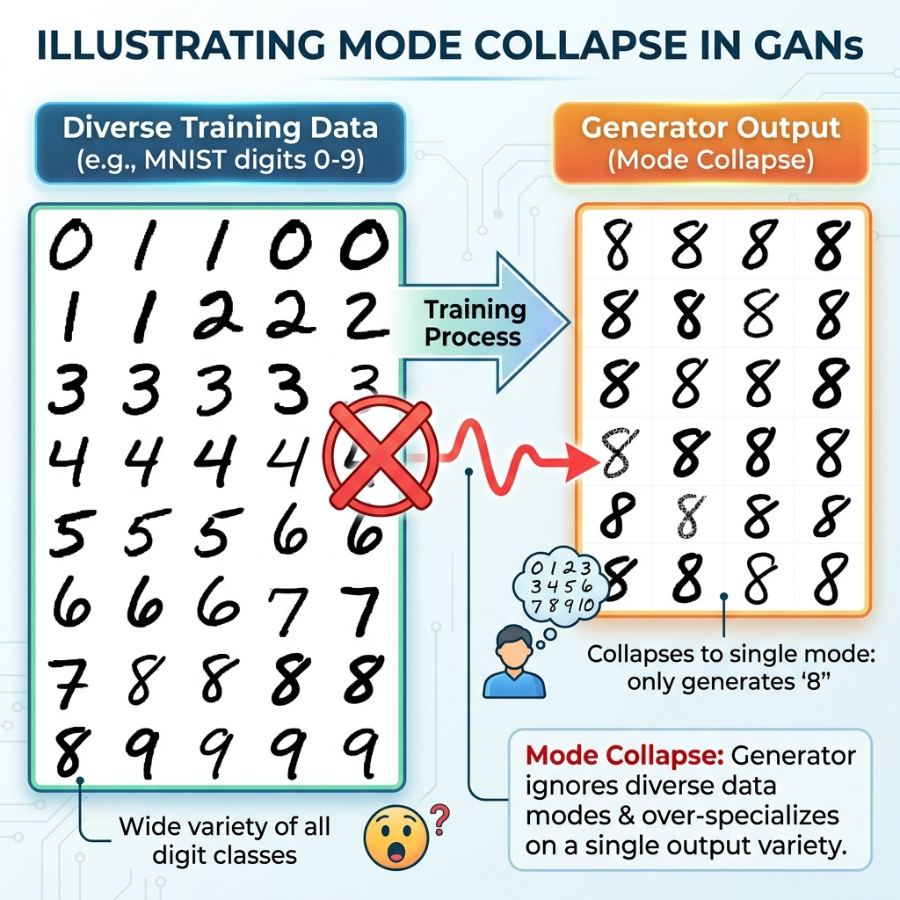
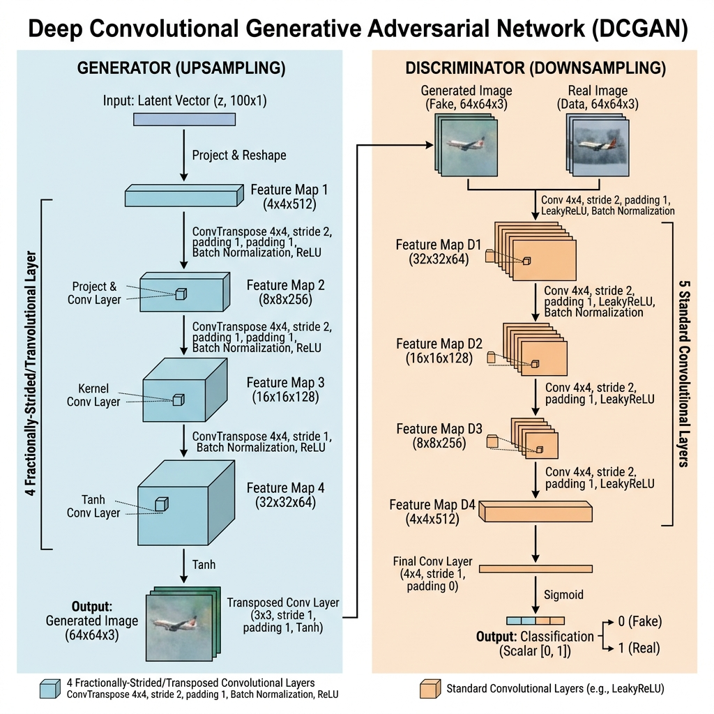
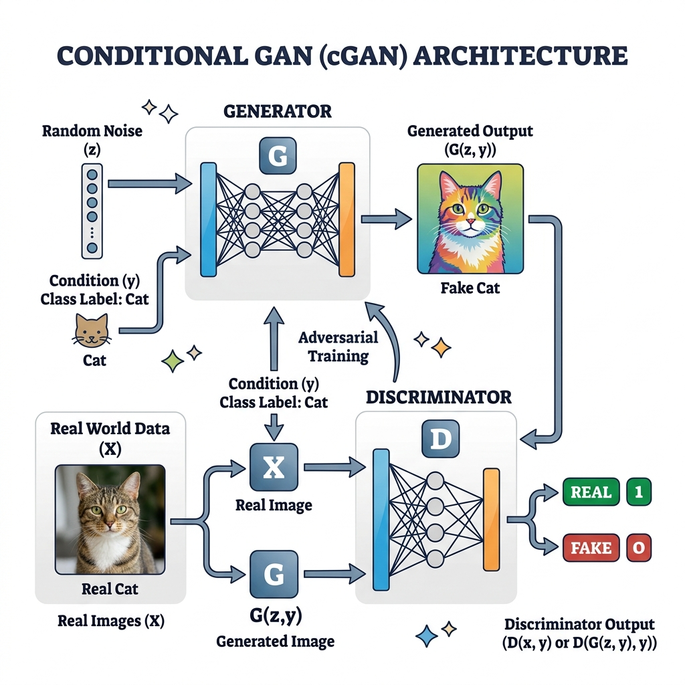

# Session 24 -- Advanced GAN Techniques & Text Generation
### Course: Deep Learning Using Neural Networks | Aptech
### Duration: 2 Hours (TL24)
---

> **Professor's Opening Note:**
> *"Last session, we built our first GAN and it worked -- but it was far from perfect. The generated images were noisy, sometimes the Generator got lazy and produced the same thing over and over, and our Dense-layer architecture ignored the spatial structure of images. Today, we fix all of that."*

---

## Table of Contents
1. [Problems with Basic GANs](#1-problems-with-basic-gans)
2. [DCGAN: Adding Convolutions](#2-dcgan-adding-convolutions)
3. [Conditional GAN (cGAN)](#3-conditional-gan-cgan)
4. [Text Generation with GANs](#4-text-generation-with-gans)
5. [The Bigger Picture: Where GANs Are Heading](#5-the-bigger-picture-where-gans-are-heading)
6. [Recommended Videos](#6-recommended-videos)

---

## 1. Problems with Basic GANs

Our Session 23 GAN had three major problems. Understanding them is essential before we can fix them.

### Problem 1: Mode Collapse

**What it is:** The Generator discovers ONE type of output that consistently fools the Discriminator, and it stops trying anything else. For example, it might only generate the digit "1" over and over, ignoring digits 0, 2, 3, ..., 9.

### The Restaurant Analogy
Imagine a chef (Generator) who is judged by a single food critic (Discriminator). The chef discovers that the critic loves spaghetti. So the chef stops cooking anything else -- every dish is spaghetti. The critic keeps giving high scores because the spaghetti is great, but the restaurant's menu has "collapsed" to a single item.



### Problem 2: Training Instability

GAN training is a delicate balancing act. If the Discriminator becomes too strong too fast, it gives the Generator no useful gradient to learn from (the gradient becomes either 0 or infinity). If the Generator becomes too strong, the Discriminator cannot learn either.

### The Arms Race Analogy
Think of two boxers training together. If one boxer (the Discriminator) becomes a world champion while the other (the Generator) is still a beginner, the beginner gets knocked out in every round and learns nothing. Both fighters must improve at roughly the same pace for productive training.

### Problem 3: No Spatial Awareness

Our Session 23 GAN used Dense layers, which flatten the image into a 1D vector of 784 numbers. The network has no concept that pixel (0,0) is next to pixel (0,1). It treats the image like a spreadsheet, not a picture.

---

## 2. DCGAN: Adding Convolutions

The **Deep Convolutional GAN (DCGAN)** (Radford et al., 2015) solved the spatial awareness problem by replacing Dense layers with Convolutional layers -- the same type we studied in Sessions 16-18.

### The Generator Uses Transposed Convolutions

In a CNN classifier, convolution layers shrink the image (from 28x28 to 14x14 to 7x7). The DCGAN Generator does the opposite -- it **grows** the image using **Transposed Convolutions** (also called "Deconvolutions").

```
RANDOM NOISE (100 numbers)
        |
   Reshape to (7, 7, 256)     <-- Start with a tiny 7x7 "seed"
        |
   Conv2DTranspose(128, 5x5, stride=2)  --> (14, 14, 128)  -- Double the size!
        |
   Conv2DTranspose(64, 5x5, stride=2)   --> (28, 28, 64)   -- Double again!
        |
   Conv2DTranspose(1, 5x5, stride=1)    --> (28, 28, 1)    -- Final image!
```

### Plain English Translation:
A transposed convolution is like an image "zoom-in." With a stride of 2, every pixel in the input becomes a 2x2 block in the output, effectively doubling the spatial dimensions. The network learns how to fill in the details during this upscaling.

### The Discriminator Uses Regular Convolutions

The Discriminator is essentially a CNN classifier (like VGGNet from Session 18) that outputs a single probability:

```
INPUT IMAGE (28, 28, 1)
        |
   Conv2D(64, 5x5, stride=2)    --> (14, 14, 64)   -- Shrink
        |
   Conv2D(128, 5x5, stride=2)   --> (7, 7, 128)    -- Shrink more
        |
   Flatten -> Dense(1, sigmoid)  --> 0.0 to 1.0
```



### DCGAN Best Practices (The "Recipe")

The DCGAN paper discovered several tricks that make training stable:
1. **Use BatchNormalization** in both Generator and Discriminator (except the Generator's output layer and Discriminator's input layer).
2. **Use ReLU in the Generator**, LeakyReLU in the Discriminator.
3. **Use stride=2 convolutions** instead of pooling layers.
4. **Remove all Dense layers** (except for reshaping noise into the initial spatial tensor).
5. **Use Adam optimizer** with learning rate 0.0002 and beta_1 = 0.5.

---

## 3. Conditional GAN (cGAN)

Our basic GAN generates random images -- we have no control over *what* it generates. A **Conditional GAN (cGAN)** lets us tell the Generator exactly what class to produce.

### The Concept

Instead of just feeding random noise to the Generator, we also feed it a **label** (the condition). For example:
- Noise + Label "7" --> Generator produces a handwritten 7
- Noise + Label "3" --> Generator produces a handwritten 3

The Discriminator also receives the label, so it can check: "Is this image a convincing 7?" rather than just "Is this image convincing?"

### How the Label is Fed to the Network

The label is converted to a **one-hot vector** (just like we did in Sessions 2-3) and **concatenated** (glued) to the input:

```
For MNIST (10 classes):
Label "7" --> One-Hot: [0,0,0,0,0,0,0,1,0,0]

Generator Input = [noise_1, noise_2, ..., noise_100, 0, 0, 0, 0, 0, 0, 0, 1, 0, 0]
                   ^^^^^^^^^^^^^^^^^^^^^^^^^^^^^^^^   ^^^^^^^^^^^^^^^^^^^^^^^^^^^^^^
                   100 random numbers                  10-element one-hot label
                   Total input size: 110
```



### Why cGANs Matter

Conditional GANs unlock powerful applications:
- **Generate specific digits** for captcha systems
- **Generate specific clothing types** for fashion design
- **Text-to-Image:** Give a text description as the condition, generate a matching image (this is the foundation of DALL-E and Midjourney)
- **Image-to-Image:** Give a sketch as the condition, generate a photorealistic version (pix2pix)

---

## 4. Text Generation with GANs

In Session 21, we generated text using RNNs. Can GANs also generate text? The answer is yes, but it is much harder.

### The Problem: Text is Discrete

Images are made of continuous pixel values (0.0 to 1.0). The Generator can smoothly adjust these values during training using gradient descent. But text is made of **discrete tokens** (words or characters). You either output the letter "A" or you don't -- there is no "halfway between A and B."

This discreteness breaks the gradient flow. You cannot backpropagate through a discrete sampling step.

### SeqGAN: The Solution

**SeqGAN** (Yu et al., 2017) solves this by treating text generation as a **reinforcement learning** problem:

1. The Generator is an RNN that produces text one token at a time.
2. The Discriminator reads the complete generated sentence and judges if it is real or fake.
3. Instead of using gradients directly, the Generator uses the Discriminator's score as a **reward signal** (like a video game score).
4. The Generator learns through a technique called **policy gradient**, which works with discrete outputs.

### RNN vs GAN for Text: A Comparison

| Feature | RNN Text Generation | GAN Text Generation |
|---------|--------------------|--------------------|
| Approach | Predict next character | Generate whole sequence, then judge |
| Training | Teacher forcing (supervised) | Adversarial (unsupervised) |
| Output | Character by character | Full sequence evaluated |
| Quality | Coherent locally, may drift | Globally coherent, but harder to train |
| Ease | Simpler to implement | Much more complex |

### The Practical Reality
For most text generation tasks today, **RNNs (and their successors, Transformers)** are preferred over GANs. GANs shine in image generation, while Transformer-based models (like GPT) dominate text generation. However, understanding SeqGAN is valuable because it shows how adversarial training can be adapted to non-image domains.

---

## 5. The Bigger Picture: Where GANs Are Heading

### StyleGAN (NVIDIA)
Generates photorealistic faces by separating "style" information (like hair color, age, expression) from "structure" information (face shape, pose). Users can mix and match styles between different generated faces.

### CycleGAN
Translates images between two domains *without paired training data*. Examples:
- Horse photos <-> Zebra photos
- Summer landscapes <-> Winter landscapes
- Photo <-> Monet painting

### Pix2Pix
Translates images with paired data. Examples:
- Architectural sketch -> Photorealistic building
- Satellite image -> Street map
- Black and white -> Color

### The Future: Diffusion Models
While GANs were the dominant generative model from 2014-2021, a newer approach called **Diffusion Models** (used by DALL-E 2, Stable Diffusion, Midjourney) has largely taken over for image generation. Diffusion models are more stable to train and produce higher-quality images. However, GANs remain important for real-time applications because they generate images in a single forward pass (diffusion models need many iterative steps).

---

## 6. Recommended Videos

### Video 1 -- DCGAN Explained
**"DCGAN Tutorial with PyTorch/TensorFlow"**
- Search YouTube for: "DCGAN tutorial explained"
- Why Watch: Shows exactly how transposed convolutions grow images from a small spatial tensor.

### Video 2 -- Conditional GAN
**"Conditional GAN (cGAN) Explained Simply"**
- Search YouTube for: "conditional GAN explained simple"
- Why Watch: Visual walkthrough of how labels are concatenated and how the cGAN architecture differs from the basic GAN.

---
*Session 24 | Deep Learning Using Neural Networks | Aptech*
