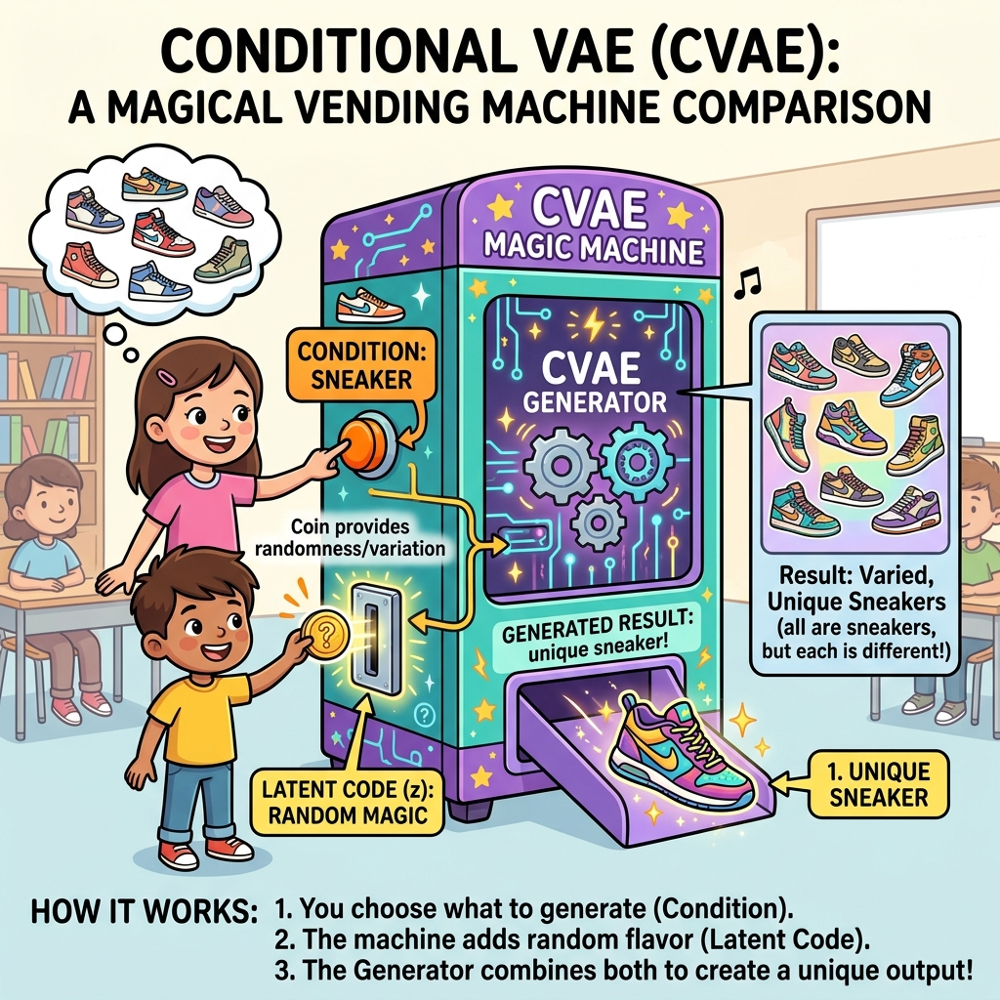
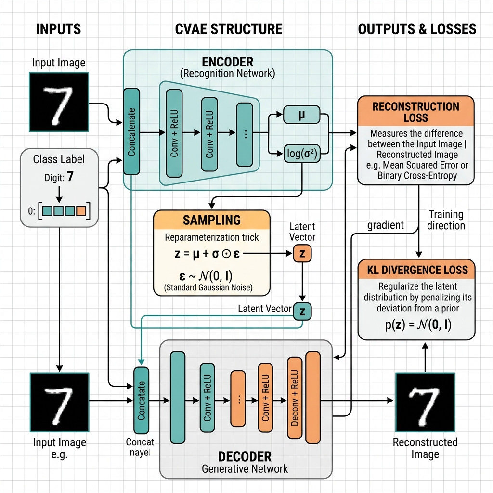
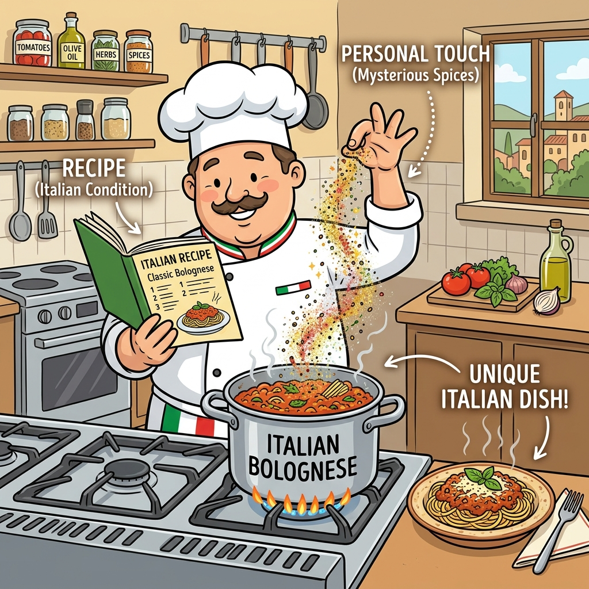

# Session 26 -- Conditional Variational Autoencoder (CVAE)
### Course: Deep Learning Using Neural Networks | Aptech
### Duration: 2 Hours (TL26)
---

> **Professor's Opening Note:**
> *"In Session 22, our VAE generated random images -- we had no control over what came out. It was like reaching into a grab bag. Today, we bring control to VAEs. The Conditional VAE lets you say 'Generate me a sneaker' or 'Generate me a dress' and it delivers exactly that. We are giving our AI steering wheels!"*

---

## 📚 Table of Contents
1. [Recap: VAE vs cGAN](#1-recap-vae-vs-cgan)
2. [The Vending Machine Analogy (How CVAEs Work)](#2-the-vending-machine-analogy-how-cvaes-work)
3. [The Chef Analogy (The Code)](#3-the-chef-analogy-the-code)
4. [Real-World Applications](#4-real-world-applications)
5. [Recommended Videos](#5-recommended-videos)

---

## 1. Recap: VAE vs cGAN

Before introducing the CVAE, let's compare what we already know in simple terms:

| Model | Can you control what it makes? | Output quality |
|---------|------|------|
| **VAE (Session 22)** | No (Random grab bag) | Blurry but smooth transitions |
| **cGAN (Session 24)** | Yes (You specify what you want) | Sharp but sometimes unstable to train |
| **CVAE (Today)** | Yes (You specify what you want) | Smooth, controlled, and stable to train |

### The Best of Both Worlds
A CVAE combines the **stability** of a VAE with the **control** of a conditional model. You get to say exactly what you want to generate, and it trains very reliably without the generator/discriminator fighting we saw in GANs.

---

## 2. The Vending Machine Analogy (How CVAEs Work)

How do we actually control a VAE? We use a **Condition** (also known as a label). 

Imagine a magical Vending Machine that creates shoes.

1. **The Condition (The Button):** On the front of the machine, there are buttons for "Sneaker," "Boot," and "Sandal." When you press the "Sneaker" button, you are giving the machine the *Condition*.
2. **The Latent Code (The Coin):** You insert a special magical coin into the slot. This coin represents the *random variation* (the Latent Code). Is the sneaker going to be high-top or low-top? Thick sole or thin? The machine decides this based on the coin.

When you press the "Sneaker" button and drop in the coin, the machine combines both pieces of information and outputs a unique sneaker!


*The button = the Condition (what category you want). The coin = the Latent Code (the random variation).*


*(The diagram above shows the full technical architecture — think of it just like the vending machine!)*

---

## 3. The Chef Analogy (The Code)

In a normal VAE, we have an **Encoder** and a **Decoder**. In a CVAE, we literally just glue the condition (the label) onto the input data. We feed this label to BOTH the Encoder and the Decoder.

Why both? Let's use a Cooking Analogy:

*   **The Condition (Label):** A recipe category, like "Italian Food."
*   **The Latent Code:** A chef's personal touch, like "extra spicy and thin pasta."

**How the Encoder uses it:**
The Encoder acts like a food critic analyzing a meal. If we hand it a spicy spaghetti dish and say, *"This is an Italian dish (Label),"* the Encoder says, *"Okay, I already know it's Italian. I will only focus on taking notes about the spicy thin pasta (Latent Code)."* 
It doesn't waste time remembering things it already knows!

**How the Decoder uses it:**
The Decoder is the chef. We tell the chef, *"Make an Italian dish (Label) and add the spicy-thin-pasta variation (Latent Code)."*
Because the chef knows the category, they know exactly what base ingredients to use, and they just apply the variations!


*Label = the recipe category. Latent Code = the chef's personal spice rack.*

### The Code is Surprisingly Simple!
To build this, we don't need complex new layers. We literally just concatenate (glue together) the label and the image!

```python
# VAE Input:
input_data = image                    # Just the image

# CVAE Input:
input_data = concat(image, label)     # The image glued to the label!
```

By just gluing the label onto the data, the neural network learns to pay attention to the condition. It is that easy!

---

## 4. Real-World Applications

### Application 1: Drug Discovery
Pharmaceutical companies use CVAEs to design new medicines.
- **Condition:** "Must cure headaches" and "Must not be toxic to the liver."
- **Output:** The CVAE generates hundreds of brand new chemical structures that fit those exact conditions!

### Application 2: Personalized Fashion Design
An e-commerce platform uses CVAEs for fashion:
- **Condition:** "Show me a casual blue dress."
- **Output:** The CVAE generates dozens of variations of casual blue dresses, giving designers instant inspiration.

### Application 3: Video Game Assets
Game developers use CVAEs to generate background trees or rocks.
- **Condition:** "Pine tree."
- **Output:** The CVAE generates 50 unique pine trees so the forest doesn't look copy-pasted.

---

## 5. 🎬 Recommended Videos

### 🥇 Video 1 -- Conceptual Overview
**"Conditional Variational Autoencoder Explained"**
- 📺 Search YouTube for: "Conditional VAE explained tutorial"
- 🎯 Why Watch: Walks through how the labels are glued to the data in a very visual way.

---
*© 2024 Aptech Limited | Deep Learning Using Neural Networks | Session 26*
