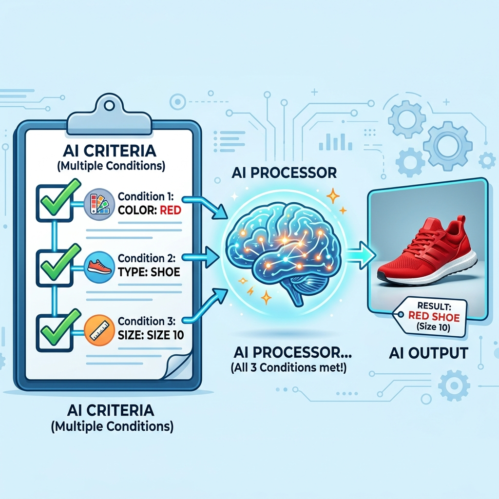
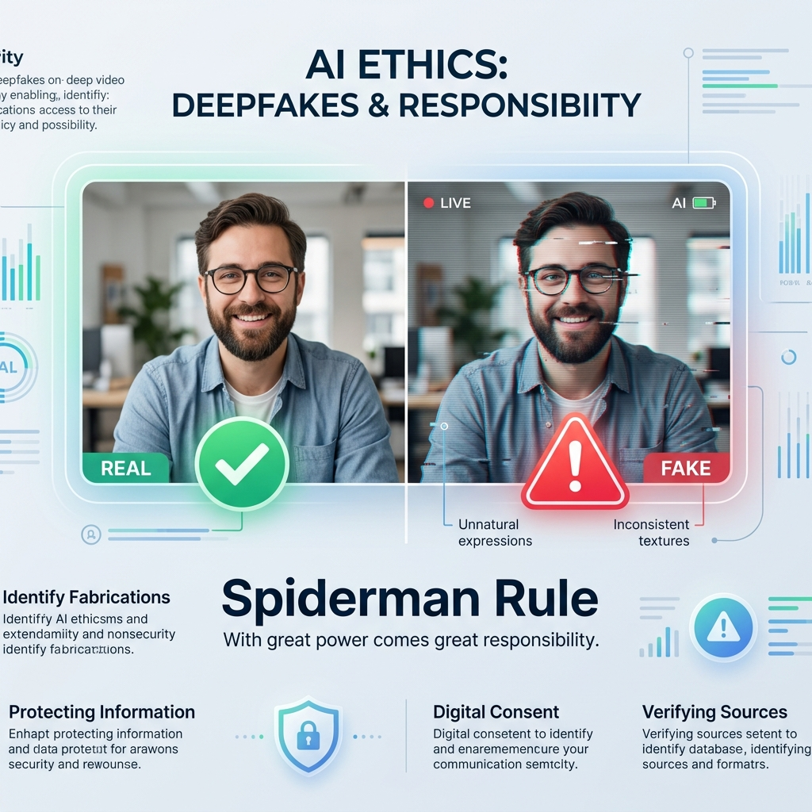

# Session 27 -- CVAE Part 2: Advanced Design & Ethical Considerations
### Course: Deep Learning Using Neural Networks | Aptech
### Duration: 2 Hours (TL27)
---

> **Professor's Opening Note:**
> *"Last session, we learned how to ask our AI for a 'sneaker'. But what if we want a 'Red, Size-10 Sneaker made of Leather'? Today, we learn how to give our AI a checklist of demands. More importantly, we will discuss the Spiderman Rule of AI: With great power comes great responsibility. We will look at deepfakes and the ethics of generating fake images."*

---

## 📚 Table of Contents
1. [The Checkbox Analogy (Multi-Condition CVAEs)](#1-the-checkbox-analogy-multi-condition-cvaes)
2. [The Spiderman Rule of AI Ethics](#2-the-spiderman-rule-of-ai-ethics)
3. [The Three Major Ethical Dangers](#3-the-three-major-ethical-dangers)
4. [Recommended Videos](#4-recommended-videos)

---

## 1. The Checkbox Analogy (Multi-Condition CVAEs)

Last session, our condition was just a single label (like "Sneaker"). But in the real world, we want more control.

Imagine giving your AI a **Checklist**.

Instead of a single condition, we can create a "multi-condition vector." This is simply a long list of checkboxes glued together:

```text
[X] Item: Shoe
[X] Color: Red
[ ] Color: Blue
[X] Style: High-top
[ ] Style: Low-top
```

We feed this entire checklist into the CVAE.


*The AI accepts a full checklist of demands and generates an output that satisfies ALL of them at once.*

### The Challenge
The network can easily handle the checklist. The *hard part* is getting the data!
To train an AI to understand this checklist, you need thousands of images where a human has manually checked every single box for every single image.
- **CelebA Dataset:** This is a famous dataset of celebrity faces where humans have checked 40 boxes for every face (e.g., "Wearing Glasses," "Smiling," "Has Hat").

By feeding these checklists into our CVAE, we can eventually say: *"Generate a face that is smiling and wearing glasses,"* and the AI will perfectly execute the checklist!

---

## 2. The Spiderman Rule of AI Ethics

*"With great power comes great responsibility."*

As AI engineers, you now know how to build systems that can create photorealistic faces of people who do not exist, or mimic handwriting perfectly. This power can be incredibly dangerous if used maliciously. 

We must always design AI defensively. Ask yourself: **"If an evil person stole my code, what is the worst thing they could do with it?"**

---

## 3. The Three Major Ethical Dangers

### Danger 1: Deepfakes & Misinformation
**What it is:** Using generative AI to create fake videos or images of real people—putting words in their mouths that they never said.
**The Harm:** Deepfakes can be used to ruin reputations, scam companies out of millions of dollars over fake video calls, or spread fake news during elections.
**Our Responsibility:** Always clearly label or watermark AI-generated content so people know it is not real.


*Real (✅) vs AI-Generated Fake (⚠️). Watermarking and consent frameworks are our first line of defence.*

### Danger 2: Bias and Stereotypes
**What it is:** AI learns entirely from its training data. If we feed it biased data, it becomes biased.
**The Harm:** If you train a medical AI only on data from one demographic, it might fail to recognize diseases in other demographics. If you ask an AI to generate a picture of a "CEO," and it only draws men, the AI is amplifying societal bias.
**Our Responsibility:** We must carefully inspect our datasets to ensure they are diverse and fair before we even start training.

### Danger 3: Theft of Art and Copyright
**What it is:** Training an AI on millions of images created by real human artists without asking their permission or paying them.
**The Harm:** The AI can now generate art in the exact style of an artist, potentially putting that artist out of a job using their own stolen hard work.
**Our Responsibility:** Future AI models should be trained on licensed data, public domain data, or data where the creators have explicitly opted in.

---

## 4. 🎬 Recommended Videos

### 🥇 Video 1 -- The Danger of Deepfakes
**"The Danger of Deepfakes" by Vox**
- 📺 Search YouTube for: "Vox deepfakes explained"
- 🎯 Why Watch: An accessible and sobering look at how generative AI can be weaponized in the real world.

### 🥈 Video 2 -- AI Ethics
**"Coded Bias (Documentary Trailer)"**
- 📺 Search YouTube for: "Coded Bias Trailer"
- 🎯 Why Watch: A fantastic introduction to how bias sneaks into datasets and harms real people.

---
*© 2024 Aptech Limited | Deep Learning Using Neural Networks | Session 27*
