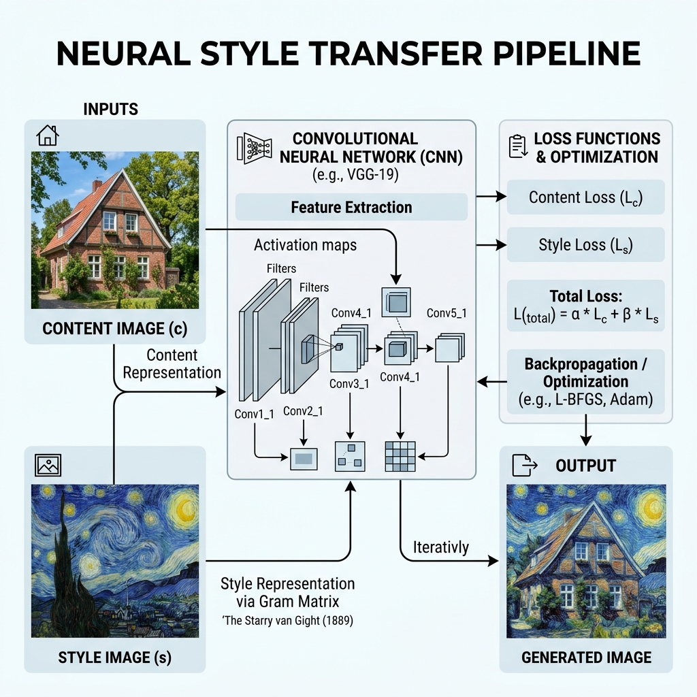
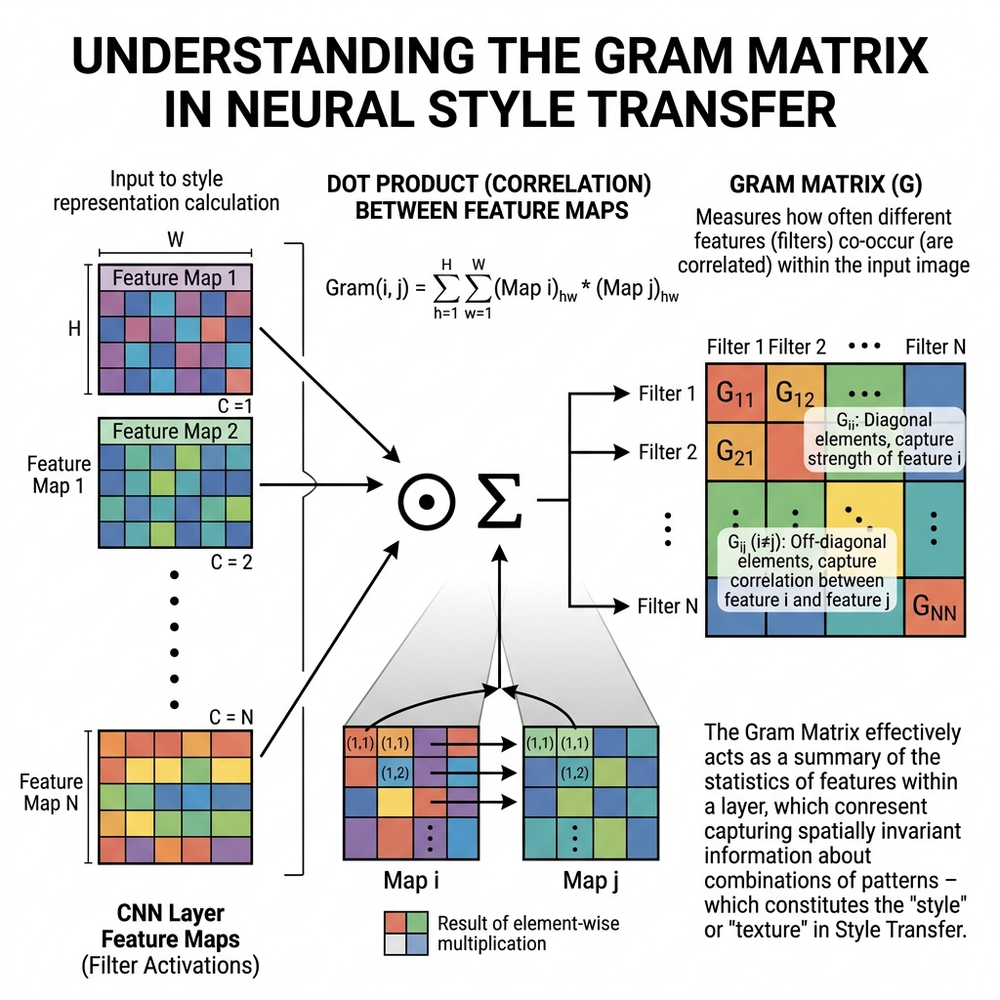

# Session 28 -- Style Transfer and Image Synthesis
### Course: Deep Learning Using Neural Networks | Aptech
### Duration: 2 Hours (TL28)
---

> **Professor's Opening Note:**
> *"Have you ever used an app that turns your selfie into a Van Gogh painting? Today, you will learn exactly how that works! It is called Neural Style Transfer. We are going to use a pre-trained network not to classify an image, but to act as a team of art critics to help us paint a masterpiece."*

---

## 📚 Table of Contents
1. [The Magic Trick: Content + Style](#1-the-magic-trick-content--style)
2. [The "Team of Art Critics" Analogy](#2-the-team-of-art-critics-analogy)
3. [The Texture Matcher (Gram Matrix)](#3-the-texture-matcher-gram-matrix)
4. [How We Actually Paint the Image](#4-how-we-actually-paint-the-image)
5. [Recommended Videos](#5-recommended-videos)

---

## 1. The Magic Trick: Content + Style

**Neural Style Transfer (NST)** takes two completely different images and mashes them together:

1. **Content Image:** The photo you want to transform (e.g., a photo of your house).
2. **Style Image:** The artistic style you want to apply (e.g., Van Gogh's "Starry Night").
3. **Output:** A brand new image showing your house, but painted exactly like Van Gogh!

How do we separate *what* is in a photo from *how* it is painted? We use a Convolutional Neural Network (CNN)!

---

## 2. The "Team of Art Critics" Analogy

We use a pre-trained CNN (like VGG19 from Session 18) as our **Team of Art Critics**. 

Remember that deep CNNs have many layers. We can think of each layer as a different art critic with a different job:

*   **The Early Layers (The Detail Critics):** These critics stand very close to the painting. They only care about small details: brushstrokes, textures, and tiny dots of color.
*   **The Deep Layers (The Subject Critics):** These critics stand far back from the painting. They don't care about the brushstrokes at all. They only look at the big picture: "Is that a house? Is that a dog?"

### How We Use the Critics
To make our final image, we start with a blank canvas and we hire the critics to yell at us until it looks right:
1. We tell the **Deep Layer Critics (Subject Critics)**: "Make sure this canvas looks like the photo of the house."
2. We tell the **Early Layer Critics (Detail Critics)**: "Make sure the brushstrokes and colors match Van Gogh's painting."

By listening to both groups of critics at the same time, we end up painting a house using Van Gogh's brushstrokes!

---

## 3. The Texture Matcher (Gram Matrix)

If you look at the official code for Style Transfer, you will see something called a **Gram Matrix**. 

Do not let the math scare you! A Gram Matrix is simply a **Texture Matcher**.

When the "Detail Critics" look at the Van Gogh painting, they might notice: "Hey, whenever I see a swirl shape, I also see the color blue!" 

The Gram Matrix just records these patterns. It doesn't care *where* the blue swirl is on the canvas; it just cares that blue and swirls go together. 

By forcing our blank canvas to have the exact same Gram Matrix (Texture Matches) as the Van Gogh painting, our canvas naturally fills up with Van Gogh's exact artistic style!

*(The math behind the scenes just multiplies features together to find these texture matches!)*

---

## 4. How We Actually Paint the Image

This is the craziest part of Neural Style Transfer: **We do not train the neural network.** The network is completely frozen!

Instead of updating the *network weights*, we update the **pixels of the image itself**!

1. Start with a blank image full of random static noise.
2. Pass it through the frozen network (The Art Critics).
3. The critics calculate how wrong the image is (The Loss).
4. We use Backpropagation to magically adjust the **colors of the pixels** to make the critics happier.
5. We repeat this 1000 times until the image is a masterpiece!

---

## 5. 🎬 Recommended Videos

### 🥇 Video 1 -- The Visual Explanation
**"Neural Style Transfer: Creating Art with Deep Learning"**
- 📺 Search YouTube for: "Neural style transfer explained simply"
- 🎯 Why Watch: It provides incredible visuals of how the "Texture Matcher" actually pulls the style out of a painting.

---
*© 2024 Aptech Limited | Deep Learning Using Neural Networks | Session 28*
