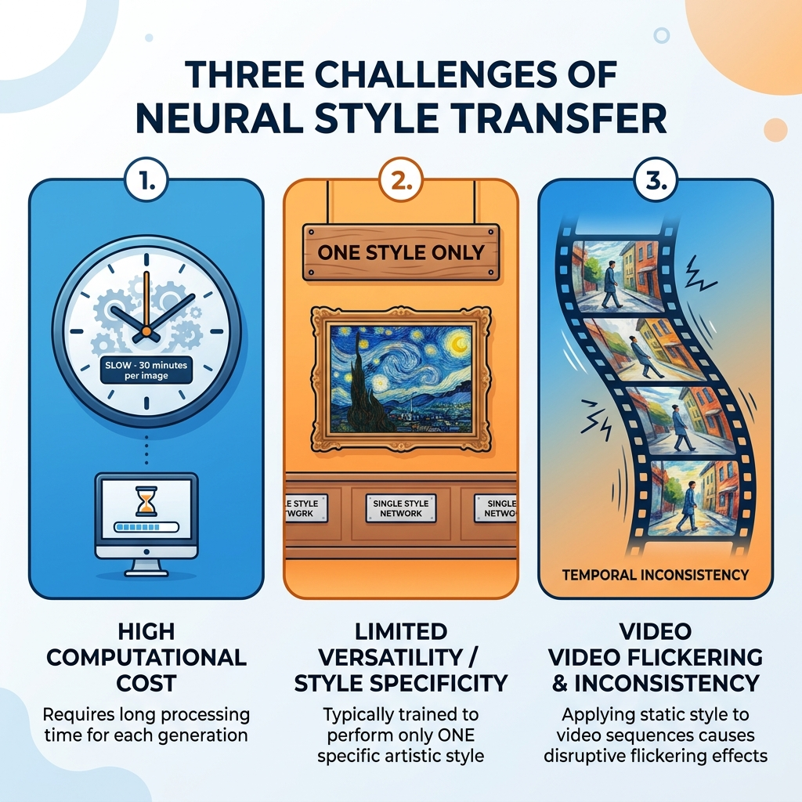
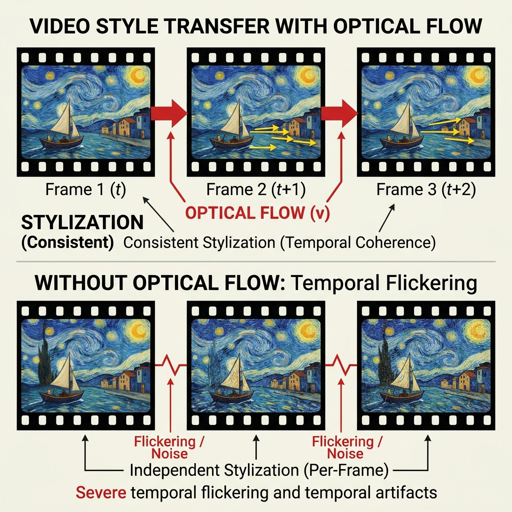
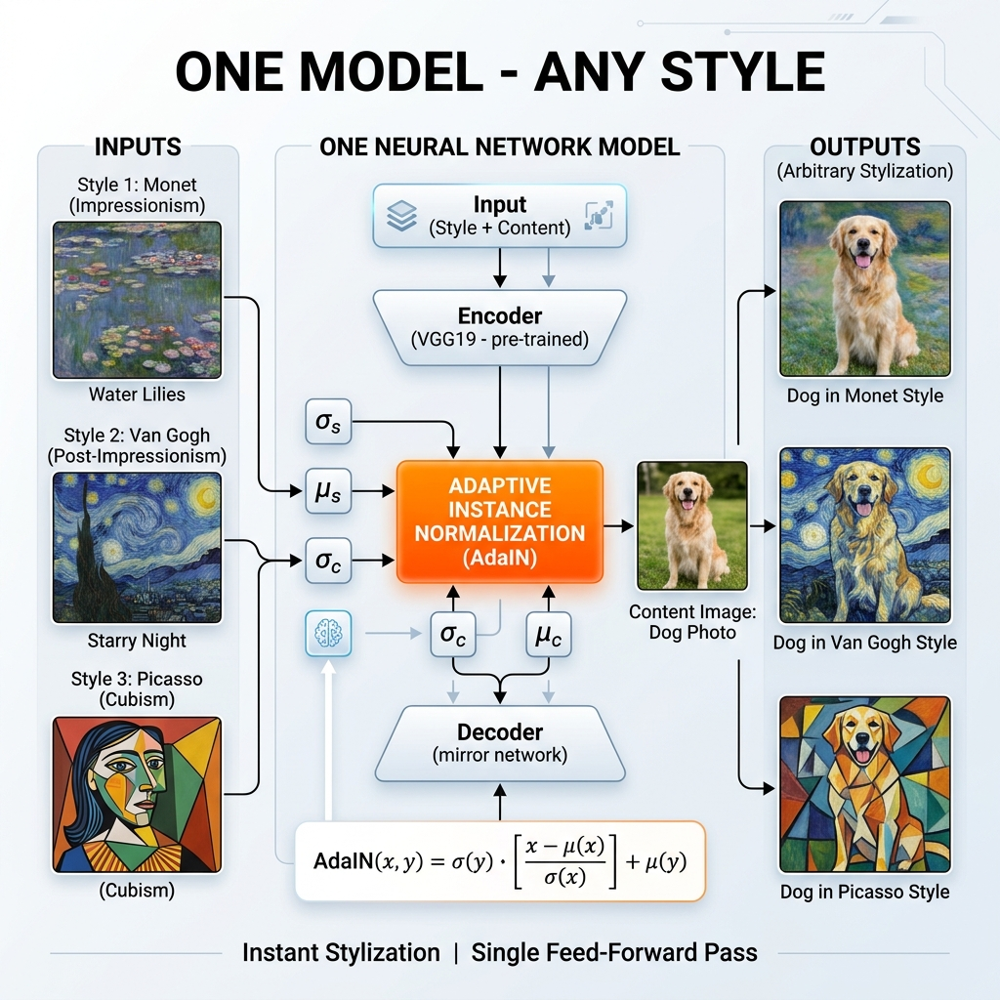

# 📘 Session 29 — Advanced Style Transfer: Challenges, Variations & Image Synthesis
### Course: Deep Learning Using Neural Networks | Aptech
### Duration: 2 Hours (TL29)
---

> **Professor's Opening Note:**
> *"In Session 28, we built our first style transfer and it worked! But you probably noticed one big problem: it was SLOW. It took 500 iterations just to stylize one photo. Today, we fix that. We will also look at the cool variations of style transfer beyond Van Gogh paintings — including turning one face into another, changing the time of day in a photo, and synthesizing completely new textures from scratch."*

---

## 📚 Table of Contents
1. [The Big Challenges of Classic NST](#1-the-big-challenges-of-classic-nst)
2. [Fast Style Transfer (The Speed Fix)](#2-fast-style-transfer-the-speed-fix)
3. [Video Style Transfer (The Flickering Problem)](#3-video-style-transfer-the-flickering-problem)
4. [Image Synthesis (Creating Textures from Scratch)](#4-image-synthesis-creating-textures-from-scratch)
5. [Arbitrary Style Transfer (Any Style, Instantly)](#5-arbitrary-style-transfer-any-style-instantly)
6. [Putting It All Together](#6-putting-it-all-together)
7. [Recommended Videos](#7-recommended-videos)

---

## 1. The Big Challenges of Classic NST

In Session 28, we built the original style transfer from Gatys et al. (2015). It works beautifully, but it has **three serious problems** in the real world:

### Problem 1: It Is Extremely Slow ⏱️

**The Core Issue:** To stylize ONE image, the classic NST runs 500–1000 optimization steps. On a laptop, this takes 10-20 minutes. Even on a powerful GPU, it takes 30-60 seconds.

**Why this is a big deal:** Apps like Instagram Filters or Snapchat need to apply style in *under a second*, on a *mobile phone*, *live*. Classic NST is 1000x too slow for this.

**Plain English:** Imagine if every time you applied a Snapchat filter, you had to wait 30 minutes. Nobody would use it!

### Problem 2: One Network, One Style Only 🖼️

**The Core Issue:** Classic NST requires a separate, full optimization run for each (content, style) pair. You cannot "save" the Van Gogh style and apply it to new photos instantly. Every new photo needs a brand new 500-step run.

**Why this is a big deal:** You cannot build a commercial filter app where every user pays the cost of 500 iterations. That would bankrupt the servers!

### Problem 3: Video Flickers Like a Strobe Light 🎥

**The Core Issue:** If you run classic NST on each frame of a video independently, every single frame gets a *slightly different* styled version because the optimization starts from random noise each time. The result looks like a strobe light — the style texture jumps around wildly between frames.



---

## 2. Fast Style Transfer (The Speed Fix)

Introduced by **Justin Johnson et al. (2016)**, Fast Style Transfer solves the speed problem with a brilliant idea: **train a network once, use it forever.**

### The Printer Analogy 🖨️

Imagine you want to print a Van Gogh-style photo for 1000 different customers.

- **Classic NST Approach:** Hand-paint every single customer's photo by hand. Slow!
- **Fast Style Transfer Approach:** Build a printing machine that can print Van Gogh style automatically. Takes a long time to **build the machine** (training), but once built, each print takes **a fraction of a second**!

### How It Works

Instead of optimizing the pixels of the output image, we train a whole new neural network called the **Image Transformation Network**. This network learns to "paint in Van Gogh's style" for any input photo.

```
CLASSIC NST:                    FAST STYLE TRANSFER:
  
  Content Image                   Content Image
       ↓                               ↓
  [500 iterations                [Image Transformation 
   of optimization]               Network (1 forward pass)]
       ↓                               ↓
  Styled Image                    Styled Image
  (30 sec per image)              (0.01 sec per image!)
```

### The Training Process

We train the Image Transformation Network using the SAME VGG19 loss functions from Session 28, but now we are training a real network:

1. Take thousands of content photos
2. Pass each through our new network → get a styled output
3. Measure the content and style loss against our chosen style painting (e.g., Starry Night)
4. Update the network weights (not the pixels!)
5. After training, the network has "memorized" how to apply that one style

**The catch:** One trained network = one style only. To support 10 different styles, you need to train 10 different networks!

---

## 3. Video Style Transfer (The Flickering Problem)

### Why Videos Flicker

When you apply style transfer independently to each frame, the Gram Matrix "texture match" lands in slightly different positions every frame. The result is constant texture jumping — called **temporal inconsistency**.

**Analogy:** Imagine painting the same wall 30 times with the same paint, but each time you close your eyes and start from a random spot. The color will be the same, but the brush patterns will shift slightly each time. When you flip through the paintings quickly, it looks like the wall is vibrating!

### The Fix: Optical Flow

The solution is **Optical Flow** — a computer vision technique that tracks how each pixel moves from frame to frame.

1. Calculate where each pixel moves between Frame 1 and Frame 2.
2. When stylizing Frame 2, **warp the style from Frame 1** to match the new pixel positions.
3. The style stays "glued" to the objects in the video, just like a real painter would.

```
Frame 1 stylized → Optical Flow → Warp texture to Frame 2 → Apply remaining style
```

This gives us smooth, consistent video style that looks like someone *actually* hand-painted the video!



---

## 4. Image Synthesis (Creating Textures from Scratch)

Style transfer is just one application of the Gram Matrix. We can also use it for **pure texture synthesis** — creating tileable textures from scratch, with NO content image at all!

### The "Fabric Machine" Analogy 🧵

Imagine you want to create infinite amounts of a unique fabric pattern. You have one small swatch of the original fabric. 

The Gram Matrix tells you exactly what makes that fabric special (e.g., horizontal blue threads always appear together with vertical red threads). Using that Texture Matcher, you can generate an entirely new, larger piece of fabric with the exact same texture pattern, even though each thread is in a slightly different position!

### Applications of Texture Synthesis

1. **Game Development:** Create infinite grass, stone, or wood textures for 3D environments.
2. **Fashion Industry:** Generate new fabric patterns inspired by classic designs.
3. **Medical:** Synthesize skin texture samples for medical training simulations.

### Simple Texture Synthesis Code

```python
import tensorflow as tf
import numpy as np

# 1. Load a style texture (e.g., a piece of fabric)
texture_path = 'fabric_swatch.jpg'
texture = load_and_process_image(texture_path)

# 2. Start with PURE RANDOM NOISE — no content image!
generated = tf.Variable(
    tf.random.uniform(shape=texture.shape, minval=0, maxval=255),
    dtype=tf.float32
)

optimizer = tf.optimizers.Adam(learning_rate=10.0)

# 3. Optimize: only style loss, no content loss
for i in range(1000):
    with tf.GradientTape() as tape:
        gen_features = feature_extractor(generated)
        tex_features = feature_extractor(texture)
        
        # ONLY style loss — we don't care about content!
        style_loss = sum(
            compute_style_loss(tf, gf) 
            for tf, gf in zip(tex_features, gen_features)
        )
    
    grads = tape.gradient(style_loss, generated)
    optimizer.apply_gradients([(grads, generated)])
    
    if i % 200 == 0:
        print(f"Iteration {i} | Style Loss: {style_loss:.2f}")

# Result: A brand new texture that matches the fabric's pattern!
```

The output is a **brand new image** that has the same texture feel as the fabric, but with a completely different arrangement of pixels. It is like creating new wallpaper from a small sample!

---

## 5. Arbitrary Style Transfer (Any Style, Instantly)

Introduced by **Huang & Belongie (2017)**, Arbitrary Style Transfer is the holy grail: apply **any style to any content photo, instantly**, with a **single trained network**.

### The "Universal Translator" Analogy 🌍

- **Fast Style Transfer** is like a translator who only speaks Spanish → English.
- **Arbitrary Style Transfer** is like a universal translator who can translate between any two languages!

### How It Works: Adaptive Instance Normalization (AdaIN)

The secret ingredient is a layer called **Adaptive Instance Normalization (AdaIN)**. This is what allows one network to handle any style.

**Step-by-step in plain English:**

1. Encode the content photo into "content features" (what the photo contains).
2. Encode the style painting into "style statistics" (mean and variance of features).
3. **AdaIN:** Mathematically shift and scale the content features using the style statistics. This is the magic layer that "mixes" the content and the style.
4. Decode the mixed features into the final styled image.

```
Content Image → Content Encoder → Content Features ──┐
                                                       ├→ AdaIN Layer → Decoder → Styled Output
Style Image   → Style Encoder   → Style Statistics ───┘
```

### The AdaIN Formula (Plain English Version)

```python
def adain(content_features, style_features):
    """
    Shift content features to match style statistics.
    
    It is like saying: "Take the content photo's features
    and redraw them using Van Gogh's color palette and stroke intensity."
    """
    # Get mean and standard deviation of style
    style_mean = style_features.mean()
    style_std  = style_features.std()
    
    # Normalize content, then re-scale using style statistics
    content_normalized = (content_features - content_features.mean()) / content_features.std()
    return style_std * content_normalized + style_mean
```

**Result:** Instead of 500 optimization steps, this is ONE single forward pass through the network. Any content + any style = instant result!



---

## 6. Putting It All Together

Here is a clear comparison of everything we have covered across Sessions 28 and 29:

| Method | Speed | Quality | Styles Supported |
|--------|-------|---------|------------------|
| **Classic NST (Session 28)** | Very Slow (minutes) | High | Any (but one at a time) |
| **Fast Style Transfer** | Very Fast (milliseconds) | High | One per trained model |
| **Texture Synthesis** | Medium | Medium | Any |
| **Arbitrary Style Transfer (AdaIN)** | Very Fast (milliseconds) | High | Any! (unlimited) |

### Which One Should You Use?

| Use Case | Best Method |
|----------|-------------|
| I want to experiment and learn | Classic NST |
| I want to build a single-style app | Fast Style Transfer |
| I want to generate game textures | Texture Synthesis |
| I want to build a commercial filter app | Arbitrary Style Transfer |

---

## 7. 🎬 Recommended Videos

### 🥇 Video 1 — Fast Style Transfer
**"Fast Style Transfer in TensorFlow" by Sentdex**
- 📺 Search YouTube for: "Fast Style Transfer TensorFlow tutorial"
- 🎯 Why Watch: A brilliant side-by-side comparison of slow NST vs fast NST. You will immediately see the speed difference.

### 🥈 Video 2 — Arbitrary Style Transfer
**"Real-Time Style Transfer for iOS" by Apple (WWDC)**
- 📺 Search YouTube for: "Apple WWDC core ML style transfer"
- 🎯 Why Watch: Shows exactly how commercial apps implement this technique on a mobile phone in real time.

### 🥉 Video 3 — Deep Dive into AdaIN
**"Arbitrary Neural Artistic Stylization Network"**
- 📺 Search YouTube for: "AdaIN style transfer explained"
- 🎯 Why Watch: Explains the AdaIN layer and how one network can handle infinite styles.

---
*© 2024 Aptech Limited | Deep Learning Using Neural Networks | Session 29*
