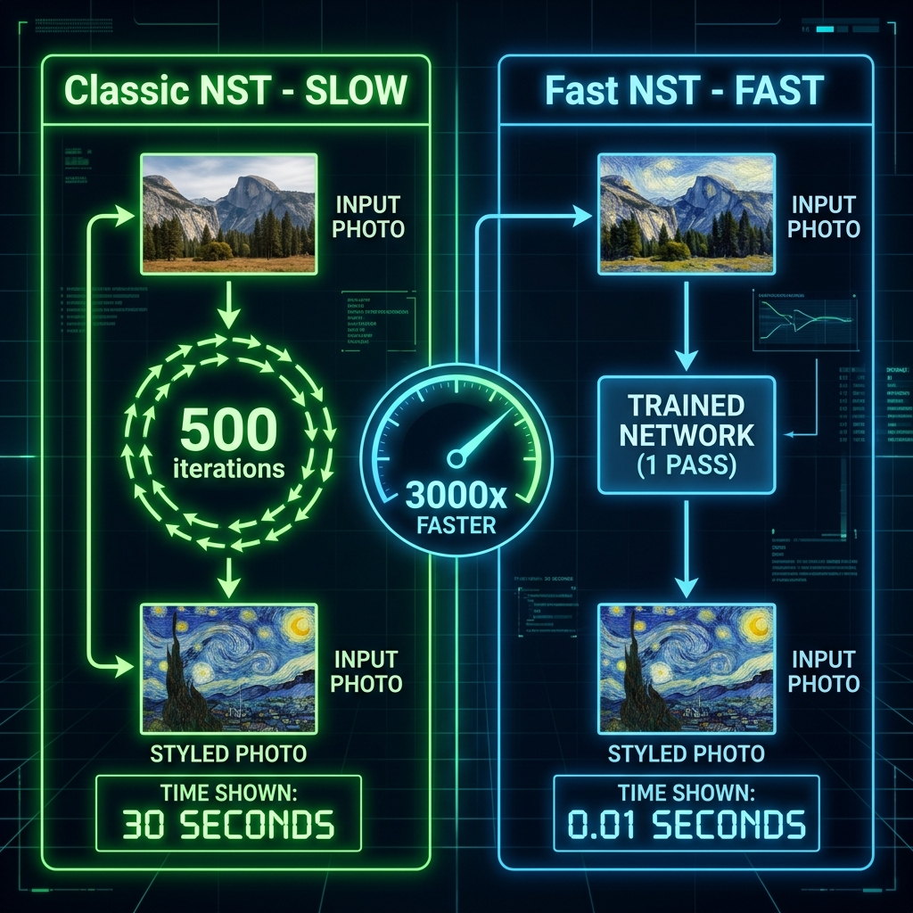
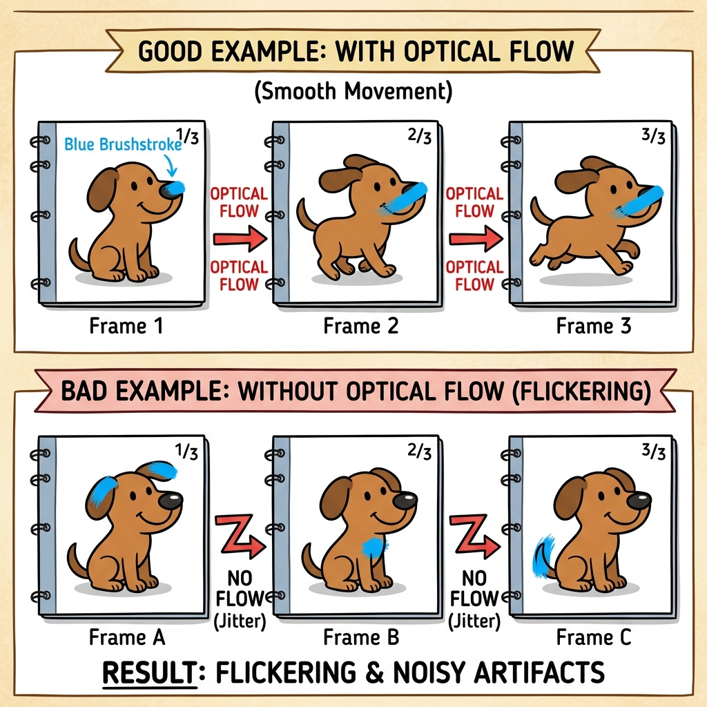
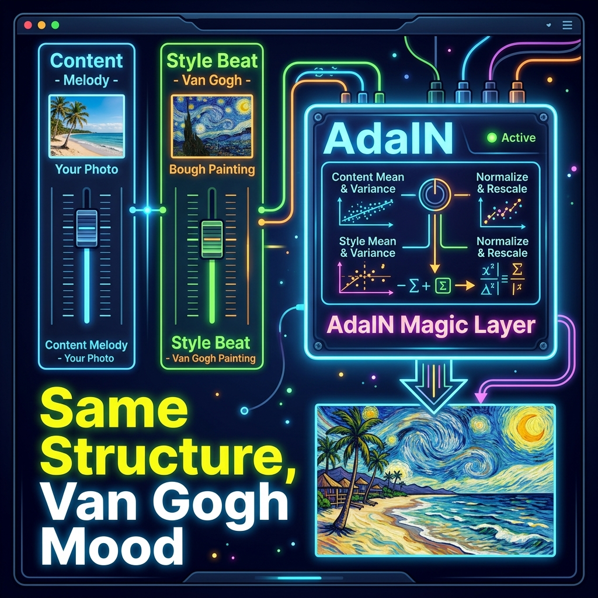

# 📘 Session 29 — Advanced Style Transfer: Challenges, Variations & Image Synthesis
### Course: Deep Learning Using Neural Networks | Aptech
### Duration: 2 Hours (TL29)
---

> **Professor's Opening Note:**
> *"In Session 28, we built our first style transfer and it worked! But if you tried to use it in real life, you would have run into a wall immediately — it was painfully slow. A Snapchat filter applies in 0.1 seconds. Our Session 28 code takes 30–60 seconds for ONE image. Today, we are going to discover how engineers at Instagram, TikTok, Adobe, and Apple solved this problem. We will also learn how to apply style to videos, create brand-new textures from nothing, and unlock a single model that can handle ANY art style instantly."*

---

## 📚 Table of Contents
1. [The Big Challenges of Classic NST](#1-the-big-challenges-of-classic-nst)
2. [Fast Style Transfer — The Speed Fix](#2-fast-style-transfer--the-speed-fix)
3. [Video Style Transfer — The Flickering Problem](#3-video-style-transfer--the-flickering-problem)
4. [Image Synthesis — Creating Textures from Scratch](#4-image-synthesis--creating-textures-from-scratch)
5. [Arbitrary Style Transfer — Any Style, Instantly](#5-arbitrary-style-transfer--any-style-instantly)
6. [Putting It All Together](#6-putting-it-all-together)
7. [Recommended Videos](#7-recommended-videos)

---

## 1. The Big Challenges of Classic NST

In Session 28, we built the original Neural Style Transfer from Gatys et al. (2015). It produces beautiful results, but it has **three serious problems** that make it completely unusable in any real product:

---

### 🔴 Problem 1: It Is Extremely Slow ⏱️

**Plain English:** In Session 28, our NST code ran a loop **500 times**. Each loop was one "round of painting." Only after all 500 rounds did we get our styled image.

**How slow exactly?**

| Device | Time for ONE styled image |
|--------|--------------------------|
| Your laptop CPU | 10–20 minutes |
| A gaming GPU | 30–60 seconds |
| Snapchat's servers | **Must be under 0.1 seconds** |

Our code is **600× too slow** even on the best hardware in the world.

**Real-World Story — The Failed Startup:**
> In 2016, a startup tried to build a live selfie camera using Classic NST. They launched it and the first user pressed the filter button... and waited 45 seconds for a result. Every single user closed the app. The startup failed within 3 months. The speed problem killed a real business!

**The Core Issue:** In Classic NST, we optimize **500 times per image**. Every single image — whether it is your selfie, your friend's selfie, or a photo of a dog — starts from scratch and runs all 500 rounds again. There is no "memory" of what was learned for previous photos.

---

### 🔴 Problem 2: One Network Can Only Do One Style 🖼️

**Plain English:** Imagine you run a photo printing shop. In Classic NST, every time a new customer wants a "Van Gogh style" print, you have to hand-paint their photo from scratch. Even though you painted 1000 Van Gogh prints before, you cannot use that experience — you start from zero every time.

**Real-World Story — Prisma App:**
> Prisma was a hugely popular app launched in 2016 that applied artistic styles to photos. In their first version, they used Classic NST on their servers. Within the first week, 1.5 million people downloaded the app. Their servers received so many style requests that they were spending **$50,000 per day** on computing costs. They had to find a faster solution immediately — and that solution is exactly what we cover next.

**The Core Issue:** Classic NST is not a learned skill — it is a fresh calculation. Every single style, every single photo costs the same enormous computing price.

---

### 🔴 Problem 3: Video Style Transfer Flickers Like a Strobe Light 🎥

**Plain English:** A video is just a sequence of photos (called frames) played very quickly — typically 30 frames per second. If you run Classic NST independently on each frame, each one starts from different random noise. The result: the style texture jumps around wildly from frame to frame. Watch it at 30fps and it looks like a strobe light.

**The Technical Name:** This problem is called **Temporal Inconsistency** — the style is not consistent over time.

**Everyday Example:**
> Open TikTok and apply any art filter to a video of yourself. Notice how the filter stays perfectly "glued" to your face even as you move? That never flickers. That is because TikTok solved the problem we are about to discuss.


---

## 2. Fast Style Transfer — The Speed Fix

Introduced by **Justin Johnson et al. (2016)** — just one year after the original NST paper — Fast Style Transfer is the first solution to Problem 1 and Problem 2.

**The Big Idea in one sentence:** Instead of painting each photo by hand, build a painting machine, and use the machine for everyone.

---

### 🖨️ The Printer Analogy (Read This First!)

Imagine you run a T-shirt printing business. You want to print Van Gogh's Starry Night on T-shirts for 10,000 customers.

**The Slow Way (Classic NST):**
- Customer 1 arrives → you hand-paint their shirt → takes 2 hours
- Customer 2 arrives → you hand-paint their shirt → takes 2 hours
- Customer 10,000 arrives → still takes 2 hours
- **Total time: 20,000 hours**

**The Fast Way (Fast Style Transfer):**
- You spend 2 weeks building a **screen-printing machine** calibrated for Starry Night
- Customer 1 arrives → machine prints in 3 seconds
- Customer 2 arrives → machine prints in 3 seconds
- Customer 10,000 arrives → still just 3 seconds
- **Total time: ~8 hours for machine building + minutes for all 10,000 prints**

The machine is the **Image Transformation Network**. Building it (training) takes time — but once it exists, every future photo is instant!



---

### 🔧 How Fast Style Transfer Works — Step by Step

Let's follow a photo of YOUR DOG through the entire process:

**TRAINING PHASE (happens once, before any user ever touches the app):**

1. **Collect thousands of photos.** These are the "training photos" — photos of cities, people, dogs, cars, etc. These are the content photos.

2. **Pass each photo through the Image Transformation Network.** This network is a special U-Net architecture — it takes an image in and produces a styled image out. At first, it produces rubbish (because its weights are random).

3. **Measure the output with TWO critics (our VGG19 from Session 28):**
   - **Content Critic (Deep Layer):** "Does this output still look like a dog?" (if not, penalize)
   - **Style Critic (Early Layer + Gram Matrix):** "Does this output look like Van Gogh's Starry Night?" (if not, penalize)

4. **Update the Image Transformation Network's weights** to score better with both critics. (NOT the image pixels this time — the NETWORK weights!)

5. **Repeat steps 2–4 for 40,000 training photos.** After all this training, the network's weights have permanently "memorized" how to paint like Van Gogh.

**INFERENCE PHASE (happens instantly every time a user takes a photo):**

6. **A user takes a selfie** → passes it through the trained Image Transformation Network → **ONE forward pass → instant Van Gogh selfie!**

```
TRAINING (done once, takes hours):
  40,000 photos → [Image Transformation Network] → styled outputs
                           ↑
              VGG19 critics update the network weights

INFERENCE (done millions of times, takes milliseconds):
  Your selfie → [Frozen Image Transformation Network] → Van Gogh selfie ✨
```

**The trade-off to remember:** One trained network = one style only. To support 10 different styles in your app, you need to train 10 different networks!

---

### 📱 Real-World Scenario — Instagram Filters

> **When you tap "Ludwig" or "Clarendon" on Instagram, what happens?**
> 
> A pre-trained Fast Style Transfer network runs your photo through a single forward pass. The network was trained weeks ago by an Instagram engineer on powerful servers. By the time you tap the filter, all the "learning" is already done — the network just applies what it memorized in an instant.
>
> This is why filters feel instant. This is Fast Style Transfer in your pocket.

---

## 3. Video Style Transfer — The Flickering Problem

Now that we can apply style quickly, let's try it on videos. The obvious approach: just run Fast Style Transfer on each frame individually. 

**This fails spectacularly.** Here is why, and here is the fix.

---

### 🎬 Why Videos Flicker — The Flip Book Explanation

Think of a video as a flip book. Each page is a frame. Flip through quickly and you see smooth motion.

Now imagine applying style to each page independently:
- Frame 1: The brushstroke lands on the dog's left ear
- Frame 2: The brushstroke lands on the dog's right ear  
- Frame 3: The brushstroke lands on the dog's tail
- **Flip through it: the brushstroke appears to TELEPORT around the image!**

This is **temporal inconsistency**. The style is not "glued" to the content — it floats around randomly.



---

### 🎯 The Fix: Optical Flow — The Choreographer

**Optical Flow** is a computer vision technique that answers one question:

> *"For every single pixel in Frame 1, where did that pixel move to in Frame 2?"*

Think of it as a **choreographer** for pixels. Every pixel in the image has a movement direction and speed assigned to it.

**Step-by-Step — How Optical Flow Fixes Flickering:**

**Step 1:** Style Frame 1 normally. A blue brushstroke lands on the dog's nose.

**Step 2:** Run Optical Flow between Frame 1 and Frame 2. It detects:
- The dog's nose pixel moved **5 pixels to the right and 2 pixels down**

**Step 3:** When stylizing Frame 2, **warp the blue brushstroke** from Frame 1 by the same amount: 5 pixels right, 2 pixels down.

**Step 4:** The brushstroke is now on the dog's nose in Frame 2 — exactly where it belongs!

**Step 5:** Repeat for Frame 3, Frame 4... every frame. The brushstroke stays **permanently glued** to the dog's nose throughout the entire video.

```
Frame 1: dog nose at (100, 150) → styled with blue brushstroke at (100, 150)
   Optical Flow detects: nose moved (+5, +2)
Frame 2: dog nose at (105, 152) → brushstroke warped to (105, 152) ✅
   Optical Flow detects: nose moved (+3, +1)
Frame 3: dog nose at (108, 153) → brushstroke warped to (108, 153) ✅
```

**Result:** The video looks like a real artist painted every single frame by hand, tracking every moving object with every brushstroke!

---

### 📱 Real-World Scenario — TikTok & Snapchat Filters

> **When you apply a "painting" filter on TikTok and record a video of yourself spinning around, how does the filter stay on your face without flickering?**
>
> Optical Flow (combined with face tracking). The algorithm tracks where your face pixels move between frames and ensures the artistic filter moves with your face. Without Optical Flow, the filter would look like TV static. With it, the filter appears to literally be painted on your skin.
>
> Every artistic video filter you have ever used on social media uses some form of temporal consistency technique based on this principle.

---

## 4. Image Synthesis — Creating Textures from Scratch

Here is one of the most surprising uses of everything we have learned: you can use the **Gram Matrix alone** (no content image!) to create brand-new textures from pure random noise.

---

### 🧵 The Fabric Machine Analogy

Imagine you work at a textile factory. A designer hands you one small swatch (5cm × 5cm) of a beautiful silk fabric pattern — swirling blue and gold threads woven together.

Your job: manufacture an **enormous roll** (100m × 100m) of new fabric that has the **exact same feel and pattern** as the swatch — even though each individual thread is in a slightly different position.

The **Gram Matrix** is your pattern analysis tool. It records:
- "Blue threads always appear next to gold threads"
- "There are always diagonal patterns going top-left to bottom-right"
- "The density of threads per square centimeter is roughly 80%"

Armed with these pattern rules (not the exact positions!), you can manufacture the huge roll so it feels identical to the original swatch — even though no single thread is in the same place.

---

### 🌍 Real-World Scenarios — Where Texture Synthesis Is Used

**1. Video Game Development (FIFA, Call of Duty, Fortnite)**
> Game artists paint ONE grass texture tile (512×512 pixels). Texture synthesis generates hundreds of unique grass variations automatically so the football field doesn't look like a copy-pasted carpet. Players never see the same blade of grass twice.

**2. Hollywood VFX (Marvel, Pixar)**
> VFX artists need to texture alien creatures whose skin doesn't exist in nature. They paint one patch of alien skin texture. Texture synthesis generates the full-body texture, automatically varying it realistically across the creature's entire surface.

**3. Nike & Adidas Shoe Design**
> Designers create one reference texture patch (e.g., a woven carbon-fibre weave). Texture synthesis generates hundreds of variations — different scales, rotations, densities — giving the design team a full catalogue of texture options to choose from in seconds instead of weeks.

**4. Architecture Firms**
> Architects choose one marble tile texture. Texture synthesis generates photorealistic textures for entire walls, floors, and countertops — making visualizations look real without photographing every surface.

---

### 📋 The Code — Line by Line in Plain English (Read This Before the Code!)

Before looking at the code, let us understand what each part does in plain English:

```
LINE 1: "Load the fabric swatch photo — this is our style target"
LINE 2: "Create a blank canvas of 128×128 random pixels (pure static noise)"
LINE 3: "Create an optimizer — this is the engine that will slowly nudge the pixels"
LINE 4: "Start a loop — we will run 1000 rounds of improvement"
LINE 5:   "Pass our blank canvas through VGG19 — ask 'what does this look like?'"
LINE 6:   "Pass the fabric swatch through VGG19 — ask 'what does the fabric look like?'"
LINE 7:   "Compute style loss: how DIFFERENT does our canvas feel vs the fabric?"
LINE 8:   "Compute gradients: which direction should each pixel change to reduce the difference?"
LINE 9:   "Apply the gradients: nudge every pixel in the right direction"
LINE 10:  "Print progress every 200 rounds so we can watch it improve"
LINE 11: "Final result: a brand new image that FEELS like the fabric — different pixels, same pattern!"
```

**Now here is the actual code:**

```python
import tensorflow as tf
import numpy as np

# LINE 1: Load the style texture we want to copy
texture = load_and_process_image('fabric_swatch.jpg')

# LINE 2: Start with PURE RANDOM NOISE — no content image at all!
# This is the blank canvas that will slowly "become" the texture
generated = tf.Variable(
    tf.random.uniform(shape=texture.shape, minval=0, maxval=255),
    dtype=tf.float32
)

# LINE 3: The optimizer — this is what "paints" the canvas
# Adam optimizer will adjust the pixel values intelligently
optimizer = tf.optimizers.Adam(learning_rate=10.0)

# LINE 4: Run 1000 rounds of improvement
for i in range(1000):
    with tf.GradientTape() as tape:
        # LINE 5: Ask VGG19 what our canvas currently looks like
        gen_features = feature_extractor(generated)

        # LINE 6: Ask VGG19 what the fabric swatch looks like
        tex_features = feature_extractor(texture)

        # LINE 7: Compute ONLY style loss (no content loss — we don't care what
        # the canvas looks like, only that it FEELS like the fabric!)
        style_loss = sum(
            compute_style_loss(tf_feat, gf)
            for tf_feat, gf in zip(tex_features, gen_features)
        )

    # LINE 8: Calculate which direction each pixel needs to change
    grads = tape.gradient(style_loss, generated)

    # LINE 9: Apply the change — nudge every pixel toward feeling more like the fabric
    optimizer.apply_gradients([(grads, generated)])

    # LINE 10: Print progress every 200 rounds
    if i % 200 == 0:
        print(f"Round {i}/1000 | How different does it feel? {style_loss:.2f} (lower = better!)")

# LINE 11: The output is now a brand new texture that feels like the fabric
# Each pixel is different, but the overall pattern and feel is identical!
```

**The magical result:** The random static noise at the start will slowly transform, round by round, into a texture that has the exact same visual feel as the fabric — even though no pixel from the fabric was directly copied!

---

## 5. Arbitrary Style Transfer — Any Style, Instantly

Introduced by **Huang & Belongie (2017)**, Arbitrary Style Transfer is the holy grail of style transfer. It solves BOTH remaining problems at once:
- ✅ Any content photo, any style painting
- ✅ Instant result (under 0.1 seconds)
- ✅ Single trained network handles everything

---

### 🌍 The Universal Translator Analogy

Think of language translation:

| Translator Type | Equivalent Model |
|----------------|-----------------|
| A translator who ONLY speaks Spanish → English | Fast Style Transfer (one style only) |
| Google Translate that handles ANY language pair | Arbitrary Style Transfer |

Fast Style Transfer trains one specialist. Arbitrary Style Transfer trains a universal expert.

---

### 🎚️ The DJ Mixing Board Analogy (AdaIN Explained)

The secret ingredient is a special layer called **AdaIN (Adaptive Instance Normalization)**. This is hard to understand mathematically, but here is a perfect everyday analogy:

Imagine you are a **DJ**. You have two inputs on your mixing board:

- **Left Channel:** The MELODY from a song (think of this as the CONTENT — the shape and structure of your photo, e.g., "there is a dog on a beach")
- **Right Channel:** The BEAT and RHYTHM from a different song (think of this as the STYLE — Van Gogh's swirling blues and thick brushstrokes)

The **AdaIN layer** is the mixing board itself. It does one thing: it takes the melody from the left channel and re-plays it using the beat and rhythm from the right channel.

**Result:** The song is recognizable as the original melody (content is preserved), but it sounds completely different — it has Van Gogh's rhythm and energy (style is applied).



---

### 🔧 How AdaIN Works — Step by Step

Let's follow a photo of a beach through Arbitrary Style Transfer:

**Step 1 — Content Encoder reads the photo:**
> VGG19 looks at the beach photo and creates a "content map" — a mathematical description of where the sea is, where the sand is, where the sky is. Think of it as a blueprint of the scene without any colour or texture information.

**Step 2 — Style Encoder reads the painting:**
> VGG19 looks at Van Gogh's Starry Night and extracts two numbers per feature: the **average intensity** (mean) and the **spread of intensity** (standard deviation). These two numbers capture the "mood" of the painting without capturing any specific position.

**Step 3 — AdaIN mixes them:**
> AdaIN takes the content blueprint and says: *"The content features normally have an average intensity of 0.5. But Van Gogh's painting has an average intensity of 0.8 with a spread of 0.3. Let me re-scale the content features to match Van Gogh's mood."*
>
> **In Plain English:** Strip the beach photo of its current "colour mood", and re-apply Van Gogh's colour mood on top of the beach's structure.

**Step 4 — Decoder produces the final image:**
> The mixed features are decoded back into a full image. The output has the STRUCTURE of the beach (content) but the COLOUR MOOD of Van Gogh (style).

```
Beach Photo  ─→ Content Encoder ─→ "Blueprint of the beach"  ──┐
                                                                 ├─→ AdaIN Layer ─→ Decoder ─→ Van Gogh Beach 🎨
Van Gogh     ─→ Style Encoder   ─→ "Mean=0.8, StdDev=0.3"   ──┘
```

---

### 📋 The AdaIN Code — Line by Line in Plain English

```python
def adain(content_features, style_features):
    """
    AdaIN: The DJ Mixing Board
    Takes the content's melody and replays it in the style's rhythm.
    """

    # LINE 1: Measure Van Gogh's "average colour intensity"
    # (This is the "brightness level" Van Gogh tends to use)
    style_mean = style_features.mean()

    # LINE 2: Measure how much Van Gogh's colours VARY
    # (Van Gogh uses high contrast — bright yellows next to dark blues)
    style_std = style_features.std()

    # LINE 3: Strip the beach photo of its own colour mood
    # (Normalize it — center it around zero, flatten its contrast to 1)
    # This is like removing the current "EQ settings" from the melody
    content_normalized = (content_features - content_features.mean()) / content_features.std()

    # LINE 4: Re-apply Van Gogh's colour mood onto the stripped content
    # Multiply by Van Gogh's contrast level, then shift to Van Gogh's brightness
    # This is like applying Van Gogh's "EQ settings" to the melody
    return style_std * content_normalized + style_mean

    # The result: The beach structure, but painted with Van Gogh's palette and energy
```

**Result:** ONE single forward pass through the network. No 500-step loop. No separate trained network per style. Any photo + any painting = instant stylized result!

---

### 📱 Real-World Scenario — Adobe Photoshop, Canva & AI Art Apps

> **When you open Adobe Photoshop's "Neural Filters" and click "Style Transfer", what happens under the hood?**
>
> A pre-trained Arbitrary Style Transfer network (similar to AdaIN) encodes your photo and the chosen style painting simultaneously. The AdaIN layer mixes the content and style statistics in milliseconds. The result appears in under a second.
>
> The same technology powers:
> - **Canva's Magic Studio** — "Make this look like a watercolor"
> - **Lensa AI** — Artistic portrait styles applied to selfies
> - **Stable Diffusion's img2img** — Style transfer as part of image generation
> - **Google Arts & Culture** — "Art Filter" feature that pairs your face with famous paintings

This is not future technology. This is what millions of people use right now, every day.

---

## 6. Putting It All Together

Here is the complete picture — every method we have covered across Sessions 28 and 29:

| Method | Speed | Best For | Real-World Example |
|--------|-------|----------|--------------------|
| **Classic NST (S28)** | 30–60 sec | Learning & experimenting | Academic research |
| **Fast Style Transfer** | 0.01 sec | Single-style apps | Instagram's fixed filters |
| **Texture Synthesis** | ~30 sec | Creating game/fabric textures | FIFA grass, Nike shoe patterns |
| **Arbitrary Style Transfer** | 0.01 sec | Commercial apps with many styles | Adobe Neural Filters, Canva |

### ✅ Decision Guide — Which One Should YOU Build?

| Your Goal | Use This |
|-----------|----------|
| "I want to understand how NST works" | Classic NST (Session 28) |
| "I want to build a filter app with 1 style" | Fast Style Transfer |
| "I need to generate repeating textures for a game" | Texture Synthesis |
| "I want to build an app where users pick any style" | Arbitrary Style Transfer (AdaIN) |
| "I want to apply style to a video without flickering" | Fast NST + Optical Flow |

---

## 7. 🎬 Recommended Videos

### 🥇 Video 1 — Fast Style Transfer (SEE the speed difference live)
**"Fast Style Transfer in TensorFlow" by Sentdex**
- 📺 Search YouTube for: `Fast Style Transfer TensorFlow Sentdex`
- 🎯 Why Watch: Shows the real-time speed difference side by side. You will immediately feel why it matters.

### 🥈 Video 2 — Optical Flow (see it working on video)
**"Optical Flow Explained" by Computerphile**
- 📺 Search YouTube for: `Optical Flow Computerphile`
- 🎯 Why Watch: Computerphile shows optical flow visually with arrows moving over real footage. After watching this, you will never look at a video the same way.

### 🥉 Video 3 — Arbitrary Style Transfer in Adobe Photoshop
**"Photoshop Neural Filters: Style Transfer" by Adobe**
- 📺 Search YouTube for: `Adobe Photoshop Neural Filters Style Transfer`
- 🎯 Why Watch: You can watch the exact technology from this session being used in a professional product. This makes it real.

---
*© 2024 Aptech Limited | Deep Learning Using Neural Networks | Session 29*
