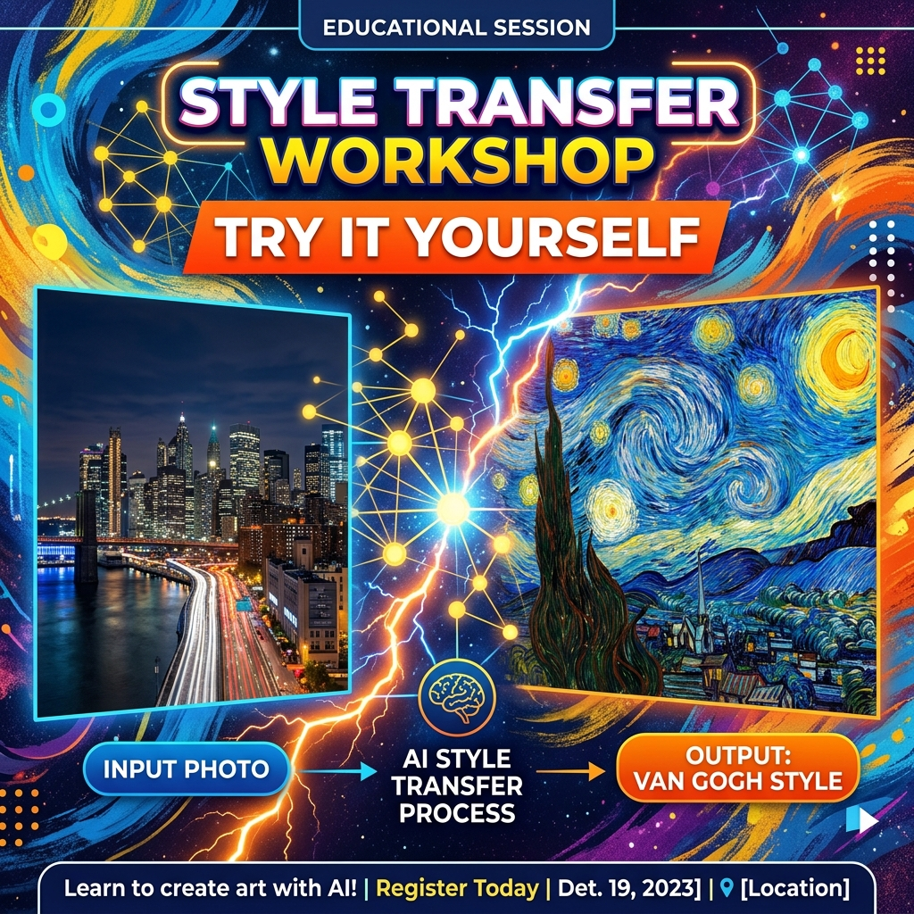

# 📘 Session 30 — Workshop: Try It Yourself (Style Transfer & Image Synthesis)
### Course: Deep Learning Using Neural Networks | Aptech
### Duration: 2 Hours (TL30)
---

> **Professor's Opening Note:**
> *"Over Sessions 28 and 29, you learned one of the most visually spectacular techniques in all of deep learning — Neural Style Transfer. You now understand the Art Critics (VGG19), the Texture Matcher (Gram Matrix), and the Speed Fix (Fast/Arbitrary Style Transfer). Today, there is no new theory. Today, you create. You will tackle three hands-on challenges that bring together everything you have learned."*

---

---

## ⏰ Workshop Schedule

| Time | Activity |
|------|----------|
| 0:00 – 0:15 | Quick Review & Challenge Briefing |
| 0:15 – 0:50 | Challenge 1: Classic NST — Tune Your Masterpiece |
| 0:50 – 1:25 | Challenge 2: Fast NST — Build a Multi-Style Gallery |
| 1:25 – 1:50 | Challenge 3: Texture Synthesis — Design from Noise |
| 1:50 – 2:00 | Gallery Showcase & Discussion |

---

## 🔁 Quick Review: What We Have Learned

### Session 28 — Neural Style Transfer Basics
- **Two inputs:** Content Image (what to paint) + Style Image (how to paint it)
- **The VGG19 Art Critics:** Early layers see textures and brushstrokes (style); deep layers see shapes and objects (content)
- **The Gram Matrix (Texture Matcher):** Records which features appear together, regardless of where in the image — this IS the style
- **The Optimization:** We update the **pixels** of the output image, not the network weights

### Session 29 — Advanced Style Transfer
- **Classic NST Problem:** Very slow (30-60 seconds per image), one image at a time
- **Fast Style Transfer:** Train one network per style; 0.01 second per image after training
- **Arbitrary Style Transfer (AdaIN):** One single network handles ANY style — the commercial app solution
- **Texture Synthesis:** Generate textures from pure random noise using only style loss

---

## 📊 Key Comparison Table

| Method | Speed | Styles Supported | Best For |
|--------|-------|-----------------|----------|
| Classic NST (Session 28) | Slow | Any (one at a time) | Experimenting & learning |
| Fast Style Transfer | Very Fast | One per model | Single-style apps |
| Arbitrary NST (AdaIN) | Very Fast | Any, unlimited | Commercial apps |
| Texture Synthesis | Medium | Any | Game/fabric textures |

---

## 🎒 What You Need

- Kaggle account with **GPU enabled** for Challenges 1 & 2
- Your completed notebooks from Sessions 28 and 29 (for reference)
- One personal photo (take a quick snapshot with your phone — you will need it for Challenge 2!)
- A creative mindset — there are no wrong answers in art!

---
*© 2024 Aptech Limited | Deep Learning Using Neural Networks | Session 30*
