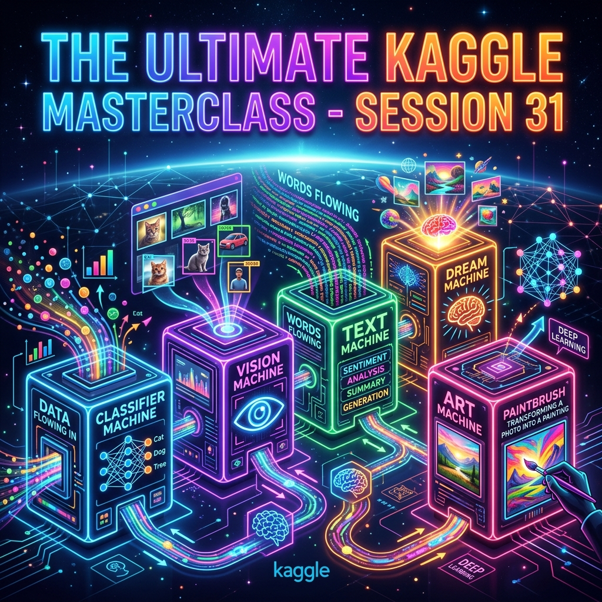

# 🏆 Session 31 — The Ultimate Kaggle Masterclass
### Course: Deep Learning Using Neural Networks | Aptech
### Duration: 2 Hours (TL31)
---

> **Professor's Opening Note:**
> *"Congratulations. You have made it to the final session. Over 30 sessions, you have gone from not knowing what a neural network is, to being able to build machines that see, read, generate, and create art. But knowing how to cook a dish is useless if you do not know how to serve it to the customer. Today, we boot up the 5 Deep Learning Machines we built in this course. Then, we learn how to apply them to real-world business problems like fraud detection, and how to deploy them to the web so anyone can test them."*

---

---

## 📚 Table of Contents
1. [Your Full Journey: Sessions 1–30 in One Map](#1-your-full-journey-sessions-130-in-one-map)
2. [The 5 Deep Learning Machines](#2-the-5-deep-learning-machines)
3. [Real-World Business Use Cases (PropTech & FinTech)](#3-real-world-business-use-cases-proptech--fintech)
4. [Deployment: How Non-Technical People Test Your AI](#4-deployment-how-non-technical-people-test-your-ai)
5. [What Comes Next After This Course](#5-what-comes-next-after-this-course)

---

## 1. Your Full Journey: Sessions 1–30 in One Map

Here is everything you have learned, mapped onto a single table:

| Sessions | Era | What You Learned | Key Model |
|----------|-----|-----------------|-----------|
| 1–5 | **The Basics** | What is deep learning? How does a neuron work? | Perceptron, ANN |
| 6–8 | **Training Science** | Activation functions, backpropagation, regularization | ReLU, Dropout, L2 |
| 9–11 | **Tools** | TensorFlow, Keras, deployment, fine-tuning | `model.fit()`, TF Hub |
| 12–13 | **Optimisation** | AutoML, hyperparameter tuning, workshops | KerasTuner |
| 14–15 | **Going Deeper** | Deep vs shallow networks, efficiency | ResNet, MobileNet |
| 16–19 | **Vision** | How CNNs see images, object recognition | VGG19, Inception, ResNet |
| 20–21 | **Language** | How RNNs process sequences and generate text | SimpleRNN, LSTM |
| 22 | **Generation I** | Creating images from a smooth, organized space | Variational Autoencoder (VAE) |
| 23–25 | **Generation II** | Two networks competing to create sharp images | GAN, DCGAN, cGAN |
| 26–27 | **Controlled Generation** | Directing what the AI creates, ethical responsibility | CVAE, Multi-condition |
| 28–30 | **Art & Synthesis** | Applying artistic style, generating textures | Neural Style Transfer, AdaIN |

---

## 2. The 5 Deep Learning Machines

Think of everything you have learned as 5 powerful machines. 

1. **The Classifier Machine 🏷️:** Takes data (numbers, tabular data) and outputs a category. Used for predicting loan defaults or house prices.
2. **The Vision Machine 👁️:** A CNN that extracts visual patterns. Used for face recognition and medical scanning.
3. **The Text Machine 📝:** An RNN that processes sequences. Used for predictive text and reading documents.
4. **The Dream Machine 🌙:** A VAE/GAN that creates brand new data. Used for drug discovery and design.
5. **The Art Machine 🎨:** Applies styles to images. Used for photo filters and VFX.

---

## 3. Real-World Business Use Cases (PropTech & FinTech)

The real power of deep learning comes from combining these machines to solve specific industry problems. Here is how we apply them to the real world.

### Industry Example A: PropTech — Nomentral Land Document Fraud
Imagine a real estate tech company (PropTech) like Nomentral. Every day, they receive hundreds of scanned land documents. Some are genuine; some are clever forgeries. Human auditors miss the fakes. How do we build an AI to catch them?

**The Architecture:**
We chain the **Vision Machine** and the **Classifier Machine**.

1. **Data Collection:** Gather 500 real land documents and 500 fake ones.
2. **The Vision Machine (CNN):** A CNN (like VGG16) scans the document image. It learns to look for tiny visual anomalies humans miss: the exact blurriness of a forged government stamp, the wrong pixel texture of the paper, or digitally copied signatures.
3. **The Classifier Machine:** The features extracted by the CNN are fed into a final Dense layer that outputs a probability: `98% Fake` or `99% Authentic`.
4. **Integration:** When a user uploads a document to the Nomentral website, it hits an API, passes through the AI, and instantly flags the file with a red 🚨 or green ✅.

### Industry Example B: FinTech — Transaction Fraud Detection
Imagine a FinTech banking app. A user normally buys coffee in Lagos. Suddenly, their card attempts to buy a $5,000 TV in London. How do we stop it instantly?

**The Architecture:**
We use the **Text/Sequence Machine** (RNN) combined with a **Classifier**.

1. **The Sequence Machine (RNN):** An RNN is perfect for fraud because it has *memory*. It reads the user's last 50 transactions as a sequence. It learns their "normal" rhythm (location, time, amount).
2. **The Classifier:** When a new transaction arrives, the RNN processes it. If the new transaction breaks the established pattern drastically, the classifier flags an Anomaly.
3. **Integration:** The AI sits directly inside the payment gateway's API. The millisecond the user clicks "Pay", the data goes to the AI. If the AI returns `1` (Fraud), the app displays "Transaction Blocked" before the money ever leaves the bank.

---

## 4. Deployment: How Non-Technical People Test Your AI

If you build the Nomentral Fraud Detector in Kaggle, your CEO cannot test it. They do not know how to run Python code. You must build a "Taste Test" environment.

### The Solution: Hugging Face & Gradio
You can take your trained model out of Kaggle and put it on a public website for free.

1. **Save the model** in Kaggle: `model.save('nomentral_fraud_ai.keras')`
2. **Upload it** to [Hugging Face Spaces](https://huggingface.co/spaces).
3. **Wrap it in a UI** using a Python library called `Gradio`. With just 5 lines of code, Gradio creates a beautiful web page with a drag-and-drop box for images.

**The "Before and After" Test:**
Now you send the Hugging Face web link to your CEO or a client. You give them 10 land documents and say: *"Try to guess which are fake."* They struggle for 10 minutes. 
Then you say: *"Now drag them into my web app."* The AI flags the fakes instantly and accurately. 

**This is how you prove the business value of Deep Learning. You show the Before and After.**

---

## 5. What Comes Next After This Course

You have completed Deep Learning Using Neural Networks. Here is your roadmap to what comes next:

### The Modern Era: Transformers & Attention
- The next frontier is **Transformers** (the architecture behind GPT, BERT, and DALL-E)
- Transformers replaced RNNs for text (no more vanishing gradient problem)
- **Recommended course:** Hugging Face NLP course (free at huggingface.co/course)

### Build a Portfolio
The best way to get a job in AI is not to show a certificate, but to show a working product.
- Train a model to solve a local problem.
- Deploy it to Hugging Face Spaces.
- Put the link on your CV. When an employer clicks the link and the AI works, you get the job.

---
*© 2024 Aptech Limited | Deep Learning Using Neural Networks | Session 31 — The Final Session*
