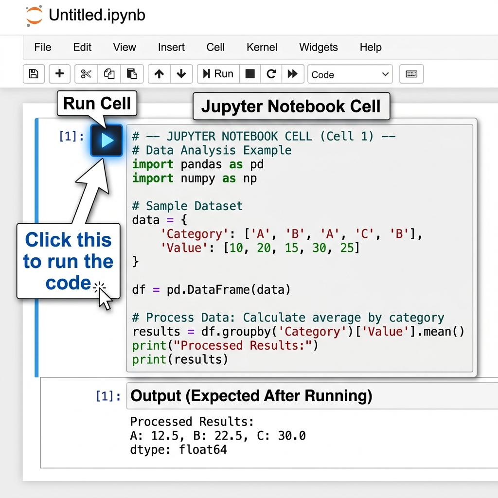

# 🎒 The Aptech Student's Guide to Kaggle: From Zero to Deep Learning
### A Step-by-Step Practical Manual
---

> **Instructor's Note:**
> *"Welcome to the most important document in this course. You have seen the theory, and you have seen the final code in our sessions. But how do you actually DO it yourself? Where do you click? How do you get photos into the code? And most importantly — how do you take your AI out of the code and put it in the real world where non-technical people can test it? This guide is your roadmap."*

---

## 📚 Table of Contents
1. [Part 1: Kaggle from Zero (How to Survive)](#part-1-kaggle-from-zero-how-to-survive)
2. [Part 2: The Data Playbook (How to Get Data)](#part-2-the-data-playbook-how-to-get-data)
3. [Part 3: The 5 Machines (Topic-by-Topic Build Guide)](#part-3-the-5-machines-topic-by-topic-build-guide)
4. [Part 4: The Taste Test (Deploying to the Real World)](#part-4-the-taste-test-deploying-to-the-real-world)
5. [Part 5: Before and After (Proving the AI Works)](#part-5-before-and-after-proving-the-ai-works)

---

## Part 1: Kaggle from Zero (How to Survive)

Kaggle is a free, powerful computer sitting in Google's data centers that you get to borrow. Here is how to use it without getting frustrated.

### 1. Creating Your Blank Canvas
- Go to [Kaggle.com](https://www.kaggle.com) and sign in.
- On the left menu, click **Create** ➔ **New Notebook**.
- A new screen opens. This is your "IDE" (Integrated Development Environment). 

### 2. The Golden Rule: Turn on the GPU!
Deep Learning without a GPU is like trying to empty a swimming pool with a teaspoon. You MUST turn the GPU on for images or text generation.

1. Look at the right-side panel (Session options).
2. Click **Accelerator**.
3. Change it from "None" to **GPU P100** or **GPU T4x2**.


*(Note: You get 30 hours of free GPU time per week. Turn off your session when you are done!)*

### 3. How to Run Code
Kaggle works in **Cells**. You type Python code into a box, and press the **Play Button** (or press `Shift + Enter`) to run just that box.



**Survival Tip:** If your notebook ever freezes, click **Run ➔ Restart & Clear Outputs** at the top. This turns the computer off and on again.

---

## Part 2: The Data Playbook (How to Get Data)

The number one question students ask: *"How do I get my own photos into the code?"* 
Here are the only 3 methods you will ever need.

### Method A: Built-in Data (For quick testing)
Keras has famous datasets built-in. Use these when you just want to test if a network works.
```python
from tensorflow import keras

# Loads 70,000 images of handwritten digits instantly!
(X_train, y_train), (X_test, y_test) = keras.datasets.mnist.load_data()
```

### Method B: The Internet Downloader (For single images)
Want to grab a picture from Wikipedia to test your model? Use `get_file`.
```python
from tensorflow import keras

# Give it a name ('my_photo.jpg') and a public URL
photo_path = keras.utils.get_file(
    'my_photo.jpg', 
    'https://upload.wikimedia.org/wikipedia/commons/thumb/3/37/African_Bush_Elephant.jpg/800px-African_Bush_Elephant.jpg'
)
# Now the photo is saved in Kaggle and ready to use!
```

### Method C: Uploading Your Own Photos (The "Add Data" Button)
Want to use a selfie from your phone, or a dataset of fake land documents?
1. On the top right of Kaggle, click **Add Data**.
2. Click the **Upload** button (a small arrow icon).
3. Drag and drop your `.jpg` or `.png` file.
4. Give it a title and click Create.
5. In your Kaggle code, the path will always be: `"/kaggle/input/YOUR-DATASET-TITLE/your_photo.jpg"`

---

## Part 3: The 5 Machines (Topic-by-Topic Build Guide)

Here is how to build every major topic in the course **from scratch**. Copy these blocks into new Kaggle cells to build them step-by-step.

### 1. The Classifier Machine (ANNs)
*Topic: Tabular Data & Simple Images (Sessions 1-13)*

**Step 1: Get Data**
```python
from tensorflow import keras
(X_train, y_train), (X_test, y_test) = keras.datasets.mnist.load_data()
X_train = X_train.reshape(-1, 784) / 255.0  # Flatten and normalize
```

**Step 2: Build the Machine**
```python
from tensorflow.keras import layers
model = keras.Sequential([
    layers.Dense(128, activation='relu', input_shape=(784,)),
    layers.Dense(10, activation='softmax') # 10 categories
])
model.compile(optimizer='adam', loss='sparse_categorical_crossentropy', metrics=['accuracy'])
```

**Step 3: Train and Test**
```python
model.fit(X_train, y_train, epochs=3)
# To predict: model.predict(X_test[0:1])
```

---

### 2. The Vision Machine (CNNs)
*Topic: Advanced Image Recognition (Sessions 14-19)*

**Step 1: Get a Pre-Trained Machine**
```python
from tensorflow.keras.applications import VGG19
# We don't train it! We borrow Google's already-trained brain.
vision_machine = VGG19(weights='imagenet') 
```

**Step 2: Get Data (Internet Download)**
```python
from tensorflow.keras.preprocessing import image
import numpy as np

img_path = keras.utils.get_file('cat.jpg', 'https://upload.wikimedia.org/wikipedia/commons/4/4d/Cat_November_2010-1a.jpg')

# Resize image to exactly what VGG19 expects (224x224)
img = image.load_img(img_path, target_size=(224, 224))
img_array = image.img_to_array(img)
img_array = np.expand_dims(img_array, axis=0) # Add batch dimension
```

**Step 3: Predict**
```python
from tensorflow.keras.applications.vgg19 import preprocess_input, decode_predictions
img_ready = preprocess_input(img_array)
predictions = vision_machine.predict(img_ready)
print(decode_predictions(predictions, top=3)[0]) # See top 3 guesses!
```

---

### 3. The Text Machine (RNNs)
*Topic: Generating Language (Sessions 20-21)*

**Step 1: Get Text Data**
```python
text = "hello world hello world hello world " * 10
chars = sorted(set(text))
char_to_index = {c: i for i, c in enumerate(chars)}
```

**Step 2: Build the Recurrent Machine**
```python
from tensorflow import keras
from tensorflow.keras import layers

rnn_model = keras.Sequential([
    layers.SimpleRNN(64, input_shape=(None, len(chars))), # "None" means any length of text
    layers.Dense(len(chars), activation='softmax')
])
rnn_model.compile(optimizer='adam', loss='categorical_crossentropy')
print("RNN Built!") # (Data prep for RNNs is complex, see Session 20 for the full loop!)
```

---

### 4. The Dream Machine (CVAE)
*Topic: Generative AI (Sessions 22-27)*

**Step 1: Build the Encoder (The Compressor)**
```python
from tensorflow import keras
from tensorflow.keras import layers

# Compresses a 784-pixel image down to 8 numbers
img_in = keras.Input(shape=(784,))
x = layers.Dense(128, activation='relu')(img_in)
latent_space = layers.Dense(8)(x) 
encoder = keras.Model(img_in, latent_space)
```

**Step 2: Build the Decoder (The Generator)**
```python
# Takes 8 numbers and expands them back into 784 pixels
latent_in = keras.Input(shape=(8,))
x = layers.Dense(128, activation='relu')(latent_in)
img_out = layers.Dense(784, activation='sigmoid')(x)
decoder = keras.Model(latent_in, img_out)
```
*(Note: To train this, you combine them and add KL Loss — see Session 26!)*

---

### 5. The Art Machine (Style Transfer)
*Topic: AI Art & Texture (Sessions 28-30)*

**Step 1: Get the Magic AdaIN Machine from TF Hub**
```python
import tensorflow_hub as hub
# One model that handles any style instantly!
art_machine = hub.load('https://tfhub.dev/google/magenta/arbitrary-image-stylization-v1-256/2')
```

**Step 2: Load Your Photo and a Painting (Method C or B)**
```python
import tensorflow as tf

def load_image(path):
    img = tf.io.read_file(path)
    img = tf.image.decode_jpeg(img, channels=3)
    img = tf.image.convert_image_dtype(img, tf.float32)
    return img[tf.newaxis, :]

# Use Method B to get a photo and a painting
content = load_image(tf.keras.utils.get_file('city.jpg', 'https://upload.wikimedia.org/wikipedia/commons/thumb/d/d3/Statue_of_Liberty%2C_NY.jpg/800px-Statue_of_Liberty%2C_NY.jpg'))
style = load_image(tf.keras.utils.get_file('starry.jpg', 'https://upload.wikimedia.org/wikipedia/commons/thumb/e/ea/Van_Gogh_-_Starry_Night_-_Google_Art_Project.jpg/800px-Van_Gogh_-_Starry_Night_-_Google_Art_Project.jpg'))
```

**Step 3: Mix Them!**
```python
import matplotlib.pyplot as plt

# Mash them together in 0.1 seconds
styled_image = art_machine(tf.constant(content), tf.constant(style))[0]

plt.imshow(styled_image[0])
plt.axis('off')
plt.show()
```

---

## Part 4: The Taste Test (Deploying to the Real World)

Coding a model in Kaggle is like cooking a dish in a closed kitchen. If nobody can taste it, what is the point? You cannot send Python code to your CEO or a real-world client and expect them to test it.

We need to build a **User Interface (UI)** so anyone can use your AI. 

### Step 1: Save Your Model
First, save your trained brain so you can take it out of Kaggle.
```python
# Run this at the end of your Kaggle notebook
model.save('my_fraud_detector.keras')
```
*Download this file to your computer.*

### Step 2: Use Hugging Face & Gradio
**Hugging Face Spaces** provides free hosting for AI apps. **Gradio** is a Python library that builds a beautiful website around your AI in 5 lines of code.

1. Go to [HuggingFace.co](https://huggingface.co/) and create a free account.
2. Click **Spaces ➔ Create New Space**.
3. Choose **Gradio** as the SDK.
4. Upload your `my_fraud_detector.keras` file.
5. Create a file called `app.py` and write this code:

```python
import gradio as gr
from tensorflow.keras.models import load_model
import numpy as np

# 1. Load the model you trained in Kaggle
model = load_model('my_fraud_detector.keras')

# 2. Define what happens when a user uploads an image
def predict_fraud(image):
    # Resize image for the model
    image = image.reshape(1, 224, 224, 3) 
    prediction = model.predict(image)[0][0]
    
    if prediction > 0.8:
        return "🚨 FRAUDULENT DOCUMENT DETECTED"
    else:
        return "✅ AUTHENTIC DOCUMENT"

# 3. Create the web page
interface = gr.Interface(
    fn=predict_fraud,          # The function to run
    inputs=gr.Image(),         # A box for the user to drag-and-drop a photo
    outputs=gr.Text(),         # A box to show the result
    title="Nomentral AI - Land Document Scanner"
)

# 4. Launch the website!
interface.launch()
```

**That's it!** Hugging Face will generate a public URL. You can send this link to your CEO, friends, or clients. They can open it on their phone, take a picture of a document, and test your AI instantly without seeing a single line of code.

---

## Part 5: Before and After (Proving the AI Works)

When you hand your app to a non-technical person, how do they know it is actually good? You must prove the business value using a **Before and After** test.

### How to run a "Blind Test"
Do not just tell them the accuracy is 95%. Show them.

1. **Get 20 test cases:** For a PropTech company, get 10 real land documents and 10 fake/forged ones. Do NOT tell the tester which is which.
2. **The "Before" (Human Test):** Ask the non-technical user (a human auditor) to sort the 20 documents manually. 
   - *Time taken:* 15 minutes.
   - *Accuracy:* They caught 7 out of 10 fakes.
3. **The "After" (AI Test):** Have the user upload those same 20 documents into your Hugging Face Gradio app.
   - *Time taken:* 10 seconds.
   - *Accuracy:* The AI caught 9 out of 10 fakes.

### Why this matters
By doing this, you just proved to the business that your AI is **90 times faster** and **20% more accurate** than manual labour. This is how you sell deep learning in the real world. 

Always build your model, wrap it in a Gradio UI, and run a "Before and After" test.

---
*© 2024 Aptech Limited | Deep Learning Using Neural Networks | Kaggle Survival Guide*
